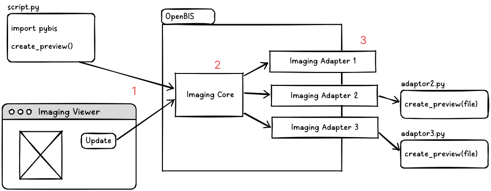

Imaging technology
==================================

## Introduction

Imaging technology is an extension that allows to process raw scientific data stored in datasets into easy to analyze images.

This technology is split into following parts:
- Imaging Service
    - Imaging Core
    - Imaging Gallery Viewer
    - Imaging DataSet Viewer
- Imaging Adapters


The basic flow of image generation is represented by the following image:



1. User creates a request to generate a new preview (either by using Imaging Viewer ELN plugin or by python script)
2. Imaging Core technology analyze the request, transfers the request to adequate Imaging Adapter
3. Imaging adapter accesses the raw file and converts it into an image to be displayed


## Imaging Service

Imaging Service provides:
- Imaging Core service that handles conversion of raw data stored in OpenBIS into images dynamically.
- ELN plugin which allows to visualize stored data.

### How to enable this technology

`imaging` needs to be enabled in the `servers/core-plugins/core-plugins.properties`

`imaging-nanonis` and `imaging-test` plugins contain of adapters that are ready to use.

#### imaging-nanonis
`imaging-nanonis` is a plugin that contain implementation of adapters for transforming `.SXM` and `.DAT` files into images.


#### imaging-test
`imaigng-test` is a simple test plugin that can be used for testing imaging core technology. It contains a simple adapter that generates a randomly-colored images.


## Data Model

The new imaging extension follows the current eln-lims data model.

This structure could initially seem to have a couple of additional levels that not everybody will actively use, but in practice is the most flexible since allows to use all openBIS linking features between Experiments, Experimental Steps and other Objects.

Space (Space): Used for rights management\
&nbsp; &rdsh; Project (Project): Used for rights management\
&nbsp; &nbsp; &nbsp; &nbsp; &rdsh; Collection (Collection): Allows Object Aggregation\
&nbsp; &nbsp; &nbsp; &nbsp; &nbsp; &nbsp; &nbsp; &rdsh; Experiment (Object): Allows Objects linking\
&nbsp; &nbsp; &nbsp; &nbsp; &nbsp; &nbsp; &nbsp; &nbsp; &nbsp; &nbsp; &rdsh; Exp. Step (Object): Allows Objects linking and DataSets\
&nbsp; &nbsp; &nbsp; &nbsp; &nbsp; &nbsp; &nbsp; &nbsp; &nbsp; &nbsp; &nbsp; &nbsp; &nbsp; &rdsh; DataSet (DataSet): Allows to attach data

Different DataSet Types can have different properties and metadata sections. A default template type called IMAGING_DATA is provided. Additionally, each lab can create their own types with different metadata - a core requirement for dataset type is to contain an internal property called $IMAGING_DATA_CONFIG.

### IMAGING_DATA_CONFIG

To fulfill the visualization requirements, including the flexibility of updating these over time it is needed for every DataSet to include certain data and mutable metadata.
* Original RAW data, on any format, open or proprietary.
* A property IMAGING_DATA_CONFIG of type JSON containing:
    * Indicating the number of inputs and their components.
    * The number of images (at least one).
    * The number of previews per image (at least one).
    * The config with the inputs selected to recalculate each preview.
    * The preview image byte array in png or jpeg format.
    * Any Custom Metadata fields.

Example of `IMAGING _DATA_CONFIG`:

```json 
{
  "@type": "imaging.dto.ImagingDataSetPropertyConfig",
  "images": [
    {
      "@type": "imaging.dto.ImagingDataSetImage",
      "index": 0,
      "config": {
        "@type": "imaging.dto.ImagingDataSetConfig",
        "adaptor": "ch.ethz.sis.openbis.generic.server.as.plugins.imaging.adaptor.NanonisSxmAdaptor",
        "inputs": [
          {
            "@type" : "dss.dto.imaging.ImagingDataSetControl",
            "label": "Dimension 1",
            "section": "Channels",
            "type": "Dropdown",
            "values": ["Channel A", "Channel B", "Channel C"],
            "multiselect" : false,
            "playable" : false,
            "speeds": [1000, 2000, 5000]
          },
          {
            "@type" : "dss.dto.imaging.ImagingDataSetControl",
            "label": "Dimension 2",
            "section": "Channels",
            "type": "Slider",
            "range": null, //If range of a component is null, visibility should be used instead.
            "unit": null, //optional parameter 
            "playable": true,
            "speeds": [1000, 2000, 5000],
            "visibility": [{
              "label": "Dimension 1",
              "values": ["Channel A"],
              "range": [1,2,1], //From 1 to 2 with a step of 1
              "unit": "nm" //optional 
            }, {
              "label": "Dimension 1",
              "values":["Channel B", "Channel C"],
              "range": [4,6,1], //From 4 to 6 with a step of 1
              "unit": "px" //optional 
            }]
          },
          {
            "@type" : "dss.dto.imaging.ImagingDataSetControl",
            "label": "Dimension 3",
            "section": "Channels",
            "type": "Slider",
            "range": [1,2,0.5], // From 1 to 2 with a step of 0.5
            "playable": true,
            "speeds": [1000, 2000, 5000]
          }
        ],
        "speeds": [
          1000,
          2000,
          5000
        ],

        "exports" : [ // parameters for export
          {
            "@type" : "dss.dto.imaging.ImagingDataSetControl",  //non-null
            "label": "Include",  //non-null
            "type": "Dropdown", // non-null
            "values": ["Data", "Metadata"], // nullable 
            "multiselect" : true
          },
          {
            "@type" : "dss.dto.imaging.ImagingDataSetControl",
            "label": "Resolutions",
            "type": "Dropdown",
            "values": ["original", "300dpi", "150dpi", "72dpi"],
            "multiselect" : false
          },
          {
            "@type" : "dss.dto.imaging.ImagingDataSetControl",
            "label": "Format",
            "type": "Dropdown",
            "values": ["zip/original", "zip/jpeg", "zip/png", "zip/svg"],
            "multiselect" : false
          }
        ],
        "filters": {
          "Gaussian": [
            {
              "type": "Slider",
              "unit": null,
              "@type": "imaging.dto.ImagingDataSetControl",
              "label": "Sigma",
              "range": [
                "1",
                "100",
                "1"
              ],
              "speeds": null,
              "values": null,
              "section": "Gaussian",
              "metadata": null,
              "playable": null,
              "visibility": null,
              "multiselect": null,
              "semanticAnnotation": null
            },
            {
              "type": "Slider",
              "unit": null,
              "@type": "imaging.dto.ImagingDataSetControl",
              "label": "Truncate",
              "range": [
                "0",
                "1",
                "0.1"
              ],
              "speeds": null,
              "values": null,
              "section": "Gaussian",
              "metadata": null,
              "playable": null,
              "visibility": null,
              "multiselect": null,
              "semanticAnnotation": null
            }
          ]
        },
        "version": 1,
        "metadata": {},
        "playable": true, // (UI-specific)true or false
        "resolutions": ["original", "200x200", "2000x2000"], //(UI-specific) Available values expressed in pixels or null
        "filterSemanticAnnotation": {
          "Gaussian": {
            "@type": "imaging.dto.ImagingSemanticAnnotation",
            "ontologyId": "schema.org",
            "ontologyVersion": "https://schema.org/version/28.1",
            "ontologyAnnotationId": "https://schema.org/headline"
          }
        }
      },
      "metadata": { /* Custom Metadata to use by UI */
        "title": "img_0026.sxm"
      },
      "previews": [
        {
          "show": true,
          "tags": [
            "SXM"
          ],
          "@type": "imaging.dto.ImagingDataSetPreview",
          "bytes": "FFD8 … FFD9",
          "index": 0,
          "width": 640,
          "format": "png",
          "height": 480,
          "config": {
            "X-axis": [
              "5.31",
              "14.999999999999998"
            ],
            "Y-axis": [
              "0",
              "14.999999999999998"
            ],
            "Channel": "z",
            "Scaling": "linear",
            "Colormap": "rainbow",
            "Color-scale": [
              "-71.52387",
              "-71.3"
            ],
            "include labels": "False",
            "include parameters": "True"
          }
        }
      ],
      "imageConfig": {}
    }
  ],
  "metadata": {}
}
```


## Imaging Service
This section describes how Imaging Service works and how it can be extended.

Imaging service is implemented using Custom Services technology for AS (For more details see [Custom Server Services](./as-services.md)). It is a special service that, when requested, runs "adaptor" java class (specified in IMAGING_DATA_CONFIG) which computes images based on associated dataset files and some input parameters.

### Adaptors
Currently, there are 3 types of adaptors that are implemented:
- [ImagingDataSetExampleAdaptor](https://sissource.ethz.ch/sispub/openbis/-/blob/master/core-plugin-openbis/dist/core-plugins/imaging/1/as/services/imaging/lib/imaging-technology-sources/source/java/ch/ethz/sis/openbis/generic/server/as/plugins/imaging/adaptor/ImagingDataSetExampleAdaptor.java) - an example adaptor written in Java, it produces a random image.
- [ImagingDataSetJythonAdaptor](https://sissource.ethz.ch/sispub/openbis/-/blob/master/core-plugin-openbis/dist/core-plugins/imaging/1/as/services/imaging/lib/imaging-technology-sources/source/java/ch/ethz/sis/openbis/generic/server/as/plugins/imaging/adaptor/ImagingDataSetJythonAdaptor.java) - an adaptor that makes use of Jython (deprecated).
- [ImagingDataSetPythonAdaptor](https://sissource.ethz.ch/sispub/openbis/-/blob/master/core-plugin-openbis/dist/core-plugins/imaging/1/as/services/imaging/lib/imaging-technology-sources/source/java/ch/ethz/sis/openbis/generic/server/as/plugins/imaging/adaptor/ImagingDataSetPythonAdaptor.java) - abstract adaptor that allows to implement image computation logic as a python script. More can be read here: [Python adaptor]

All of these adaptor have one thing in common: they implement [IImagingDataSetAdaptor](https://sissource.ethz.ch/sispub/openbis/-/blob/master/core-plugin-openbis/dist/core-plugins/imaging/1/as/services/imaging/lib/imaging-technology-sources/source/java/ch/ethz/sis/openbis/generic/server/as/plugins/imaging/adaptor/IImagingDataSetAdaptor.java) interface.

Writing a completely new adaptor requires:
1. Writing a Java class that implements IImagingDataSetAdaptor interface (by either interface realization or extension of existing adapter implementaiton).
2. Compiling java classes into a .jar file.
3. Including .jar library in  `servers/core-plugins/imaging/<version number>/as/services/imaging/lib` folder or in you custom plugin directory.
4. Restarting OpenBIS.

Example of such implementation can be found [here](https://sissource.ethz.ch/sispub/openbis/-/blob/master/core-plugin-openbis/dist/core-plugins/imaging-test/1/as/services/imaging-test/lib/imaging-test-adapters-sources/source/java/ch/ethz/sis/openbis/generic/server/as/plugins/imaging/adaptor/ImagingTestAdaptor.java?ref_type=heads)

#### Python adaptor
ImagingDataSetPythonAdaptor is a class that contains logic for handling adaptor logic written in a python script. It can be reused so no additional Java class implementation would be needed.

It requires 2 elements to be set in order to work:

1. Property `imaging.as.services.imaging.python-adapter.pyhton3-path` - path to a python environment to execute script. If such property is not found, a default python3 environment is used.
2. Property `imaging.as.services.imaging.python-adapter.script-path` - path to a python script to be executed by this adaptor.

These properties can be set either of the following:

1. As a system environment variable
2. In AS `etc/service.properties`
3. In `servers/core-plugins/imaging/<version number>/as/services/imaging/plugin.properties`


### Communication with the service
To send request to an OpenBIS service, it is required to send POST message with special JSON in the body, the recipe is as follows:

```json 
{
  "method": "executeCustomASService",
  "id": "2",
  "jsonrpc": "2.0",
  "params": [
    OPENBIS_TOKEN,
    {
      "@type": "dss.dto.service.id.CustomDssServiceCode",
      "permId": SERVICE_NAME
    },
    {
      "@type": "dss.dto.service.CustomDSSServiceExecutionOptions",
      "parameters": PARAMETERS
    }
  ]
}
```

*OPENBIS_TOKEN* is a user session token\
*SERVICE_NAME* is a name of the plugin we are sending our requests. For Imaging technology it should be *imaging*\
*PARAMETERS* is a command-specific object to be used by the service.

Imaging service provides 3 of commands that can process the data:
- preview
- export
- multi-export

PyBIS implements a simple set of helper functions that allows for interacting with Imaging technology, more information can be found [here](../apis/python-v3-api.md )


#### Preview
Preview command triggers computation of a preview images based on a config parameters

*PARAMETERS* section looks like this:
```json 
{
    "type" : "preview", // preview command type
    "permId" : "999999999-9999", // permId of the dataset
    "error" : null, // (response) exception details, if error occurs
    "index" : 0, // index of an image in dataset
    "preview" : { // preview definition
        "@type" : "dss.dto.imaging.ImagingDataSetPreview",
        "config" : { // config to be passed to the adapter, it is format-specific
            "Parameter 1“: “Channel A", 
            "Parameter 2": [2, 1.5]
        },
        "bytes": null, // (response) base64 encoded bytes of the image
        "width": null, // (response) width of generated image (in pixels)
        "height": null, // (response) height of generated image (in pixels)
        "index" : 0, // index of the preview in the UI (UI-specific requirement)
        "metadata": {} // metadata map to be used by the adapter 
    }
}
```

In the response, Imaging Service will send the same JSON object with the bytes, width, height filled.

#### Export
Export command triggers re-computation of existing previews of a single image and packs them into an archive file to be downloaded.

*PARAMETERS* section looks like this:
```json 
{
    "type" : "export", // export command type
    "permId" : "999999999-9999", // permId of the dataset
    "error" : null, // (response) exception details, if error occurs
    "index" : 0, // index of an image in dataset
    "url": null, // (response) download url where archive is located
    "export" : { // export parameters
        "@type" : "dss.dto.imaging.ImagingDataSetExport",
        "config" : {
            "Include": ["Data"], // What kind of data needs to be exported
            "Resolution": "300dpi", // DPI to be used for images 
            "Format": "Zip/jpeg" // What kind of format to be used for archive/image
    	},        
        "metadata": {} // optional metadata map to be used by adaptor
    }
}
```

#### Multi-Export
Multi-export allows to download multiple images in a single zip file.

*PARAMETERS* section looks like this:
```json 
{
    "type" : "multi-export", // export command type
    "error" : null, // (response) exception details, if error occurs
    "exports" : [{ // export parameters
        "@type" : "dss.dto.imaging.ImagingDataSetMultiExport",
        "permId" : "999999999-1111", // permId of the dataset
        "imageIndex" : 0, // image index
        "previewIndex": 0, // preview index
        "config" : {
          "Include": ["Data"] // what kind of data needs to be exported
        },
        "metadata": {} // optional metadata map to be used by adaptor
      },
      {
        "@type" : "dss.dto.imaging.ImagingDataSetMultiExport",
        "permId" : "999999999-2222", // permId of the dataset
        "imageIndex" : 0, // image index
        "previewIndex": 0, // preview index
        "config" : {
            "Include": ["Image", "Data"],  // what kind of data needs to be exported
            "Resolutions": "300dpi",  // DPI to be used for images 
            "Format": "jpeg" // what kind of image format to be used 
	    },
        "metadata": {} // optional metadata map to be used by adaptor
    }],
    "url": null // (response) download url where archive is located
}
```


