Usage
==================================

## Introduction

Imaging technology is an extension that allows to process raw scientific data stored in datasets into easy to
analyze images. Raw data is stored in openBIS as a regular DataSet or Object, while the images generated from it (previews)
are computed on demand and displayed in the ELN-LIMS interface through dedicated viewer components.

This page describes the extension from the point of view of a user working in the ELN-LIMS: how imaging data is
organized, how to view it, upload it, browse it in bulk and manage previews. For details about how the technology
is implemented and how to write your own adaptors, see the [Technical documentation](./as-imaging.md).

## Data Model

The imaging extension follows the standard eln-lims data model:

Space (Space): Used for rights management\
&nbsp; &rdsh; Project (Project): Used for rights management\
&nbsp; &nbsp; &nbsp; &nbsp; &rdsh; Collection (Collection): Allows Object Aggregation\
&nbsp; &nbsp; &nbsp; &nbsp; &nbsp; &nbsp; &nbsp; &rdsh; Experiment (Object): Allows Objects linking\
&nbsp; &nbsp; &nbsp; &nbsp; &nbsp; &nbsp; &nbsp; &nbsp; &nbsp; &nbsp; &rdsh; Imaging Sample (Object): Allows Objects linking and DataSets\
&nbsp; &nbsp; &nbsp; &nbsp; &nbsp; &nbsp; &nbsp; &nbsp; &nbsp; &nbsp; &nbsp; &nbsp; &nbsp; &rdsh; Imaging Data (DataSet): Allows to attach data\
&nbsp; &nbsp; &nbsp; &nbsp; &nbsp; &nbsp; &nbsp; &rdsh; Imaging Data (Object): Allows to attach data

This may look like it has a couple of levels more than strictly necessary, but in practice it is the most flexible
approach since it allows the use of all openBIS linking features between Experiments, Experimental Steps and other
Objects.

Any DataSet or Object Type can act as an Imaging Data Type. By convention, Entity Types intended to be visualized with the
Imaging viewers use a code ending in `IMAGING_DATA` (for example `IMAGING_DATA`, `NANONIS_2D_SXM_IMAGING_DATA`). A
default `IMAGING_DATA` type is shipped out of the box, and each lab is free to define its own types with additional
metadata sections.

## Data Viewer

### Overview

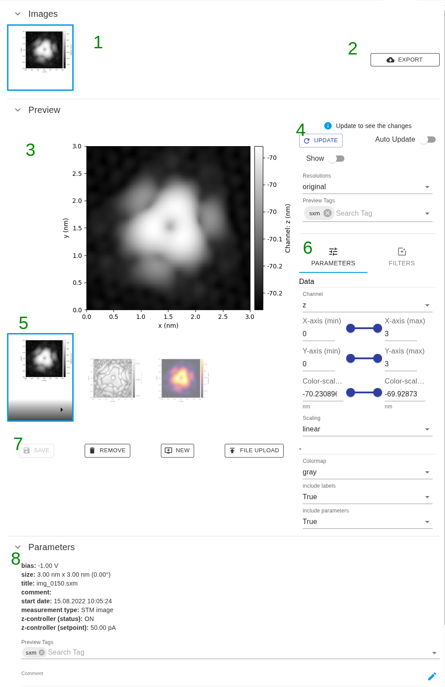

1. [Image list](#visualizing-imaging-data-of-a-dataset)
2. [Export button](#export)
3. Preview view
4. Viewer controls
5. Image preview list
6. [Preview parameters](#inputs)
7. [Preview controls](#default-preview-and-updating-a-preview)
8. [Preview metadata](#metadata)

### Visualizing Imaging Data of a DataSet

Every Imaging DataSet has a dedicated **Imaging DataSet Viewer** embedded directly in the form, above the
regular metadata fields. It lets you browse the images and previews contained in the dataset without having to
download the raw data.

An Imaging DataSet can contain:
- One or more **images**. The number of images is fixed when the dataset is created. (**1**)
- One or more **previews** per image. Previews can be freely added, updated or deleted afterwards. (**2**)

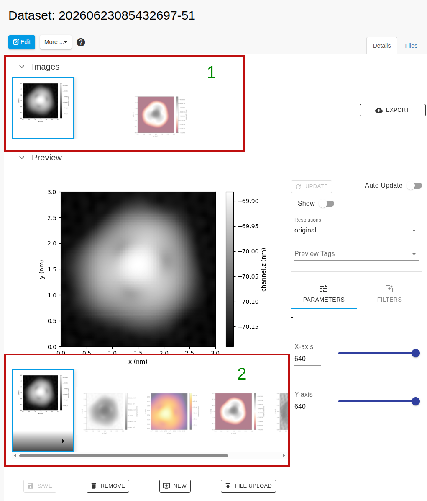

### Export
Every image can be exported, by default such parameters can be specified:
- whether to export generated previews or raw data
- preview file format
- archive format
- preview resolution

Additionally, depending on dataset configuration additional parameters can be specified.

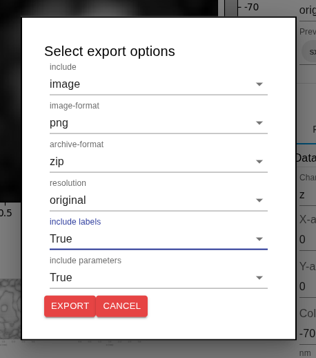

### Inputs

Each image can expose one or more **inputs** — controls that let you select which variant of the image is
displayed (for example a channel, a wavelength, a slice index, or an ingredient amount). Depending on the dataset
configuration, inputs are rendered as:

- **Slider** – pick a single value on a range. The value can also be typed in directly; out-of-range values are
  automatically snapped to the closest allowed value.
- **Range** – pick two values (a lower and upper bound) on a range.
- **Dropdown (single value)** – pick one value from a list.
- **Dropdown (multiple values)** – pick several values from a list.
- **Color picker** – pick an RGB color.

Some inputs are only shown when other inputs have a specific value (for example a "Dimension 2" slider that only
makes sense once a particular channel is selected).

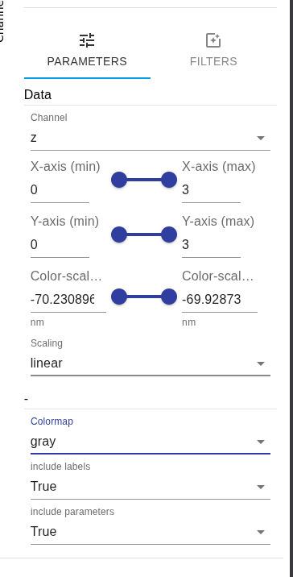

#### Playing through values

Any input can have a **play** button that automatically steps through its values. A speed slider controls how fast playback runs
for all players; if the connection cannot keep up with the requested speed, playback slows down rather than
skipping frames.

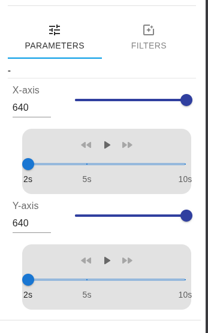

#### Filters

Adapter generating the preview can implement a set of image processing filters which will be applied onto image in user-defined order. 

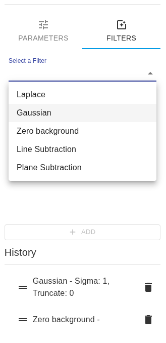

### Default Preview and Updating a Preview

#### Default preview

Ideally, every image of an Imaging DataSet should have at least one preview attached when the dataset is created.
If the data needed to render a preview is missing, the viewer shows a blank placeholder image with a cross instead
of failing.

#### Updating a preview

The Imaging DataSet Viewer lets you manage as many previews per image as you need, using the following actions:

| Button     | Effect                                                           |
|------------|------------------------------------------------------------------|
| **Update** | Recomputes the preview currently on screen.                      |
| **Upload** | Replaces the preview currently on screen with an uploaded image. |
| **New**    | Creates a new, blank preview.                                    |
| **Save**   | Saves the preview currently on screen as the selected preview.   |
| **Delete** | Deletes the preview currently on screen (asks for confirmation). |

All these actions block the viewer until they complete; only **Delete** asks for confirmation, the others take
effect immediately.

### Metadata

Each preview have a metadata section that can be filled by the adaptor with image and preview-related information.

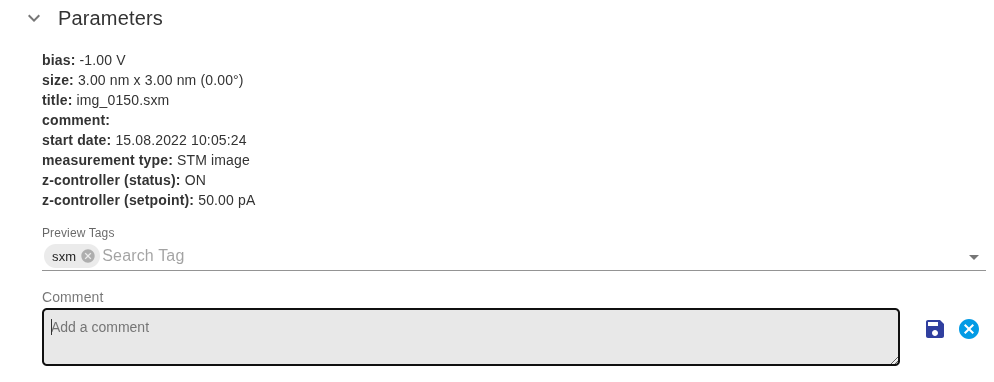

## Uploading Imaging Data

Imaging DataSets can be created like any other DataSet, for example through the ELN-LIMS DataSet Uploader, a Python
or JavaScript, or a dropbox. There is no dedicated API you are required to use. 

We strongly recommend using Pybis as it contains a set of helper functions for communication with Imaging Service. More information can be found [here](./../../apis/python-v3-api.md#imaging-technology)

What makes a DataSet "imaging aware" is an internal property, `IMAGING_DATA_CONFIG`, which describes the images,
previews and input controls available for that dataset. This property is normally filled in automatically by the
tool or script that produces the dataset; as a user you generally do not need
to edit it by hand.

If a DataSet is uploaded without this property being set, the Imaging DataSet Viewer still opens, but shows a
single blank image with no controls. You can still attach a static preview manually.

### Updating configuration

It is possible to update dataset configuration manually. Under **More** button, **Update imaging config** option allows for upload of a JOSN file with new dataset configuration. An example of such configuration can be found [here](./as-imaging.md#imaging_data_config)

Using this option will not damage the raw data but will wipe out the current configuration (your current images and previews as well). We discourge usage of this option unless it is absolutely necessary.

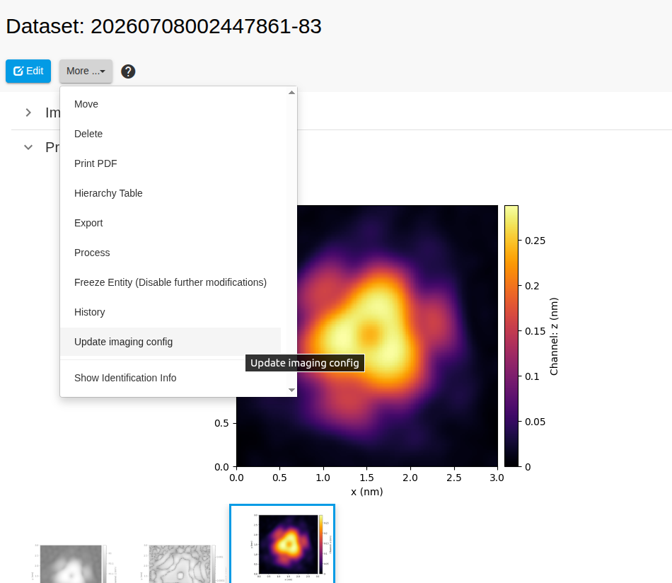

## Visualizing Several DataSets

Besides looking at one DataSet at a time, imaging data can be browsed in bulk at the Collection level,
using two complementary views: a **Gallery View** and a **List View**. Which view (if any) is shown by
default for an Object, Collection or DataSet is configured through the `DEFAULT_OBJECT_VIEW`,
`DEFAULT_COLLECTION_VIEW` and `DEFAULT_DATASET_VIEW` properties.

### Gallery View

The Gallery View shows the previews of all Imaging DataSets found in a Collection as a grid of
thumbnails. It offers:

- **Quick filter** – type one or more terms in the search field to filter out previews whose properties do not
  match. Terms are combined with AND/OR.
- **Pagination** – choose how many items are shown per page and jump between pages, using the same controls as in
  regular openBIS tables.
- **Show All toggle** – switch between showing only the previews flagged to be shown by default, or all previews.
- **Show Controls toggle** – mark previews to be included in an export.
- **Open in DataSet form** – clicking a preview opens the corresponding DataSet form, where the full Imaging
  DataSet Viewer with all its controls is available. More than one preview in the gallery can point to the same
  DataSet.

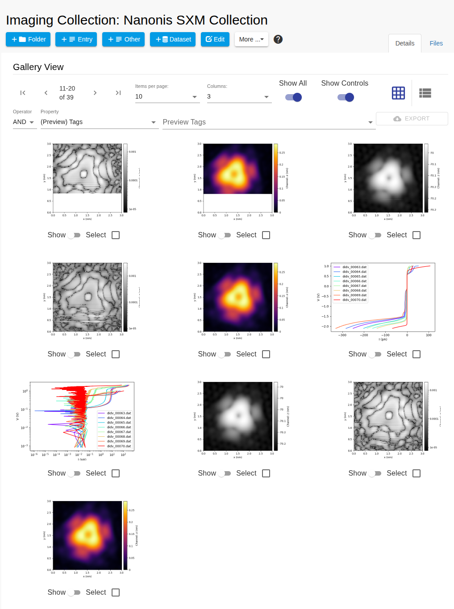

### List View

The List View shows Imaging DataSets at the Experiment or Experimental Step level as a list, one row per dataset,
combining a preview with a limited set of metadata:

- Only the properties from the **first metadata section** of the DataSet Type are shown, together with the
  `COMMENTS` property. Place the properties you consider most relevant for browsing in the first section of your
  type.
- The `COMMENTS` property can be edited directly from the List View as plain text; no other property can be
  modified from this view.
- The same **quick filter**, **show/hide toggle** and **select toggle** available in the Gallery View are also
  available here.
- Clicking a preview opens the DataSet form, exactly as in the Gallery View.

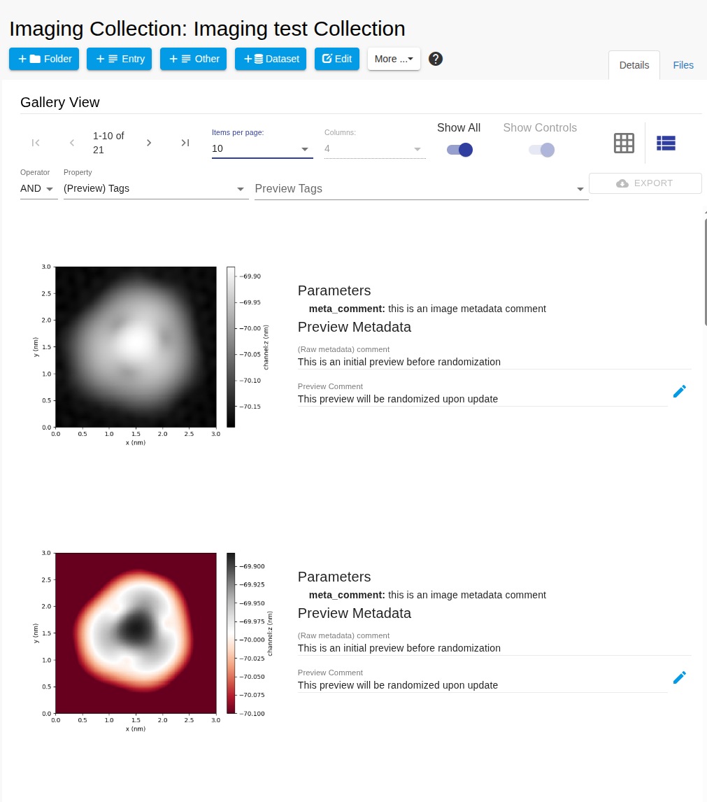

## Creating a Plain Image DataSet

You can still use the regular DataSet Uploader to create a DataSet by simply uploading files, without any imaging
configuration. In that case `IMAGING_DATA_CONFIG` is left blank and the Imaging DataSet Viewer shows a single blank
image without any controls. A preview can still be attached manually afterwards.

## Error Handling

If `IMAGING_DATA_CONFIG` is set but its content cannot be parsed, the Imaging DataSet Viewer reports an error and
becomes unusable for that dataset. Check the property value, or recreate/repair it using the tool that generated
the dataset.

## Spectra Locator

For datasets of type NANONIS .dat, an additional **Spectra Locator** component is shown in the ELN-LIMS. 
It offers a dropdown listing the NANONIS .sxm datasets found in the same Collection, letting
you locate where on the corresponding 2D scan a given 1D spectrum was acquired.

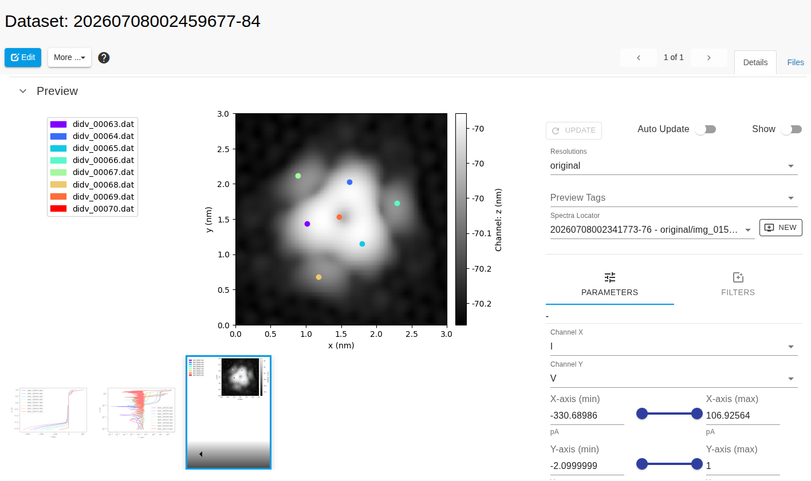