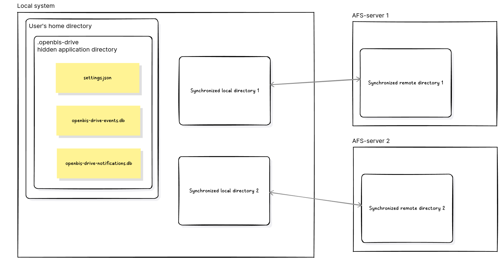
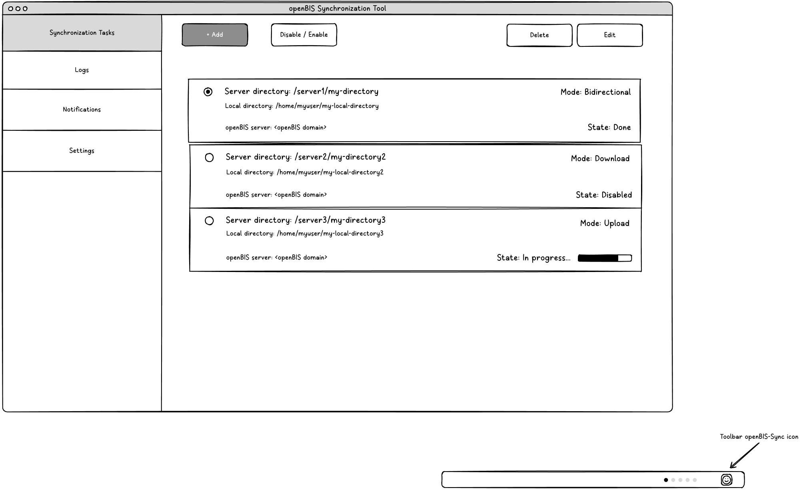
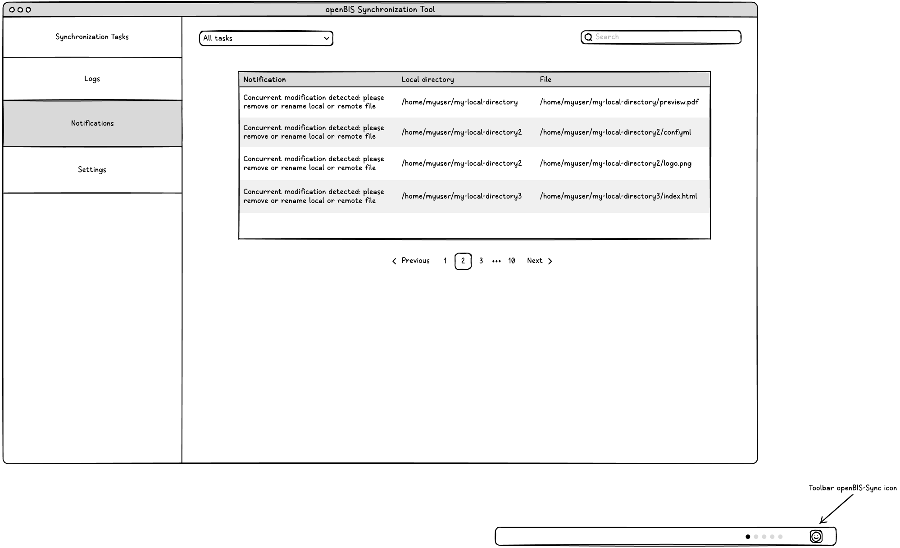
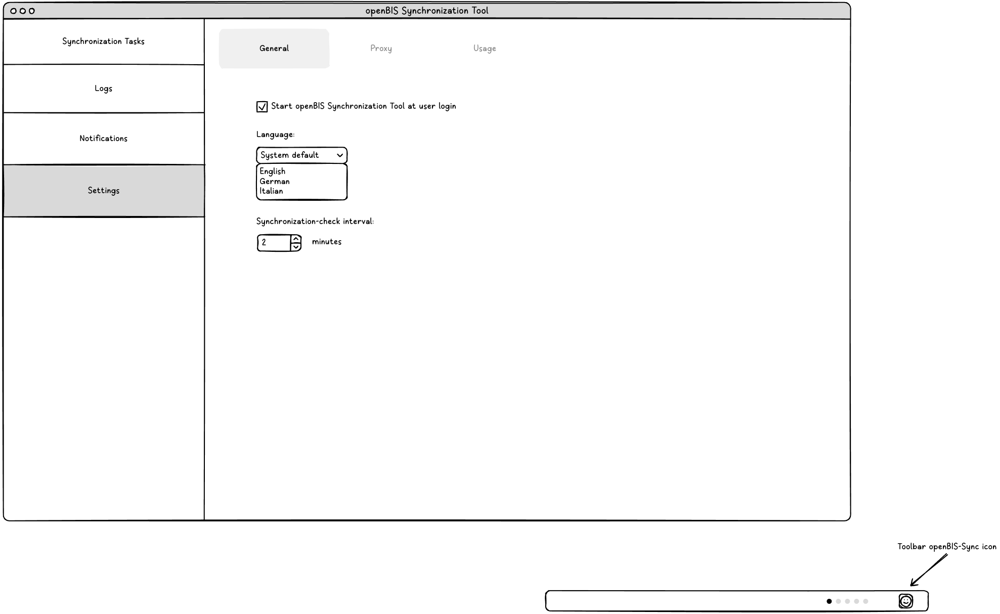
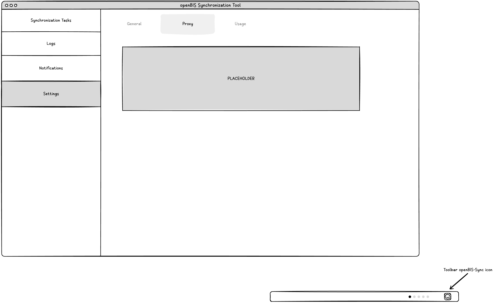
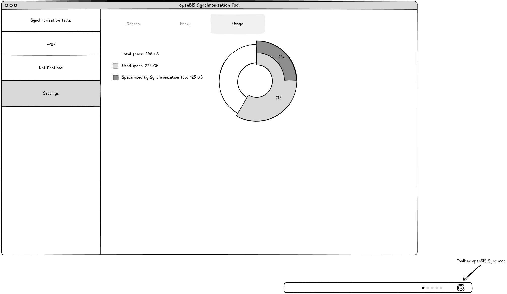
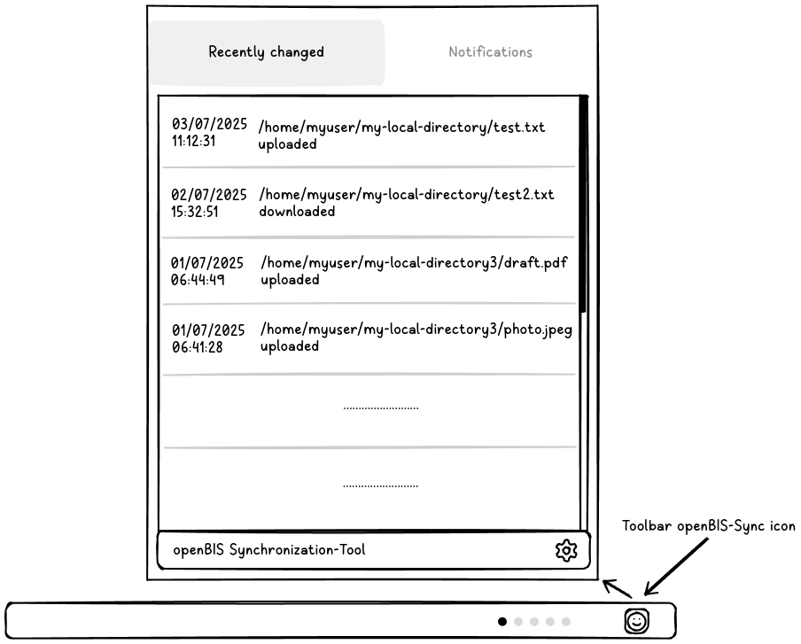
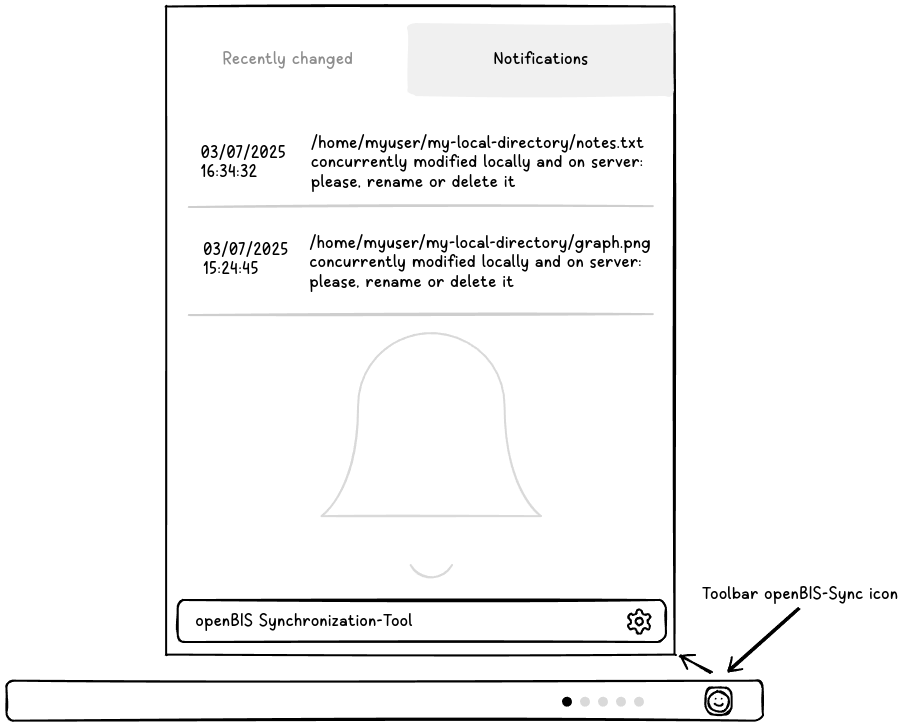
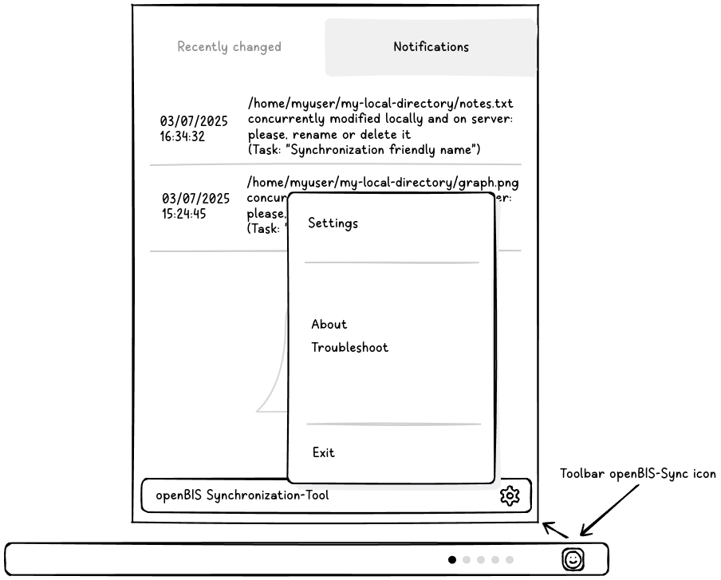

# App openBIS Drive

## Overview
The application openBIS-Drive is the combination of:
- A background Java server application run as a service. 
- A command-line application that can communicate with the service to configure it and oversee its status.
- A graphical desktop application that can communicate with the service to configure it and oversee its status.

Whose purpose is to keep unidirectional or bidirectional synchronization between local directories and AFS-server directories.



## Config and application files

In the local user's home-directory the application stores a hidden directory `.openbis-drive` with the following files:

- `settings.json` : a JSON serialization of the `Settings` object (see model)
- `openbis-drive-events.db` : SQLite file containing SyncJobEvents (see model for `Event`)
- `openbis-drive-notifications.db` : SQLite file containing `Notification` items (see model)

## Application Data Model

```java

public class Settings {
    private boolean startAtLogin;
    private String language;
    private int syncInterval; //Seconds
    private ArrayList<@NonNull SyncJob> jobs;
    //TODO Proxy proxy;
}
```
```java
public class SyncJob {
    public enum Type { Bidirectional, Upload, Download }

    @NonNull private Type type;
    @NonNull private String openBisUrl;
    @NonNull private String openBisPersonalAccessToken;
    @NonNull private String entityPermId;

    @NonNull private String remoteDirectoryRoot;
    @NonNull private String localDirectoryRoot;

    private boolean enabled;
}
```
```java
public interface Event {
    enum SyncDirection { UP, DOWN }

    @NonNull SyncDirection getSyncDirection();

    @NonNull String getLocalFile();

    @NonNull String getRemoteFile();

    boolean isDirectory();

    boolean isSourceDeleted();
    
    @NonNull Long getTimestamp();

    @NonNull String getLocalDirectoryRoot();
}
```
```java
public class SyncJobEvent implements Event {
    /*
     * These 3 properties are the key of the table
     */
    @NonNull private final SyncDirection syncDirection;
    @NonNull private final String localFile;
    @NonNull private final String remoteFile;

    private final boolean directory;
    private final boolean sourceDeleted;

    /*
     * These 2 properties identify the job, so we can clear all data belonging to a job when this is deleted
     */
    @NonNull private final String entityPermId;
    @NonNull private final String localDirectoryRoot;

    /*
     * These 2 properties track the changes on the files
     */
    @NonNull private final Long sourceTimestamp;
    private final Long destinationTimestamp;

    @NonNull private final Long timestamp;
}
```
```java
public class Notification {
    public enum Type { Conflict, JobStopped, JobException }

    // Primary key
    @NonNull private final Type type;
    @NonNull private final String localDirectory;
    private final String localFile;
    private final String remoteFile;
    //

    @NonNull private final String message;
    @NonNull private final Long timestamp;
}
```


### Settings
Local settings of the application contain the following information:

- start-at-login option: if true, the application is added to the services which are started by the system when the user logs in
- language
- synchronization interval (the time-interval between synchronization checks)
- the list of registered `SyncJob` items, that is to say, the bindings between local and remote directories

### Sync Jobs
This is the descriptor of a binding between a local and a remore directory. It contains:

- type: `Upload`, `Download` or `Bidirectional`
- path of the local directory
- coordinates to the remote directory: 
  - AFS-server url 
  - a personal-access-token for authentication
  - an entity-perm-id (owner-id) to identify the AFS-server owned compartment
  - the absolute path of the remote directory inside the entity-perm-id root
- an indication of enabled or disabled state

`SyncJob` items are stored in `Settings` in the local configuration JSON file `$USER_HOME/.openbis-drive/settings.json`.

### Events
The application is meant to show information about transfer events through the `Event` interface, which exposes:
- the type of the event (for file transfers: upload or download)
- the path of the local root-directory on which the sync-job operates
- the paths of the local and remote files involved
- a timestamp

Internally, the application uses a richer structure called `SyncJobEvent` (which implements `Event`) to keep track of synchronizations:
this also contains last modification timestamps of source and destination files related to a synchronization event.
This allows to check which of the two copies of a file has or has not changed in subsequent synchronization cycles.

`SyncJobEvent` items are stored in a SQLite database `$USER_HOME/.openbis-drive/openbis-drive-events.db`.

### Notifications
The application locally stores notifications about critical events, which need the user's attention.
Notifications may be shown as desktop-notifications.

Notification items contain the following information:
- the type of the notification (for example: version conflict between local and server files, a stopped job)
- the path of the local root-directory on which the sync-job operates
- the paths of the local and remote files involved
- a message to communicate any required action to the user
- a timestamp

Notifications are meant to be consultable by the user through the various clients.

`Notification` items are stored in a SQLite database `$USER_HOME/.openbis-drive/openbis-drive-notifications.db`.

## Client/Server Communication

### Background-service exposed interface

The application background service allows clients to:
- read and write `Settings`
- list, add, remove, start and stop synchronization `Jobs`
- read `Notifications`
- read `Events`

```java
public interface DriveAPI {
    void setSettings(@NonNull Settings settings);
    @NonNull Settings getSettings();

    @NonNull List<SyncJob> getSyncJobs();
    void addSyncJobs(@NonNull List<SyncJob> syncJobs);
    void removeSyncJobs(@NonNull List<SyncJob> syncJobs);
    void startSyncJobs(@NonNull List<SyncJob> syncJobs);
    void stopSyncJobs(@NonNull List<SyncJob> syncJobs);

    @NonNull List<Notification> getNotifications(@NonNull Integer limit);
    @NonNull List<Event> getEvents(@NonNull Integer limit);
}
```

## Synchronization Workflows

### Upload

An upload job scans the file-tree of the local directory and for each file:
- if the remote copy of the file is absent (no collision): it creates it on the server

- if the remote copy of the file exists (collision):

    - if a SyncJobEvent of a past synchronization between the two files is present:
      - if neither file turns out to be changed with respect to that: nothing happens
      - if the destination (remote file) turns out to be changed with respect to that: a conflict notification is raised
      - if only the source (local file) turns out to be changed with respect to that: it is uploaded to the remote
  
    - if no SyncJobEvent of a past synchronization between the two files is there:
      - if the source (local) has a later or equal last-modification-time: it is uploaded to the remote
      - if the destination (remote) has a later last-modification-time: a conflict notification is raised
      

### Download

A download job scans the file-tree of the remote directory and for each file:
- if the local copy of the file is absent (no collision): it creates it on the local system

- if the local copy of the file exists (collision):

    - if a SyncJobEvent of a past synchronization between the two files is present:
        - if neither file turns out to be changed with respect to that: nothing happens
        - if the destination (local file) turns out to be changed with respect to that: a conflict notification is raised
        - if only the source (remote file) turns out to be changed with respect to that: it is downloaded to the local system

    - if no SyncJobEvent of a past synchronization between the two files is there:
        - if the source (remote) has a later or equal last-modification-time: it is downloaded to the local-system
        - if the destination (local) has a later last-modification-time: a conflict notification is raised

### Bidirectional

A bidirectional job scans the file-trees first of the local directory and then of the remote directory and for each file:
- if the destination copy of the file is absent (no collision):

  - if a SyncJobEvent of a past synchronization between the two files is present, then this means that the destination has been deleted and:
    - if the source has not been modified since: it gets deleted too
    - if the source has been modified since: it is transferred to the destination

  - if no SyncJobEvent of a past synchronization between the two files is there:
    - the source is transferred to the remote
    
- if the destination copy of the file exists (collision):

  - if a SyncJobEvent of a past synchronization between the two files is present:
      - if neither file turns out to be changed with respect to that: nothing happens
      - if only the destination turns out to be changed with respect to that: nothing happens now (but the transfer will happen the other way round when the job changes side, and source and destination will be inverted)
      - if only the source turns out to be changed with respect to that: it is transferred to the destination
      - if both have been modified: a conflict notification is raised

  - if no SyncJobEvent of a past synchronization between the two files is there:
      - if the source has a later or equal last-modification-time: it is transferred to the destination
      - if the destination has a later last-modification-time: nothing happens now (but the transfer will happen the other way round when the job changes side, and source and destination will be inverted)

### Exceptional situations requiring Notifications

A summary of the conditions which lead to raising a file-version-conflict `Notification`:

- in unidirectional mode: 
  - when the destination file turns out to be modified with respect to the last known synchronization state
  - when no previous synchronization state is known, but the destination turns out to have been modified later than the source

- in bidirectional mode:
  - when both files turn out to be modified with respect to the last known synchronization state
  - when the destination turns out to have been deleted since the last known synchronization state and, at the same time, the source has changed too

## Command Line Application

```java
public class DriveApp {

    /**
     * ./drive-app help
     * <p>
     * ./drive-app start
     * ./drive-app stop
     * ./drive-app status
     * <p>
     * Prints config on the standard output, in one line, fields separated by tabs
     * ./drive-app config
     * ./drive-app config -startAtLogin=true|false -language=eng syncInterval=120
     * <p>
     * Prints jobs on the standard output, one per line, fields separated by tabs
     * ./drive-app jobs
     * ./drive-app jobs add -type='Bidirectional|Upload|Download' -dir='./dir-a/dir-b' ...
     * ./drive-app jobs remove -dir='./dir-a/dir-b'
     * ./drive-app jobs start -dir='./dir-a/dir-b'
     * ./drive-app jobs stop -dir='./dir-a/dir-b'
     * <p>
     * Prints notifications on the standard output, one per line, fields separated by tabs
     * ./drive-app notifications -limit=100
     * <p>
     * Prints events on the standard output, one per line, fields separated by tabs
     * ./drive-app events -limit=100
     */
    public static void main(String[] args) {

    }
}
```

## Graphical Desktop Application

### Main Views

#### Landing Page / Sync Tasks


#### Sync Logs


#### Sync Notifications


### Settings Views

#### General Settings


#### Proxy Settings


#### Disk Usage Information


### Navbar Views

#### Recent Changes


#### Recent Notifications


#### Main Views Access

