**NEW FORMS**

**SPECIFICATION**

**\**

[**References**](#references)

[List of Fields](#list-of-fields)

[Access Right Management](#access-right-management)

[**1. Basic Form Visualization, No
Toolbar**](#basic-form-visualization-no-toolbar)

[Views](#views)

[Space Form](#space-form)

[Project Form](#project-form)

[Collection Form](#collection-form)

[Object Form](#object-form)

[DataSet Form](#dataset-form)

[Model](#model)

[Client-Server Communication](#client-server-communication)

[Form Rendering](#form-rendering)

[Requirements](#requirements)

[Functional Requirements](#functional-requirements)

[Non Functional Requirements](#non-functional-requirements)

[Adaptor to a single model, we can call this
AdaptorForm](#adaptor-to-a-single-model-we-can-call-this-adaptorform)

[But somewhere we need to build this adaptor DTO from the actual Entity,
EntityKind and
EntityType](#but-somewhere-we-need-to-build-this-adaptor-dto-from-the-actual-entity-entitykind-and-entitytype)

[**2. Basic Form Edit, Initial
Toolbar**](#basic-form-edit-initial-toolbar)

[Views](#views-1)

[Model](#model-1)

[Requirements](#requirements-1)

[Functional Requirements](#functional-requirements-1)

[Non Functional Requirements](#non-functional-requirements-1)

[**3. Basic Toolbar Actions**](#basic-toolbar-actions)

[Views](#views-2)

[Model](#model-2)

[Requirements](#requirements-2)

[Functional Requirements](#functional-requirements-2)

[**4. Form Creations**](#form-creations)

[Views](#views-3)

[Model](#model-3)

[Requirements](#requirements-3)

[Functional Requirements](#functional-requirements-3)

[**5. Form Visualization and Edit -- Part 2 (Muti-Valued
Fields)**](#form-visualization-and-edit-part-2-muti-valued-fields)

[Views](#views-4)

[Requirements](#requirements-4)

[Functional Requirements](#functional-requirements-4)

[**6. Form Visualization and Edit -- Part 3
(Spreadsheet)**](#form-visualization-and-edit-part-3-spreadsheet)

[Views](#views-5)

[Model](#model-4)

[Requirements](#requirements-5)

[Functional Requirements](#functional-requirements-5)

[**7. Advanced Toolbar Actions**](#advanced-toolbar-actions)

[Views](#views-6)

[Model](#model-5)

[Requirements](#requirements-6)

[Functional Requirements](#functional-requirements-6)

[**8. Form Visualization and Edit -- Part 4 (Parents/Child
widget)**](#form-visualization-and-edit-part-4-parentschild-widget)

[Views](#views-7)

[Model](#model-6)

[Requirements](#requirements-7)

[**9. Plugin System (To be used by ELN to integrate Storage and
other)**](#plugin-system-to-be-used-by-eln-to-integrate-storage-and-other)

[View](#view)

[Model](#model-7)

[Requirements](#requirements-8)

## **References**

### List of Fields

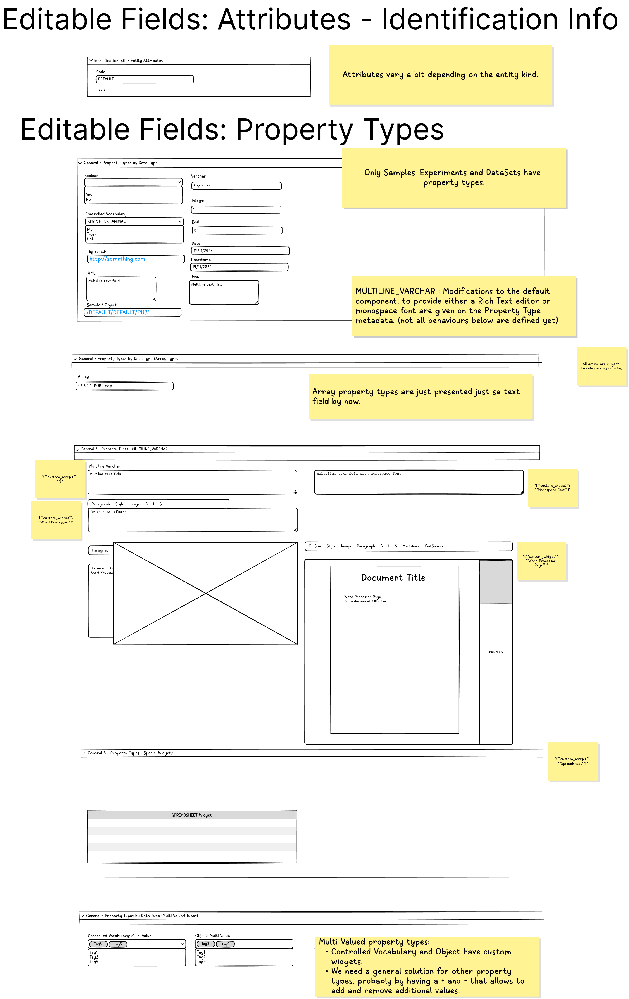

### Access Right Management

- Ideally we are not showing buttons for actions that a particular user
  cannot do.

- To know if a particular user can create/update/delete a particular ID
  the function getRights should be used. This function should be called
  as part of the data to be fetch to render the form.

public Map\<IObjectId, Rights\> getRights(String sessionToken, List\<?
extends IObjectId\> ids, RightsFetchOptions fetchOptions);

- Configuration of Roles on the system can be modified so there is no
  way of knowing the rights of a particular user given his role, calling
  this function is MANDATORY.

## **1. Basic Form Visualization, No Toolbar**

### Views

#### Space Form

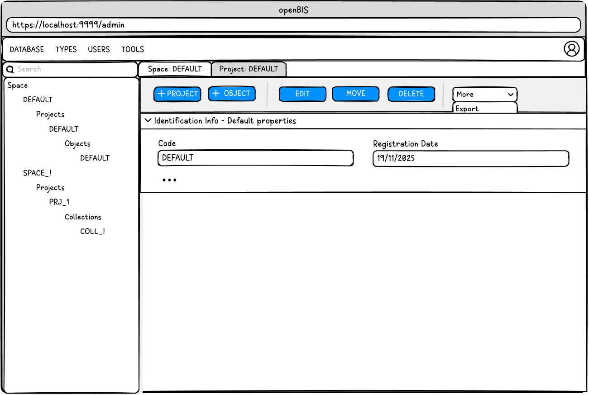

#### Project Form

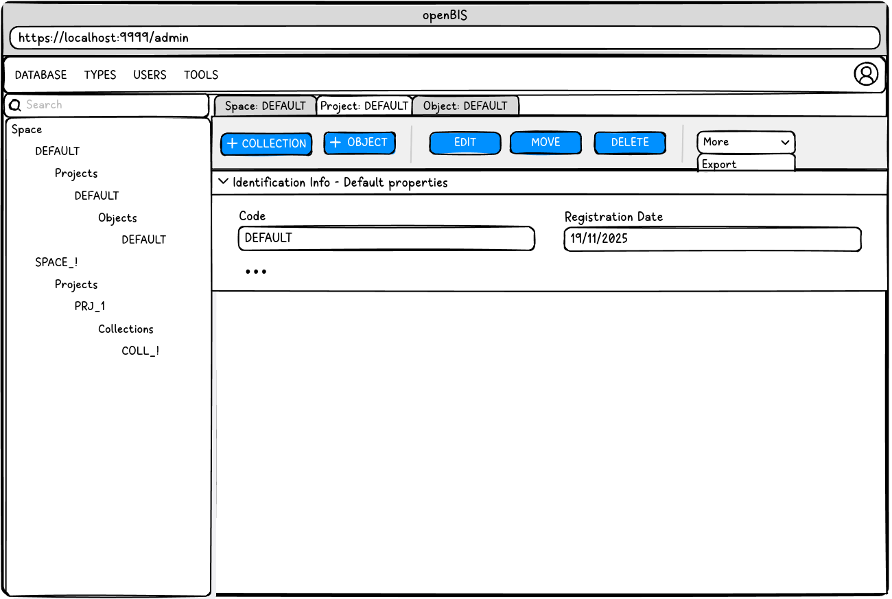

#### Collection Form

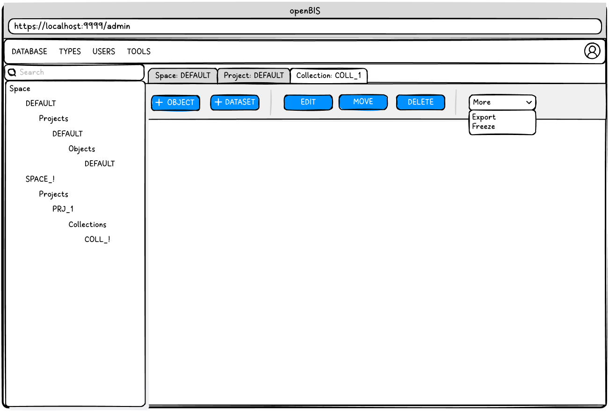

#### Object Form

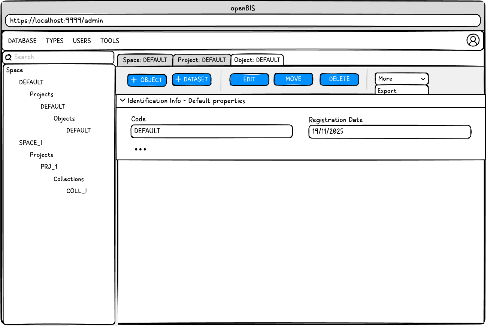

#### DataSet Form

### Model

#### Client-Server Communication

At all points of these specification we are using the existing openBIS
model.

There is no need to create or extend the model in any way.

ch.ethz.sis.openbis.generic.asapi.v3.dto.space.Space

ch.ethz.sis.openbis.generic.asapi.v3.dto.project.Project

ch.ethz.sis.openbis.generic.asapi.v3.dto.sample.Sample

ch.ethz.sis.openbis.generic.asapi.v3.dto.experiment.Experiment

ch.ethz.sis.openbis.generic.asapi.v3.dto.dataset.DataSet

#### Form Rendering

Take into account special behaviors for the text fields:

Data Type: MULTILINE_VARCHAR

Metadata: { "custom_widget" : "Word Processor" }

Metadata: { "custom_widget" : "Word Processor Page" }

Metadata: { "custom_widget" : "Monospace Font" }

### 

### Requirements

#### Functional Requirements

- Render for all 5 forms the **Identification Information** Section
  containing the attributes of the entities.

*Space*

Code

Description

*Project*

Code

Description

*Experiment*

Code

Project

Identifier

Experiment Type

*Sample*

Code

Space

Project

Experiment

Identifier

Sample Type

*DataSet*

Code

Experiment

Sample

DataSet Type

*For all 5 Forms*

Registrator

Registration Date

Modifier

Modification Date

*For forms with properties*

Property Type Assigned defined section

Property Type defined Fields (Basic, Arrays, CKEditor)

#### Non Functional Requirements

- All 5 forms use only the V3 API

- **All 5 forms to fetch the initial information and to do updates
  SHOULD o it transactionally in a single fetch call, using batch
  operations.**

- All 5 forms use a common model to render the form, to simplify
  extending them and maintaining them.

##### Adaptor to a single model, we can call this AdaptorForm

The next model is work in progress, don\'t take it as gospel.

1 DTO

A Form represents an Entity to be edited or manipulated in some way.

enum FormMode { view, new, edit }\
enum DataType { openbis-data-types + word-processor + spreadsheet }

Form\
- entityId \<- permId\
- title\
- List\<Field\>\
- meta

FormField\
- formFieldTypeId \<- PropertyType\
- Value\
- DataType\
- meta

##### But somewhere we need to build this adaptor DTO from the actual Entity, EntityKind and EntityType

We will encapsulate entity kind and type specific logic into the
controller of the form.

Every rendered Field should be updating its FormField model as the user
fill it.

+-----------------------------------------------------------------------+
| EntityForm(Form form, FormMode mode, FormController controller)       |
|                                                                       |
| private Form form;\                                                   |
| private FormMode mode;\                                               |
| private FormController controller;\                                   |
| private List\<Button\> toolbar;                                       |
|                                                                       |
| load() {\                                                             |
| This can happen outside of the main thread to load anything           |
| necessary\                                                            |
| controller.load(form, mode);\                                         |
| }                                                                     |
|                                                                       |
| render() {\                                                           |
| }                                                                     |
|                                                                       |
| save() {\                                                             |
| controller.save(form, mode);\                                         |
| }                                                                     |
|                                                                       |
| edit() {\                                                             |
| controller.edit(form, mode);\                                         |
| }                                                                     |
|                                                                       |
| delete() {\                                                           |
| controller.delete(form);\                                             |
| // Leave not implemented\                                             |
| }                                                                     |
|                                                                       |
| move() {\                                                             |
| controller.move(form);\                                               |
| // Leave not implemented\                                             |
| }                                                                     |
|                                                                       |
| checkPermissions() {                                                  |
|                                                                       |
| }                                                                     |
+=======================================================================+

##  **2. Basic Form Edit, Initial Toolbar**

### Views

Same as previous section

### Model

Same as previous section

### Requirements

#### Functional Requirements

Edit/Save

- Editable attributes

- Properties

Autosave feature

Conflict resolution

#### Non Functional Requirements

- We should have an extensible toolbar where the form attaches its
  buttons and allow to attach others.

- Only actions that can be done by the user should attach buttons. For
  that you need to check the user rights. There is a call on the V3 API
  for this, is used on the ELN.

- Client side, auto-save, maybe once a minute, maybe the user can
  enable/disable the feature with a sidebar at the top of the form.

- Conflict resolution, avoid editing entities of a different version.
  Provide feed back to the user if properties collide so he can edit it.
  If properties don\'t collide it can be resolved silently.

##  **3. Basic Toolbar Actions**

### Views

Same as previous section

Object Move

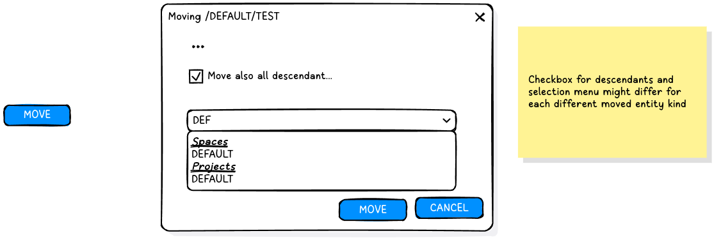

Project Delete

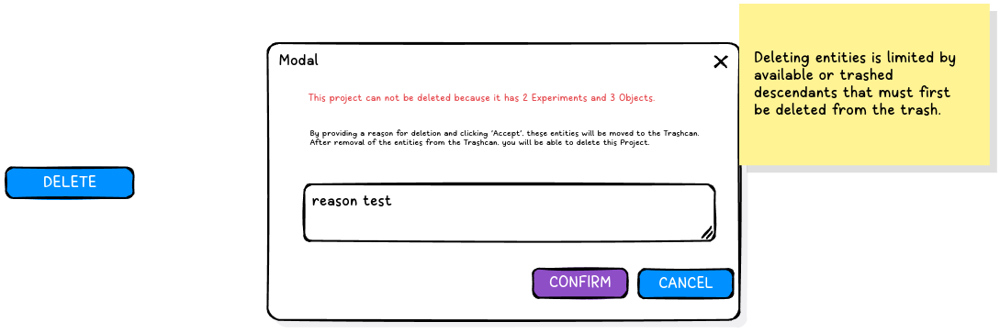

### Model

Same as previous section

### Requirements

#### Functional Requirements

MOVE

- Move Space: Spaces cannot be moved, don't show the button

- Move Project: Projects can be moved between spaces.

- Move Collections: Collection can be moved between projects.

- Move Object: Objects can be moved between spaces, projects and
  collections.

- Move DataSets: DataSets can be moved between objects and collections.

DELETE

- Delete Space: Delete space immediately, the space needs to be empty.
  Show a warning if not empty.

<!-- -->

- Delete Project:

  - If the project is empty: Delete project immediately, the project
    needs to be empty. Show a warning if not empty.

  - If the project is non empty: Allows to move all its entities to the
    trashcan.

<!-- -->

- Delete Collection: Moves to trashcan the collection and all its
  objects and datasets.

<!-- -->

- Delete Object: Moves to trashcan the object and all its datasets.
  **Optionally, a checkbox to trash the descendants object and all its
  datasets can be selected.**

<!-- -->

- Delete Dataset: Moves to trashcan the dataset. **Optionally, a
  checkbox to trash the descendants datasets.**

## **4. Form Creations**

### Views

Same as previous section

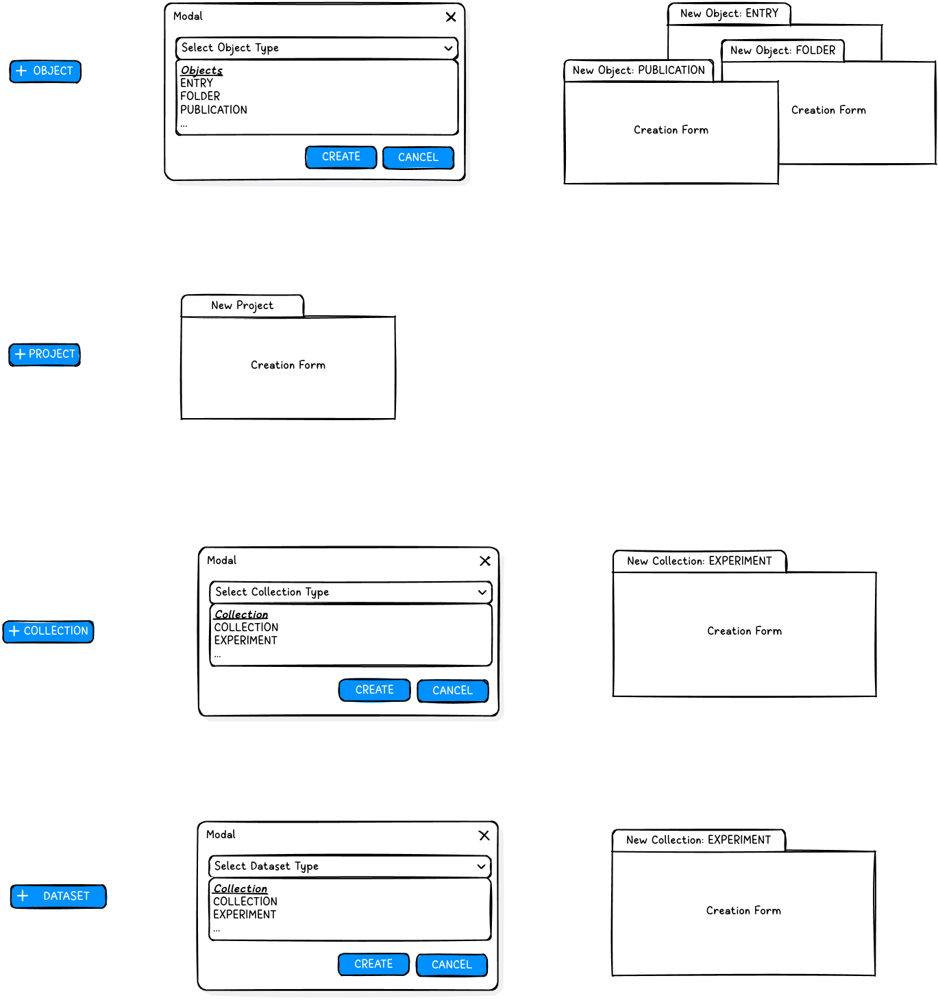

### Model

Same as previous section

### Requirements

#### Functional Requirements

- Create Space: Not to be done at this moment.

- Create Project:

  - Action Initiated from the Space Form.

- Create Collection:

  - Action initiated from the Project Form

  - A dropdown to select the Experiment Type is shown to select it.

<!-- -->

- Create Object:

  - Action initiated from the Space Form, Project Form, Experiment Form,
    Object Form.

  - A dropdown to select the Sample Type is shown to select it.

<!-- -->

- Create DataSet:

  - Action initiated from the Object Form and Experiment Form.

  - A dropdown to select the DataSet Type is shown to select it.

## **5. Form Visualization and Edit -- Part 2 (Muti-Valued Fields)**

### Views

Same as previous section

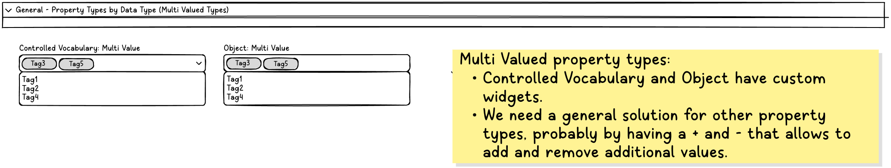Model

Same as previous section

On the V3 API, looking at AbstractEntityPropertyHolder.java we can see
that:

Array properties are represented as arrays, ex: Long\[\]

Multi valued properties are represented as lists, ex: List\<Long\>

Multi valued array properties combine both, ex: List\<Long\[\]\>

Sample, Experiment and DataSet DTOs should implement
AbstractEntityPropertyHolder that implements the serialization and
deserialization of compound data types.

To read and write any properties but specially compound data types the
get and set methods of the DTOs should be used. Even if luckily in
Javascript arrays and lists are represented the same way.

### Requirements

#### Functional Requirements

- Data Types (multi valued)

  - For known values:

    - Objects: Multi-select dropdown with as you type

    - Vocabulary Term: Multi-select dropdown with as you type

  - For open ended values:

    - Other: Show the single value field, with a plus and a minus to add
      and remove values.

## **6. Form Visualization and Edit -- Part 3 (Spreadsheet)**

### Views

Same as previous section

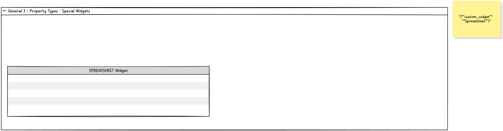

### Model

Same as previous section

Data Type: XML

Metadata: { "custom_widget" : "Spreadsheet" }

### Requirements

#### Functional Requirements

- Integrate spreadsheet component:

  - <https://bossanova.uk/jspreadsheet/>: jspreadsheet community edition
    with support for formulas.

  - It should be implemented reading and writing the same model as used
    by the ELN on the properties. There is a Spreadsheet DTO.

## **7. Advanced Toolbar Actions**

### Views

Same as previous section

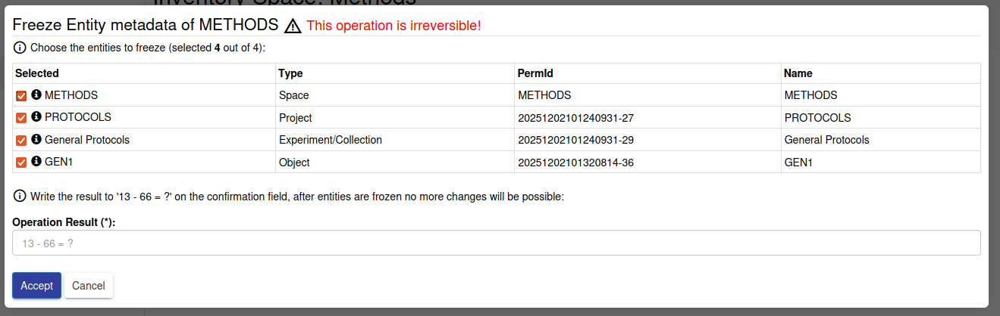

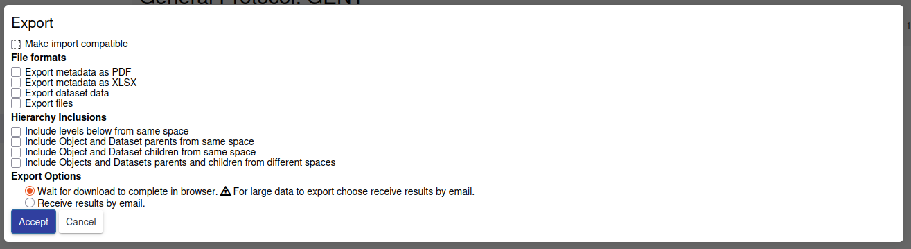

### Model

Same as previous section

### Requirements

#### Functional Requirements

- Freeze

  - During a freeze metadata operation the downstream entities of the
    selected entity are shown, and the user is given the opportunity to
    make them part of the freeze operation.

  <!-- -->

  - Collections and Objects do have a second operation, "freeze data",
    same behavior as the previous one but setting the other flag.

  <!-- -->

  - During the freeze operation, an update is sent to the SELECTED
    entities, marking their freeze or freeze data flag to TRUE.

  - If an entity is frozen, it cannot be edited.

- Freeze Flags to be used, when freeze an entity for metadata:

  - Space: frozen, frozenForProjects, frozenForSamples

  - Project: frozen, frozenForExperiments, frozenForSamples

  - Experiment: frozen, frozenForSamples

  - Sample: frozen, frozenForComponents

  - DataSet: frozen, frozenForComponents, frozenForContainers

<!-- -->

- Freeze Flags to be used, when freeze an entity for data:

  - Experiment: frozenForDataSest

  - Sample: frozenForDataSets

<!-- -->

- Space/Project/Collection/Object/DataSet Export:

  - They can reuse the same pop component, but when calling the export
    API, they are calling it, using their ID.

## **8. Form Visualization and Edit -- Part 4 (Parents/Child widget)**

### Views

Same as previous section

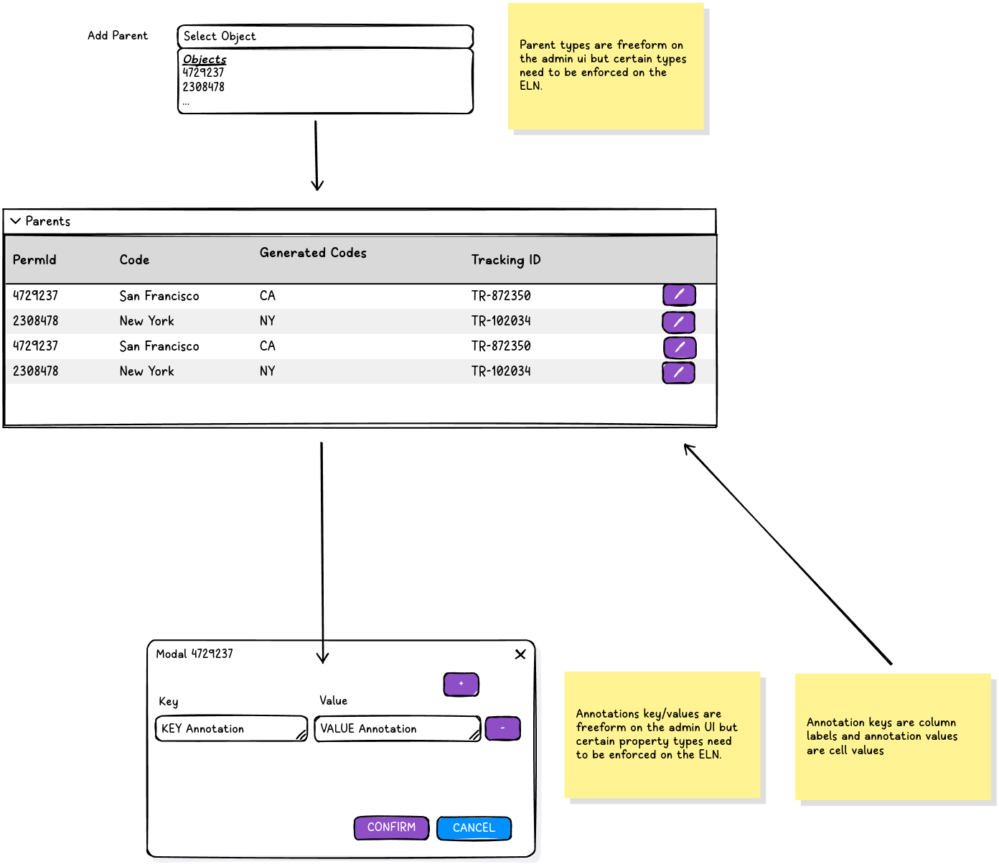

### Model

Same as previous section

### Requirements

Same as previous section

## 

## **9. Plugin System (To be used by ELN to integrate Storage and other)**

### View

Same as previous section

### Model

Same as previous section

### Requirements

#### Functional Requirements

- This part should be tackle prior to the ELN integration.

- Should be possible to specify additional components in certain parts
  of the form, at the very least at the top and bottom but a more
  polyvalent interface can be suggested. The end goal is to be able to
  plug the plugin components given by the ELN plugin interface on the
  form. Even if needs to be accepted that such plugins may need to be
  adapted to work properly with the new Forms.
