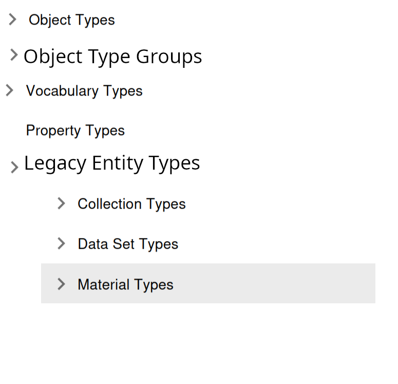

# Type Groups

## Description

Type Groups is a functionality that allows for aggregation of sample types in groups according to business rules. 
This is a many-to-many relationship connection: any sample type can be assigned to any type group. Any sample type can be assigned to multiple Type Groups. 

Type Groups improve search functionalities for sample types in case more complex division of types is needed depending on the business rules.

### Internal Type Groups and internal Type Group Assignment

Type Group can have an internal flag set - this group can only be managed by a system user (creation, update, deletion).
Internal Type Group Assignment is an assignment of Sample Type to a Type Group that can be only managed by the system user (creation, deletion)

Internal Type Group Assignment happen only between Internal Sample Type and Internal Type Group!

## Implementation proposal

### DB changes

Estimation: 2d

New tables additional tables:
- TypeGroups
- SampleTypeTypeGroups

#### TypeGroups table

| column                 | DB type        | description                                    |
|------------------------|----------------|------------------------------------------------|
| name                   | CODE (unique)  | name of the type group (unique)                |
| registration_timestamp | TIME_STAMP_DFL | time of the type group registration            |
| pres_id_registerer     | TECH_ID        | id of person registering it                    |
| is_managed_internally  | BOOLEAN_CHAR   | flag describing whether type group is internal |
| meta_data              | JSONB          | meta data for the particular type group        |

SQL changes:
``` sql
CREATE TABLE TYPE_GROUPS (
    NAME CODE NOT NULL,
    PERS_ID_REGISTERER TECH_ID NOT NULL,
    REGISTRATION_TIMESTAMP TIME_STAMP_DFL NOT NULL,
    IS_MANAGED_INTERNALLY BOOLEAN_CHAR NOT NULL DEFAULT 'F',
    META_DATA JSONB
);

ALTER TABLE TYPE_GROUPS ADD CONSTRAINT TYPE_GROUPS_PK PRIMARY KEY(NAME);

ALTER TABLE TYPE_GROUPS ADD CONSTRAINT TG_PERS_FK FOREIGN KEY (PERS_ID_REGISTERER) REFERENCES PERSONS(ID) DEFERRABLE INITIALLY DEFERRED;
```


#### SampleTypeTypeGroups table

| column                | DB type      | description                                                       |
|-----------------------|--------------|-------------------------------------------------------------------|
| SATY_ID               | TECH_ID      | sample type id                                                    |
| TG_ID                 | CODE         | type group id (name)                                              |
| pres_id_registerer    | TECH_ID      | id of person registering it                                       |
| is_managed_internally | BOOLEAN_CHAR | boolean flag describing whether type group assignment is internal |

```sql

CREATE TABLE SAMPLE_TYPE_TYPE_GROUPS (
    SATY_ID TECH_ID NOT NULL,
    TG_ID CODE NOT NULL
    PERS_ID_REGISTERER TECH_ID NOT NULL, 
    REGISTRATION_TIMESTAMP TIME_STAMP_DFL NOT NULL,
    IS_MANAGED_INTERNALLY BOOLEAN_CHAR NOT NULL DEFAULT 'F'
)

ALTER TABLE SAMPLE_TYPE_TYPE_GROUPS ADD CONSTRAINT SAMPLE_TYPE_TYPE_GROUPS_UK UNIQUE (SATY_ID, TG_ID);


ALTER TABLE SAMPLE_TYPE_TYPE_GROUPS ADD CONSTRAINT STTG_SATY_FK FOREIGN KEY (SATY_ID) REFERENCES SAMPLE_TYPES(ID) ON DELETE CASCADE;
ALTER TABLE SAMPLE_TYPE_TYPE_GROUPS ADD CONSTRAINT STTG_TG_FK FOREIGN KEY (TG_ID) REFERENCES TYPE_GROUPS(NAME) ON DELETE CASCADE;
ALTER TABLE SAMPLE_TYPE_TYPE_GROUPS ADD CONSTRAINT STTG_PERS_FK FOREIGN KEY (PERS_ID_REGISTERER) REFERENCES PERSONS(ID) DEFERRABLE INITIALLY DEFERRED;

CREATE INDEX STTG_SATY_FK_I ON SAMPLE_TYPE_TYPE_GROUPS (SATY_ID);
CREATE INDEX STTG_TG_FK_I ON SAMPLE_TYPE_TYPE_GROUPS (TG_ID);
CREATE INDEX STTG_PERS_FK_I ON SAMPLE_TYPE_TYPE_GROUPS (PERS_ID_REGISTERER);

```
### API changes

Estimation: 2d

1. Introduction of `typegroup` package to V3 API containing classes for:

- creation
- deletion (without trash)
- get
- search
- assignment

updates can update the name/fetchoptions for assignments

2. Changes to `sample` package in V3 API (sample package contains sampletype V3 classes)

- Expansion of fetchoptions to include type group assignments
- Expansion of create/update to include type group assignments


### AS changes

Estimation: 8d

- Executors for creation/deletion/update/search need to be created for Type Groups and Type Group Assignment
- Sample Type executors need to be amended to include Type Group Assignment information

#### DTO classes
- TypeGroupsPE, SampleTypeTypeGroups, SampleTypeTypeGroupsId


#### Data Import/Export

- Importer needs to be amended to include Type Group and Type Group Assignment information
- Exporter needs to export Type Groups and Type Groups Assignments in import-compatible way


### DSS/AFS changes
DSS/AFS are not aware of Type Group existance, no change is needed


### UI changes

#### ADMIN UI

Estimation: 5d


- Changes on the `Left Side Navigation Menu`: As shown on the image below, there is a new section called `Object Type Groups` where
type groups are. There a second new Section called `Legacy Entity Types` where `Collections`, `Datasets` and `Materials`
will be grouped.



- Changes on the `Object Type Form`: A table showing the `Object Type Groups` the type belongs to is shown, 
on edit mode is possible to add/remove new groups to this table. (internal assignments can not be deleted by non system user)

- New View `Object Type Groups Table`: This view is just a table with the list of groups, is shown when the user clicks over `Object Type Groups`.
- New View `Object Type Group Form`: This view is shown when clicking over a singular group, it has a single table with 
the list of `Object Types` that belong to that group, in edit mode is possible to add/remove new types to the table.  (internal assignments can not be deleted by non system user)


#### Task 2: ELN UI

- Need to add Type Groups filtering on the sample tables, specially parents and children tables.
- Need to add Type Groups filtering to the new Graph View when this view is rewritten.

### Task 3: PyBIS changes

Estimation: 2d

- only get/search functionalities for type groups and type group assignments in sample types
