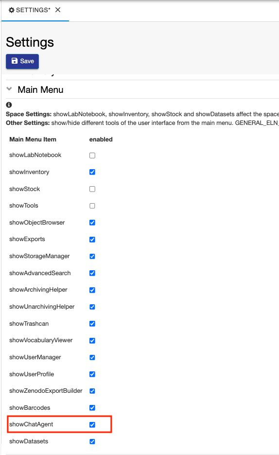
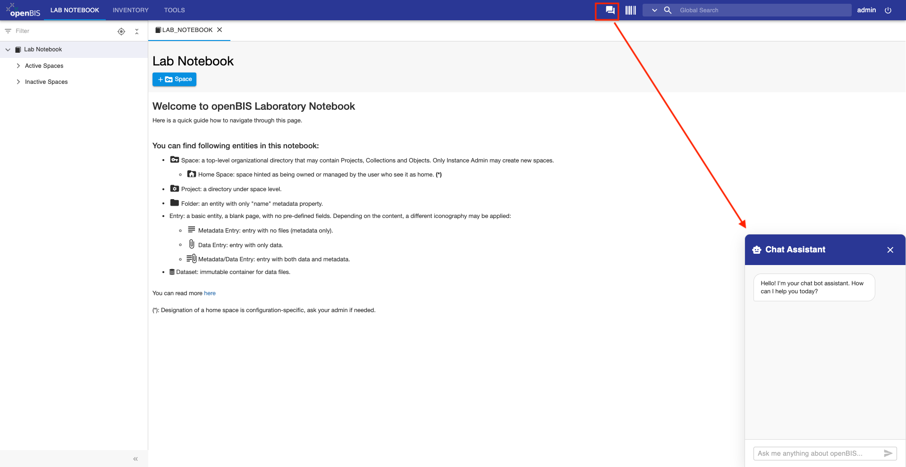
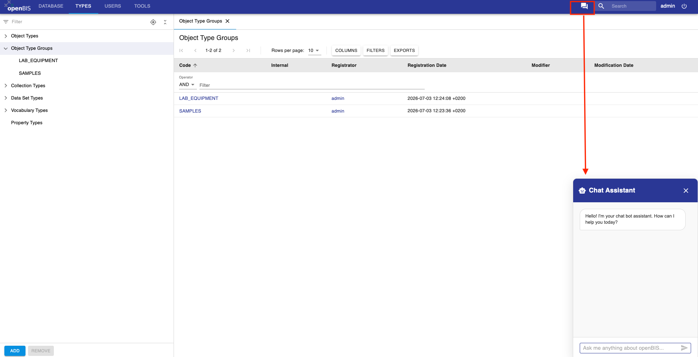

Enable chatbot
====

openBIS 7.0 provides a User interface component for a chatbot. An own model need to be used to be able to make use of this functionality.

The chatbot can be enabled for both ELN and admin interfaces from the ELN interface, under **Settings**.

The chatbot can be started by clicking the icon next to the search, bot in the ELN UI, as shown below:

and admin UI, as shown below.

