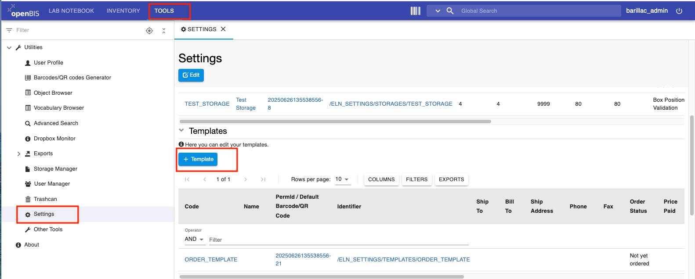
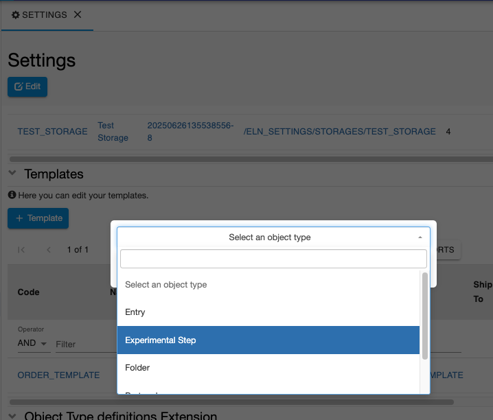
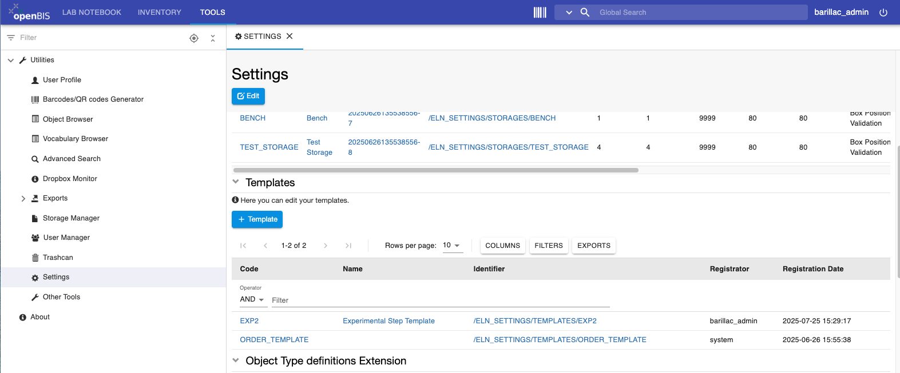

# Create Templates for Objects

  
It is possible to create templates for *Objects*. Templates are useful
when one has to register repetitive *Experimental steps* or other types of
*measurements* where some fields should be pre-defined.

For each *Object* type several templates can be created. This can be
done by the lab manager, who should have admin rights for editing the
**ELN Settings**. It is not necessary to be *Instance admin* for this. 

In a multi-group set up, this can be done by the *group admin*.

  
Procedure:  
  

1.  Go to the **Settings**, under **Utilities** in the **Tools** tab.
2.  Scroll down to the **Templates** section

3.  From the **+Template** tab select select the *Object type* for which you want to have a template.

 

4.  Fill in the fields as desired.
5.  **Save.**

  
Your templates will be show in the table in the **Templates** section, as shown below

 

See [Use template for Experimental Steps](../../general-users/lab-notebook.md#use-templates-for-experimental-steps) for more info on how to use templates. 

