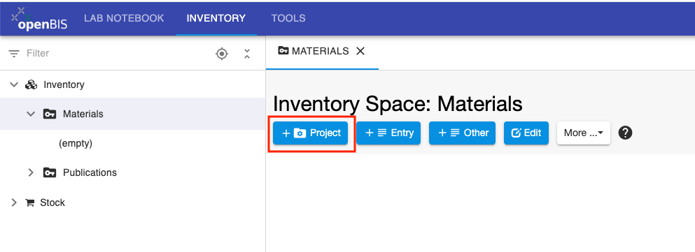
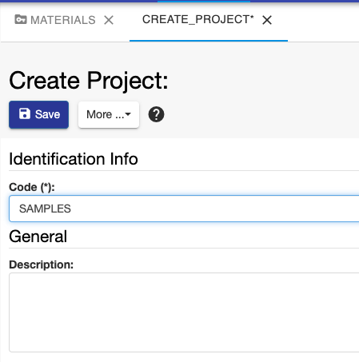
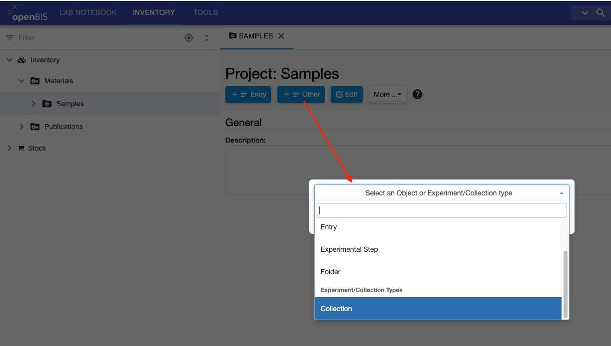
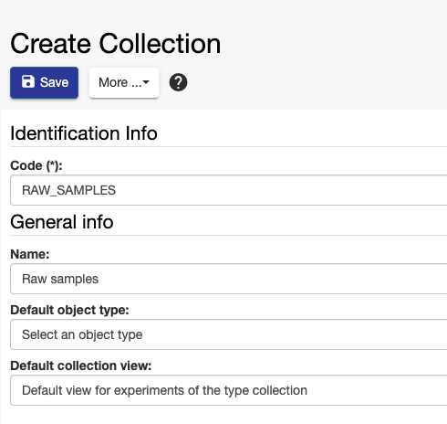
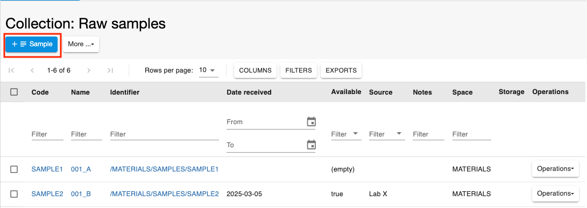
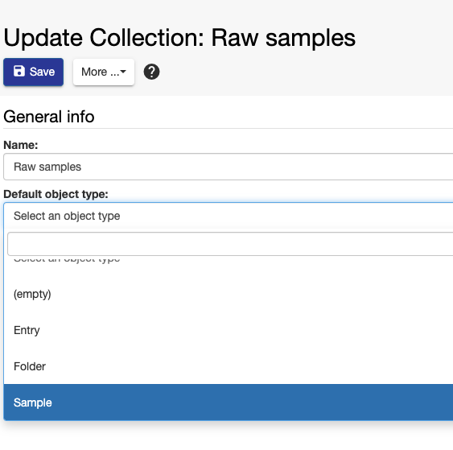
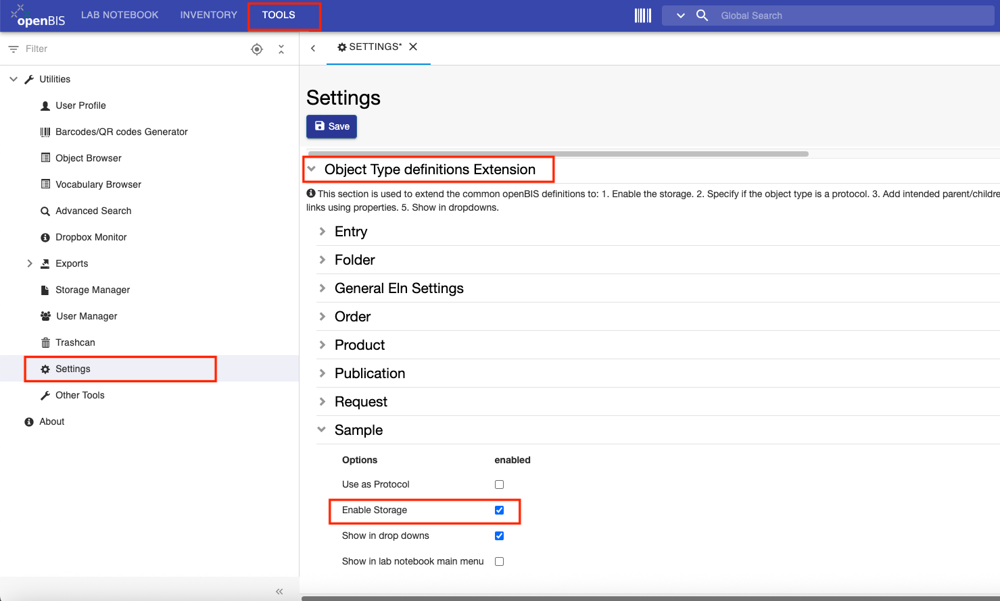
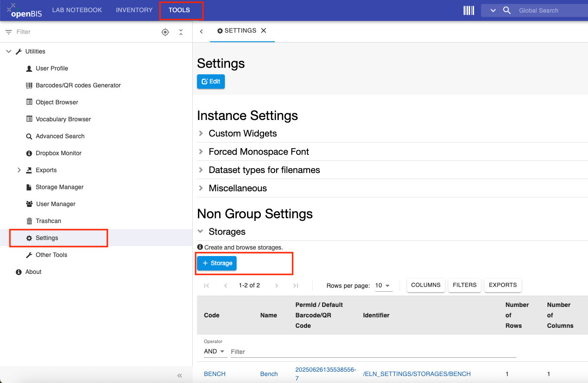

Customise Inventory Of Materials And Samples
====
 
## Create Collections of Materials

 

*Collections* are folders used to organise *Objects* in the
**Materials** Inventory. Such *Objects* can be different types of
samples and materials (e.g. chemicals, antibodies, batteries,
environmental samples).

 

*Collections* need to be created inside another folder, called
*Project*, in the **Materials** inventory.

 

For example, if we want to create a collection of raw samples, we need
to adopt the following steps:

1.  Create an *Object Type* called **Sample**. This can only be done by an
    *Instance admin*, from the admin interface, as explained here: [New Entity Type Registration](./new-entity-type-registration.md).
2.  Create a first folder called **Samples** inside the **Materials** folder *(Project)*.
3.  Create a second folder called **Raw Samples** *(Collection)*.

 

### Create the Project folder

To create the *Project* folder:

1.  Click on the **Materials** folder
2.  Click the **+ New Project** button in the form.

3.  Provide a description, if wanted. This is not mandatory.
4.  Enter the **Code**. This will be the name of the folder, in this case **SAMPLES**. Codes only take alphanumeric characters and no spaces. 

 

 

 
### Create the Collection folder

To register the *Collection* folder, inside the *Project* folder:

1.  Click on the *Project* folder, in this case **Samples**.
2.  Click the **+ Other** button in the main form and choose **Collection** from the dropdown.

3.  Replace the automatically generated **Code** with something pertinent to the collection (e.g RAW\_SAMPLES)
4.  Fill in the **Name** field (e.g. Raw Samples). Note that by default, the navigation menu on the left shows the name. If the name is not provided, the code is shown.
5.  Select the **Default object type** from the list of available types. This is the *Object Type* for which the *Collection* is used. In this case, **Sample**.
6.  Select the **Default collection view** (see **[Customise Collection View](../../general-users/inventory-of-materials-and-methods.md#customise-collection-view))**

 

 

 
### Add the "+Object Type" button in the Collection percentage

If you use a *Collection* for one *Object Type*, you can display a button to add that type to the Collection, as shown below for the **Sample** *Object Type*.

For this, you need to edit the *Collection* form and set the **Default Object type**, as shown below.

 
## Delete Collections

 

To delete an existing *Collection*:

 

1.  Select **Edit Collection** under the **More..** dropdown menu

 

 

2. Select **Delete** under the **More..** drop down menu

 

 
## Enable Storage Widget on Sample Forms

  
When a new *Object Type* is created by an *Instance admin* (see [New Entity Type Registration)](./new-entity-type-registration.md), the storage widget is disabled by default.

  
If we want to track storage positions for this particular *Object Type* as described in [Allocate storage positions to samples](../../general-users/managing-storage-of-samples.md#allocate-storage-positions-to-samples), the **Storage** should be enabled in the **Settings**, under **Tools**. This can be done by a *group admin*.

For this, follow the steps below:  
  

1.  Go to **Settings**, under **Tools**
2.  Click the **Edit** button
3.  Scroll to the last section of the Settings: **Object Type definitions Extensions**
4.  Open the *Object Type* for which you want to enable the storage, e.g. **Sample**
5.  Select **Enable Storage**
6.  Save
 

## Configure Lab Storage
  
Fridges and freezers can be configured in the **Settings**, under **Tools**.

 

1.  Go to **Settings**
2.  Click **Edit**
3.  Scroll down to the **Storages** section
4.  Click the **+ New Storage** button above the storage table, as shown below.
5.  Fill in the **Storage Form** as explained below

  
**How to fill in Storage Form:**

1. **Code**. It is advisable to provide a meaningful code for the storage, rather than using the default, because this information is needed when registering storage positions in Batch mode. For example MINUS80\_ROOM\_A1
2. **Name**. The name is what is shown in most parts of the ELN. E.g. Minus 80°C in Room A1
3. **Number of Rows**. This is the number of shelves.
4. **Number of Columns**. This is the number of racks per shelf.
5. **Number of Boxes**. This is the maximum number per rack. Enter a very high number if this is not important.
6. **Rack Space Warning**. Enter space as percentage. E.g. 80, means that the system will give a warning when 80% of a rack is occupied.
7. **Box Space Warning**. Enter space as percentage. E.g. 80, means that the system will give a warning when 80% of a box is occupied.
8. **Validation level**. This is the minimum level of information required about the storage:
    1. **Rack validation**. The position in the shelf and rack needs to be specified.
    2. **Box validation**. In addition to **a**, a box name needs to be specified.
    3. **Box position validation**. In addition to **a** and **b**, the position in the box needs to be specified.

 
## Add metadata to Storage Positions
 

Storage positions by default have the following metadata:

1.  Storage code
2.  Storage rack row
3.  Storage rack column
4.  Box name
5.  Box size
6.  Box position
7.  User id

 

It is possible to add additional information. This can be done by an
*Instance Admin* by editing the *Object Type* **STORAGE\_POSITION** in
the admin interface (see [New Entity Type Registration](./new-entity-type-registration.md)).

