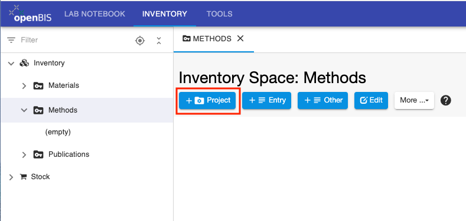
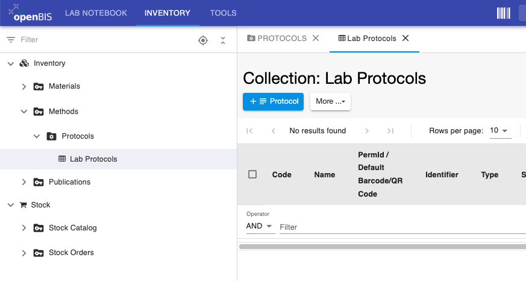
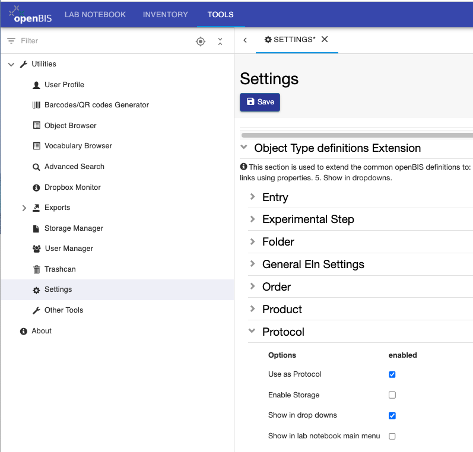

Customise Inventory Of Protocols
====
 
## Create Collections of Protocols

In the **Methods** *Space* in the inventory, you can create one or more collections for the protocols used in the labs.
If you have several protocols for one specific operation (e.g. microscopy, PCR), you can create one *Collection* for each protocol type, to group protocols of the same type together.
  
If we want to create a collection of lab protocols, we need to adopt the following steps:

- Register a first *Project* folder called PROTOCOLS in the **Methods** *Space*.

- In the **Protocols** folder, register a *Collection* called **Lab Protocols**

 

  
The steps for the registration of the folders are the same as explained
in [Create Collections of
Materials](./customise-inventory-of-materials-and-samples.md#create-collections-of-materials)  
  

 
## Enable Protocols in Settings

  
If a new *Object type* for a protocol is created by an *Instance admin*
in the admin interface, it is advisable to set the *Object type* to
**Protocol** in the **Settings**, under **Utilities** in the **Tools** tab.

  
For this, follow the steps below:  
  

1.  Go to **Settings**
2.  Click **Edit**
3.  Scroll to the last section of the **Settings**: **Object Type
    definitions Extension**
4.  Open the *Object type* corresponding to your protocol, e.g.
    **Protocol**
5.  Select **Use as Protocol**
6.  **Save**

  
This is done to be able to create local copies of protocols from the
*Inventory* inside an *Experiment* when writing *Experimental steps,* as
described in [How to use protocols in Experimental
Steps](../../general-users/lab-notebook.md#how-to-use-protocols-in-experimental-steps)

