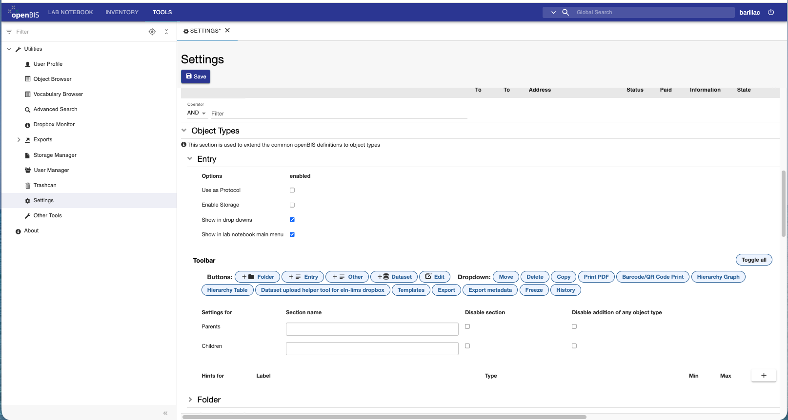

Toolbar customization
=======================

It is now possible to customize the toolbar for Object types, Collection types, Dataset types, Spaces, Projects.

This can be done from the ELN Settings, available under the **Tools** tab.

In multi group instances, the customization can be done for each group, in the group settings.

This customization can be done by an instance admin, a group admin, or anyone with admin rights to the ELN settings space.

## Object type toolbar customization

Go the the **Object Type** section in the ELN Settings and open one Object type (e.g. Entry). There is a **Toolbar** section where you can enable/disable Toolbar buttons and options for the **More..** dropdown.
This can be done for individual Object types, as you may want to have different options available depending on the Object type.

Similar options are available for Collection types, Dataset types, Spaces, Projects. In the case of Collections and Datasets, every type can be individually customized. For Spaces and Projects, customization will apply to all.
