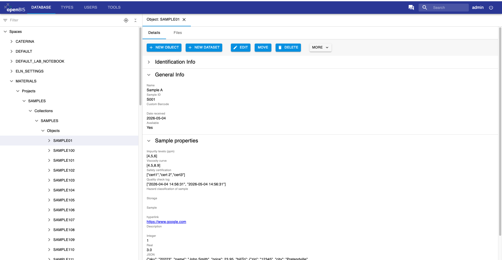
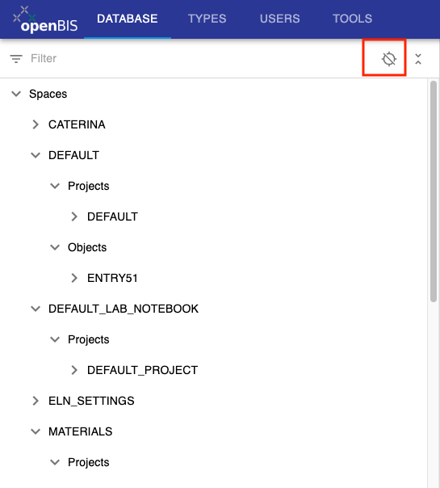
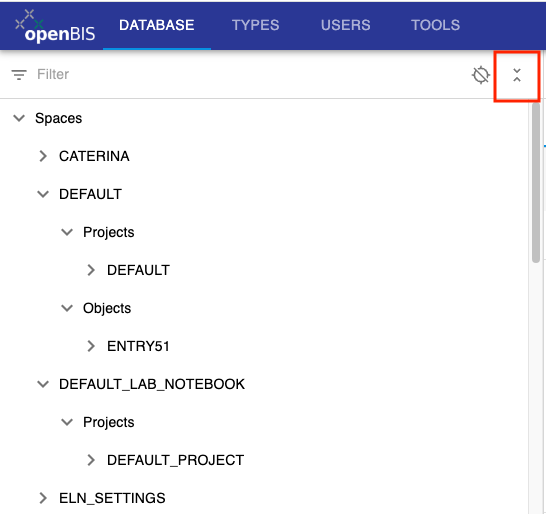

# Database navigation in admin UI

 

In openBIS version 7.0 forms have been added to the database navigation in the admin UI, as shown below.

 

 

This allows to navigate the openBIS hierarchy of *Spaces, Projects,
Experiments/Collections, Objects, Datasets*.

 

## Features

 

### Filter

It is possible to filter the menu by code or name of the desired entity.

 

 

### Navigation

To navigate the menu, the nodes have to be opened individually.

When you select an entry in the node, the corresponding entry page
opens. 

If you open several entry pages and you switch between them, by default
the navigation menu will scroll up or down to the corresponding entry in
the menu. If you do not want to have this behaviour, you can turn off
the scrolling by selecting the button on the top right corner of the
menu, as show in the picture below.

 

 
It is possible to collapse the menu by using the button shown in the picture below.

 

### Sorting

Each level of the hierarchy except for *Spaces* (*Projects, Collections,
Objects, Datasets*) can be sorted separately, using the buttons shown in
the pictures below.

By default, the sorting is done by **Code** in alphabetical order. Other
options are: sorting by code in reverse alphabetical order; sorting by
ascending date; sorting by descending date.

 

 

