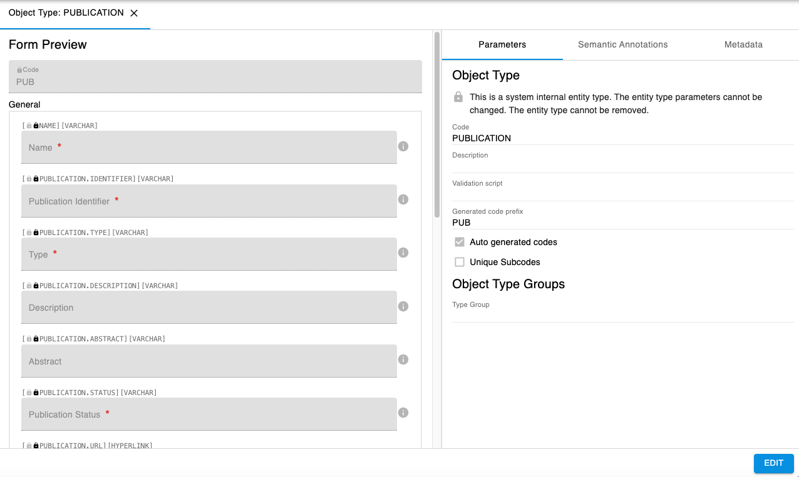
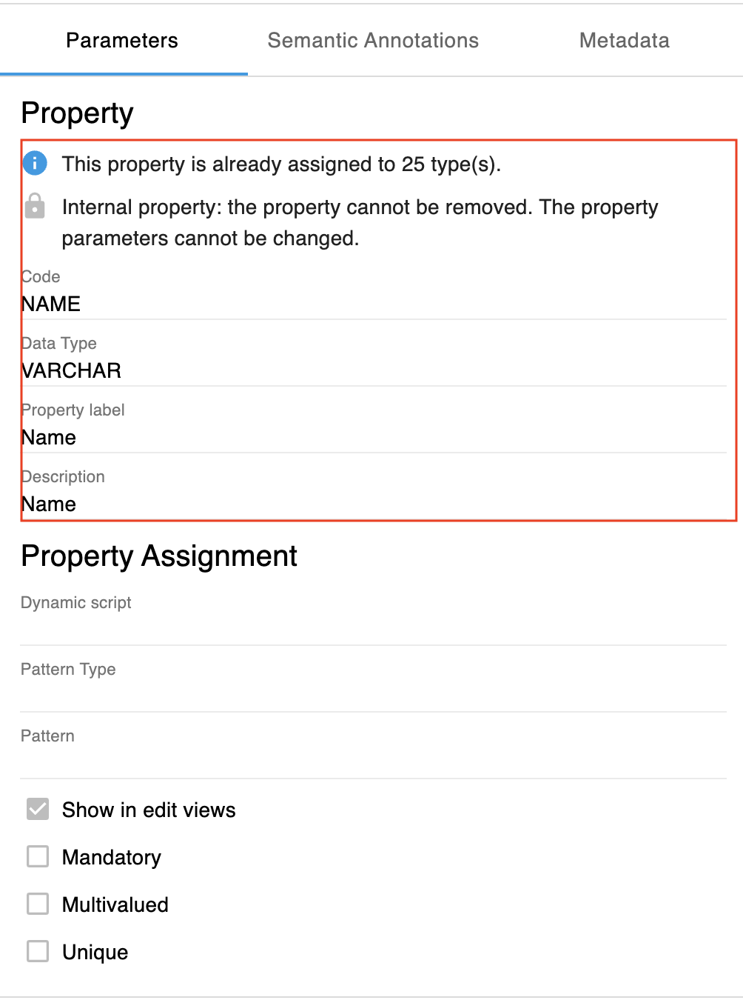
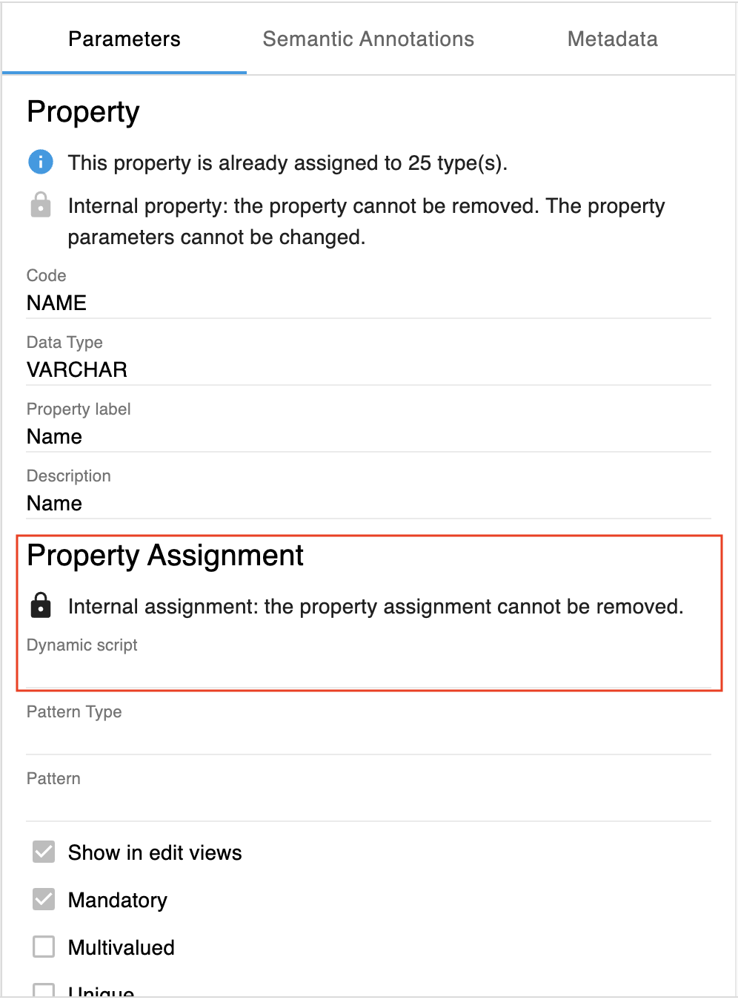
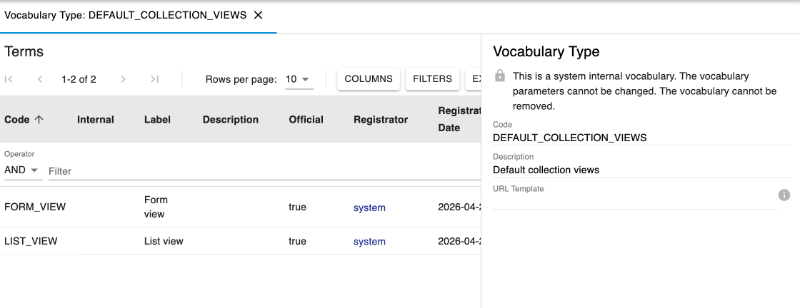

Internal Types
====

## Internal Entity Types

Internal Entity types (Object, Collection, Dataset types) can be identified by a *lock* icon in the Entity Type Parameters section:

or in the Entity table:

 
Internal types cannot be modified and cannot be deleted.

## Internal Property Types

Internal Properties types can be identified by a lock icon in the Property type Parameters section.

Internal types cannot be deleted nor modified 

Internal properties (e.g. NAME, BARCODE, etc) cannot be deleted nor
modified, not even by an instance admin.

 

## Internal Property Assignment

In some cases, internal properties are also internally assigned. Thsi means that the assignment of this property to a specific Entity type cannot be removed.

## Internal Vocabularies

Internal vocabularies (e.g. DEFAULT\_COLLECTION\_VIEWS, etc), cannot be
deleted and their existing terms cannot be deleted nor modified, however
an instance admin can add new terms to an internal vocabulary. The terms added by an admin can be modified and/or deleted.

