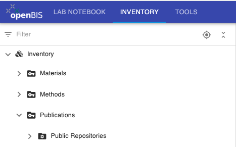

# Inventory overview

The default Inventory contains three
folders: **Materials**, **Methods**, **Publications**.

These are used to organise respectively:

- **Materials**: samples and materials of any type used in the lab.
- **Methods**: protocols and procedures that need to be shared with all lab members.
- **Publications**: this folder contains the **Public Repositories** *Collection*, used to collect entries published in Zenodo or in the ETH Research Collection (for ETH users only). See [Data export](./docs/user-documentation/general-users/data-export.md).

Samples, materials and protocols are modelled in openBIS as *Objects*.

For life sciences, following *Object* types are provided:

 

    Antibodies, Chemicals, Enzymes, Media, Solutions and Buffers, Plasmids, Plants, Oligos, 
    RNAs, Bacteria, Cell lines, Flies, Yeasts, General protocols, PCR protocols, Western blotting protocols.

 

These *Objects* are organised in *Collections* in the **Materials** and
**Methods** sections of the Inventory. See [ELN types](./docs/user-documentation/general-users/ELN-types.md).

 

Additional *Object* types and the corresponding *Collections* must be
created by the *Instance admin*, based on the needs of the lab.

 

It is possible to add additional folders in the Inventory, for example
for **Equipment** (see [Create new Inventory
Spaces](./docs/user-documentation/general-admin-users/admins-documentation/space-management.md)).

 

