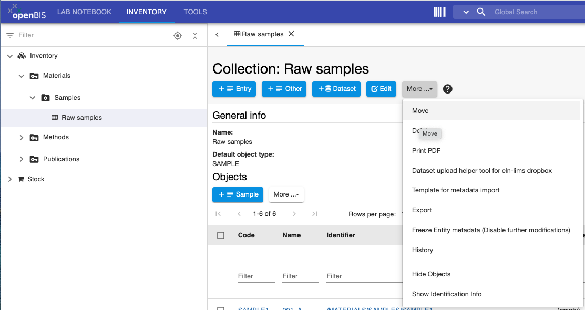
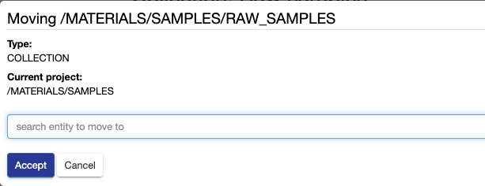

# Move Collections to a different Project

 

It is possible to move one *Collection* with its entire content
(*Objects* +, *Datasets*) from one *Project* to another.

If *Objects* contain parent/child relationships these are preserved.

This operation requires minimum *Space Power User* or *Space Admin* rights.

 

To move *Collections* in the Inventory:

1.  Go to the *Collection* page you want to move
2.  Click on **Edit Collection**

  

3\. Select **Move** from the **More..** dropdown

 

  

4\. Enter the code of the *Project* where you want to move your
*Collection*. If you start typing the code, openBIS will prompt you with
a list of available options and you can select the appropriate one from
there.

 

5\. Click **Accept**

