New Entity Type Registration via User Interface
====

Entity types, i.e. *Experiment/Collection*, *Object* and *Dataset*
types, as well as *Property types* and *Controlled Vocabularies*
constitute the openBIS **masterdata**. They can be created by someone
with *Instance admin* role in the **admin openBIS UI**. 

The admin openBIS UI can be accessed via a URL of this type:
**https://openbis-xxx/openbis/webapp/admin/**

where openbis-xxx is the name of the server specified in the openBIS
configuration file, during the installation by a system admin.

## Register a new Object Type

### Parameters

1.  Select **Types -&gt; Object Types** from the menu.
2.  Click **Add** at the bottom of the page.
 

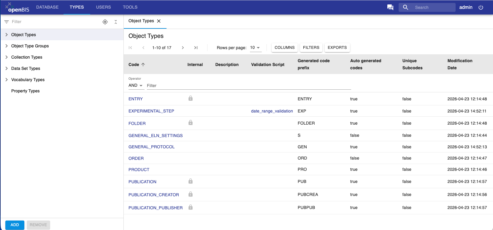
 

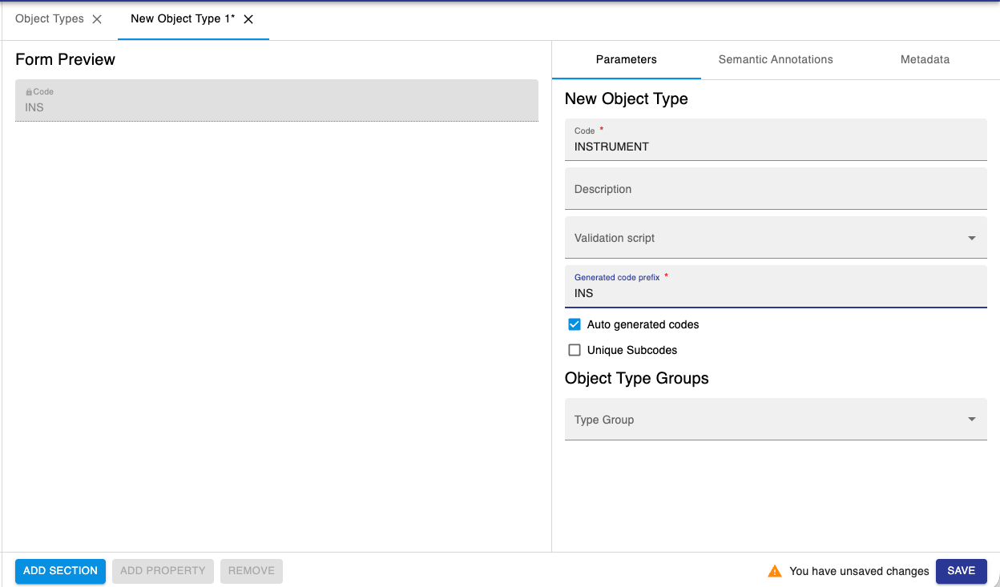
 

3. Enter a **Code**. E.g. **INSTRUMENT**. This is the name of the
Object to create and is unique. Please note that Codes should be in
capital letters, and they can only contain A-Z, a-z, 0-9 and \_, -, .

4. Provide a **Description** (not mandatory).

5. **Validation Script** is used when we want to have validation on
some data entries. This is done via a custom script (see [Entity Validation Scripts](../properties-handled-by-scripts.md#entity-validation-scripts))

6. Enter the **Generated Code Prefix**. As a convention, we recommended
to use the first 3 letters of the *Object* *type* code (e.g. **INS**, in
this case). This field is used by openBIS to automatically generate
Object codes: the codes will be for example INS1, INS2, INS3, etc.

7. Leave **Auto generated codes** selected if you want to have codes
automatically generated by openBIS.

8. **Unique Subcodes** is used for contained objects, which are not
used in the ELN. Ignore this option. 

9. Click **Add Section** at the bottom of the page. Sections are ways
of grouping together similar properties. Examples of sections used in
the ELN are *General info*, *Storage info*, *Experimental Details*, etc.
 

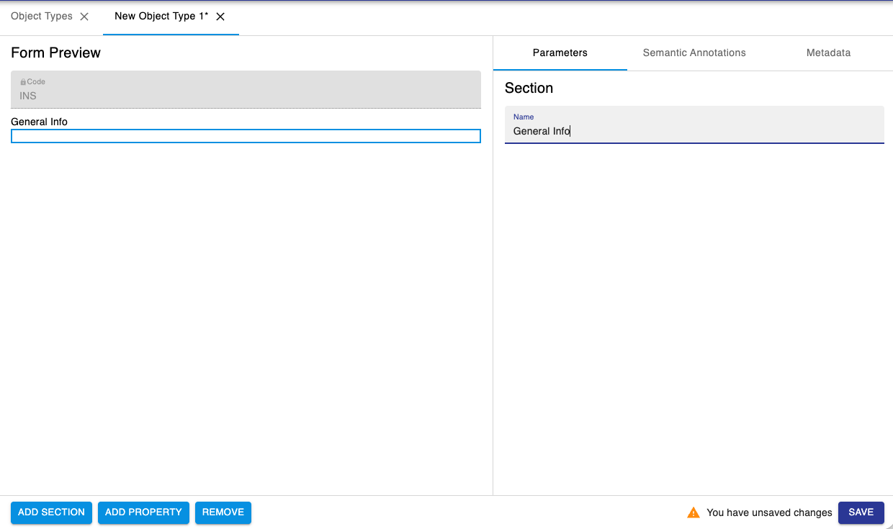
 

10. Add properties inside the Section, by clicking the **Add Property**
button at the bottom of the page. To remove a property, use the
**Remove** button at the bottom of the page. 

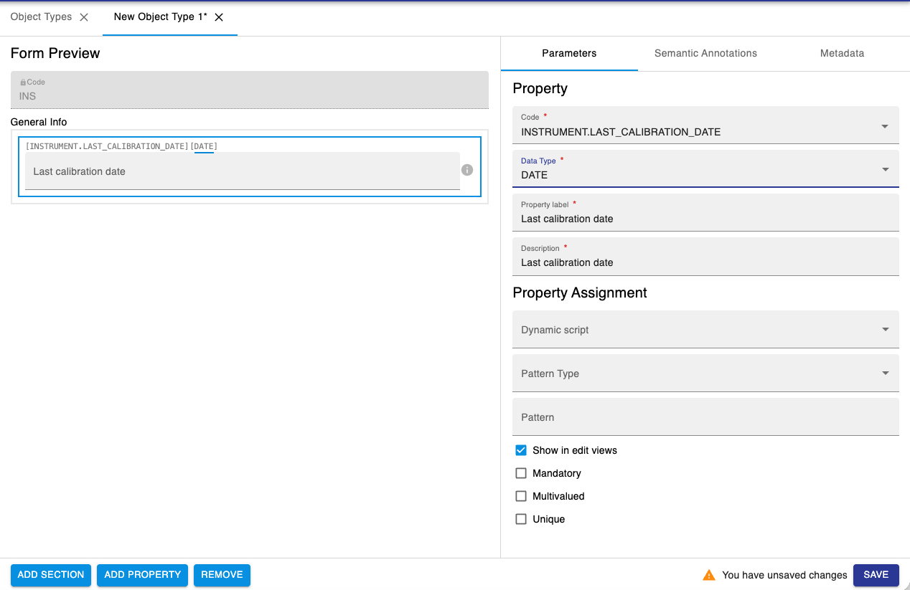

11. Click **Save** at the bottom of the page.
 

Please note that new *Object types* created in the admin UI, do not
automatically appear in ELN drop downs, but they have to be manually
enabled, as described below in this page.

### Semantic Annotations

It is possible to semantically annotate Object types, as shown in the example below.

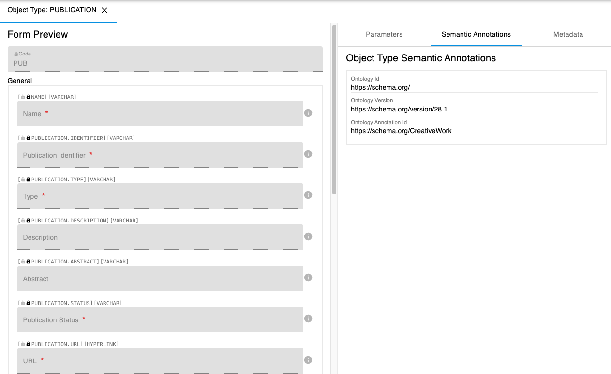

### Metadata

It is possible to define metadata specific to the Object type. This can be useful for example to configure plugins in the admin UI instead of having the configuration in a configuration file. 

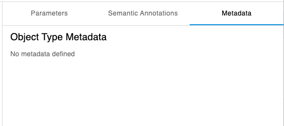

## Registration of Properties in Types

### Parameters

When registering new properties, the fields below need to be filled in.

**Property**

1.  **Code.** Unique identifier of the property. Codes can only contain
    A-Z, a-z, 0-9 and \_, -, .
2.  **Data Type.** See below for data types definitions.
3.  **Label.** This is the property/column header that the user can see
    in the ELN.
4.  **Description**: The description is shown inside a field, to give
    hints about the field itself. In most cases, label and description
    can be the same.

**Property Assignment**

1.  **Dynamic Script**: Script for calculated properties.
    See [Dynamic properties](../properties-handled-by-scripts.md#dynamic-properties)
2.  **Pattern Type**. Some property types allow to specify a pattern to validate values of a property. There are a few pattern types that can be specified
    1. **NONE**: Disables pattern validation
    2. **PATTERN**: Allows to specify RegExp.
    3. **RANGES**: Comma-separated list of strings in quotes, e.g "a", "b", "c"
    4. **VALUES**: Comma-separated list of ranges in %d-%d format, e.g 1-10, 12-15
3.  **Pattern**. text field. Validation rules to validate value of the given property.
 

**Additional fields**

Depending on the property types, additional optional features may be available.

1.  **Show in edit views**: Editable in the ELN interface. In some cases, metadata
    is automatically imported by scripts and this should not be changed
    by users in the interface.
2.  **Mandatory**: Field can be set as mandatory.
3.  **Multivalued**. true/false. Whether a given property should be able to hold multiple values of the same type (e.g. Controlled Vocabulary or Object). 
4.  **Unique**. true/false. Enables validation of value inserted into this property to be unique among all entities of this type.
 

 

**Property Data Types**

 
The following data types are available in openBIS.

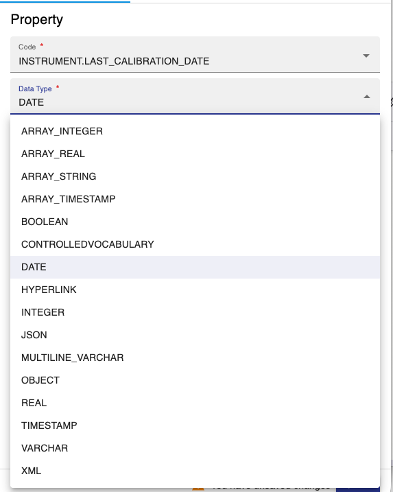

1. **ARRAY_INTEGER**: comma-separated list of integers. Syntax: [1, 2, 3]
2. **ARRAY_REAL**: comma-separated list of decimal numbers. Syntax: [1.2, 2.5, 3.7]
3. **ARRAY_STRING**: comma-separated list of string values. Syntax: ["string 1", "string 2", "string 3"]
4. **ARRAY_TIMESTAMP**: comma-separated list of dates with timestamps Syntax: ["2026-02-04 12:56:31", "2026-04-10 11:50:23"]
5. **BOOLEAN**: true or false
6. **CONTROLLEDVOCABULARY**: list of predefined values
7. **DATE**. Date field
8. **HYPERLINK**: URL
9. **INTEGER**: integer number
10. **JSON**: json-validated text field
11. **MULTILINE\_VARCHAR**: long text. It is possible to enable a Rich Text Editor for this type of property, as decribed below in this page.    
12. **OBJECT**. 1-1 connection to one or more specific object type. 
13. **REAL**: decimal number
10. **TIMESTAMP**: date with timestamp
11. **VARCHAR**: one-line text
12. **XML**: to be used for *Spreadsheet component*s, as described below in this page.
 
### Semantic Annotations

It is possible to semantically annotate property types, as shown in the example below.

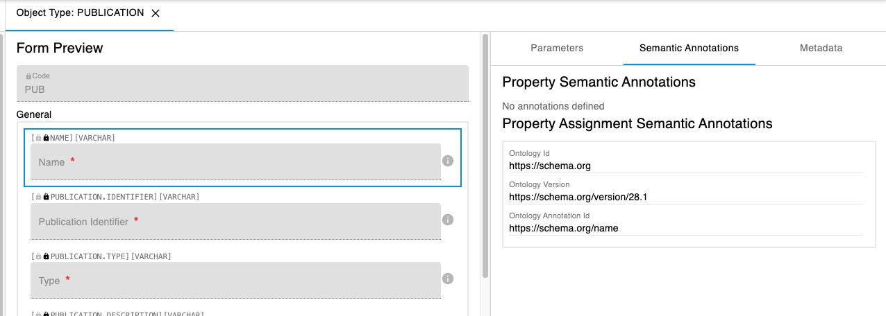

### Metadata

It is possible to add metadata to property types.
One possible use case for this is to specify some custom widgets available for use in the ELN UI:

* Word Processor
* Spreadheet

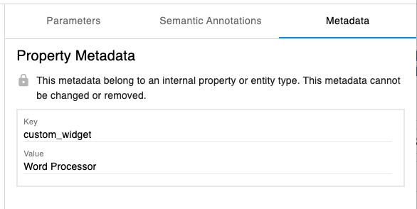
 
This can also be done from the ELN interface, in the Settings (see below)

### Considerations on properties registration

1.  If you create a property with code “PROJECT”, you should not use the
    label “Project”. This will give an error if you use XLS Batch
    registration/update, because openBIS considers this to be an openBIS
    *Project*.
2.  If you assign two properties with the same label to the same type, they will be exported using their code in the XLSX export. 
    

 
### Properties overview

The overview of all properties registered in openBIS and their
assignments to types is available under the **Types** section in the
admin UI, as shown below.

 

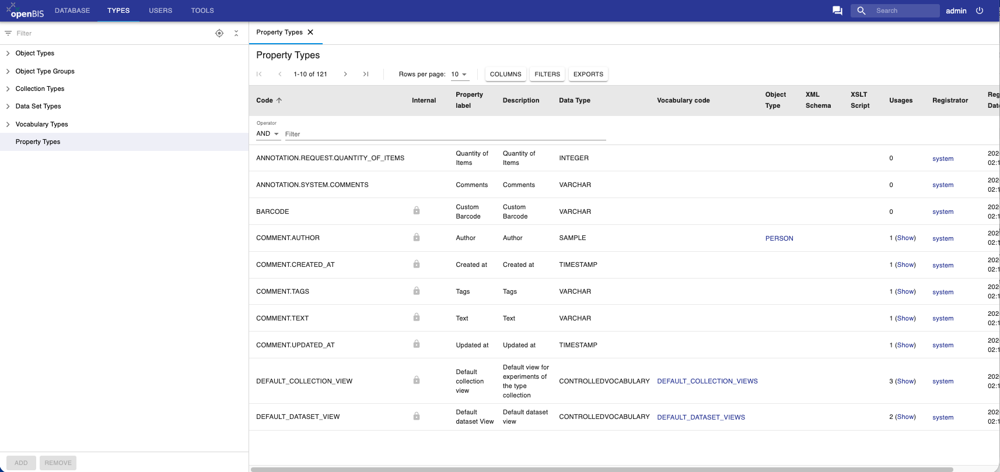
 

### Controlled Vocabularies

Controlled vocabularies are pre-defined lists of values for a given
field.
 

New Vocabularies can be added, by clicking the **Add** button at the
bottom of the page.

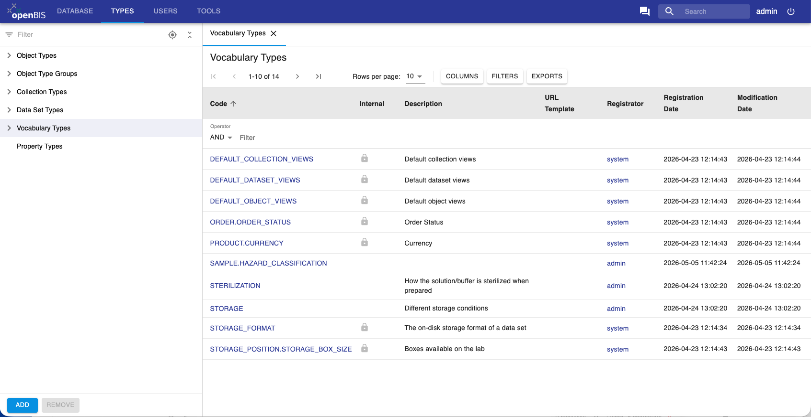

When registering a new vocabulary, a Code for the vocabulary needs to be
entered. This corresponds to the name of the vocabulary, and it is a
unique identifier. Codes can only contain A-Z, a-z, 0-9 and \_, -, .

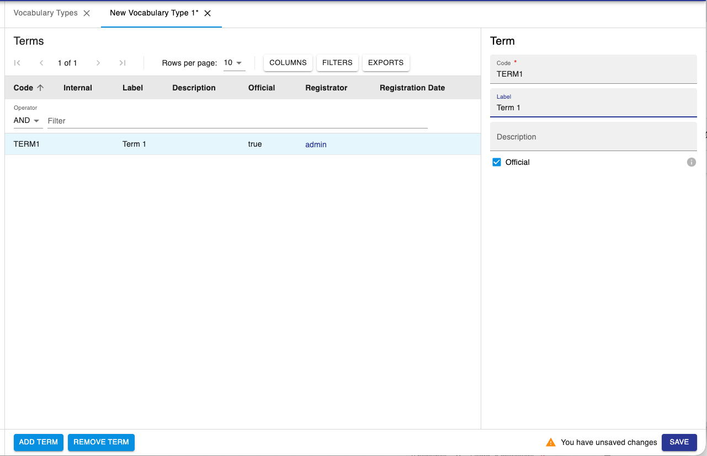

To add terms to the list click **Add Term** at the bottom of the page.
Vocabulary terms always have a code and a label: the code is unique and
contain only alpha-numeric characters; labels are not necessarily unique
and allow also special characters. If the label is not defined, codes
are shown.

After creating the vocabulary and registering the terms, remember to **Save**.

## Object Type Groups

From openBIS 7.0 it is possible to have **Object Type Groups**. This feature is currently only available in the admin UI, but will be extended to the ELN UI.
It is possible to create groups of Object Types, and these groups can be used for filtering.

To create a new group, select **Object Type Groups** from the menu and click the **ADD** button at the bottom of the page. 

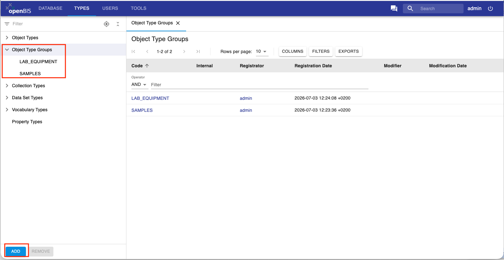

Once a group is created, you can add Object Types to the group by clicking the **EDIT** button at the bottom right corner of the page. To remove a group, you can click on **REMOVE** at the bottom left corner of the page.

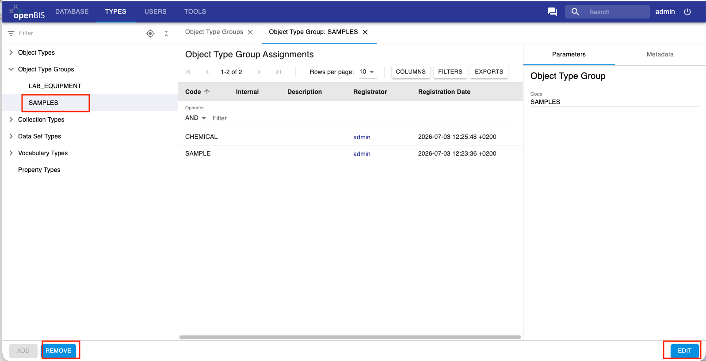

You can also add a group to an Object Type in the Object type form.

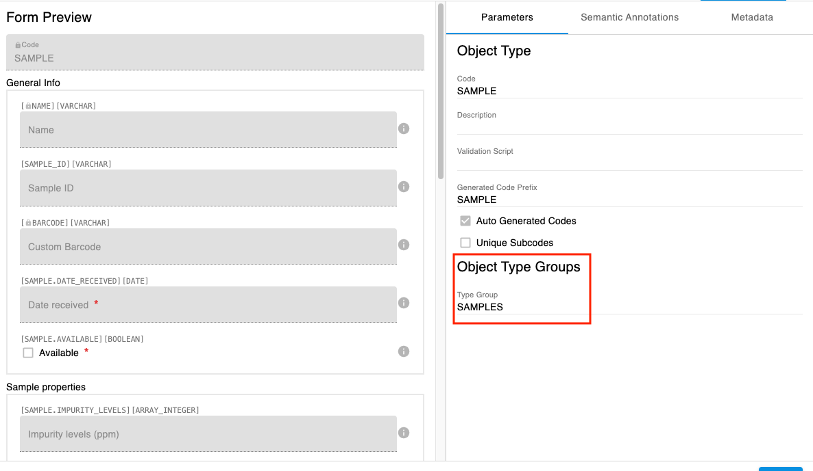 

## Register a new Experiment/Collection type

The registration of a new **Collection** type is very similar to the
registration of **Object** types. For Collection Types, you only need to
provide a **Code** (which is a unique identifier), **Description** and add a **Validation script** if you want to have metadata validation (see [Entity Validation Scripts](../properties-handled-by-scripts.md#entity-validation-scripts)).

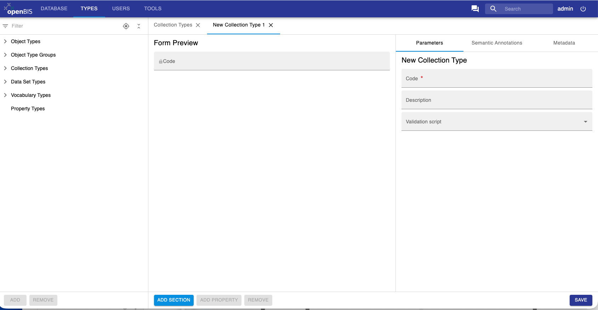

## Register a new Dataset type

The registration of a new Dataset types is similar to the registration
of Object types. 

It is possible to disallow deletion for a given dataset type.

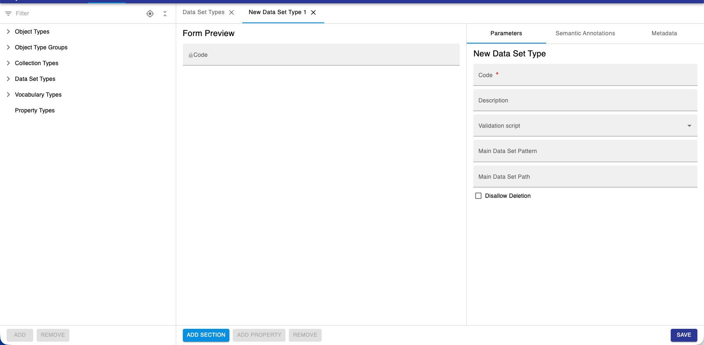

 
## Enable Rich Text Editor or Spreadsheet Widgets in ELN UI

  
For certain fields, it is possible to enable the use of a Rich Text
Editor (RTE) or a spreadsheet component. *Instance admin* rights are
necessary for this.

  
The **RTE** can be enabled for properties of type
**MULTILINE\_VARCHAR**. The **spreadsheet component** can be enabled for
properties of type **XML**.

  
Procedure:  
  

1.  Properties are defined when creating new entity types (*Datasets*,
    *Objects*, *Experiments/Collections*)
2.  To set a property as RTE or spreadsheet go to the **Settings**,
    under **Tools** in the ELN UI
3.  Select /ELN\_SETTINGS/GENERAL\_ELN\_SETTINGS
4.  Enable editing and scroll down to the **Custom Widgets** section
5.  Click the + button on the same line as **Property Type** and
    **Widget**, as shown below
6.  A new field will appear where you can select the property type and
    the widget. Choices are: **Word Processor** (=RTE) or
    **Spreadsheet.**

 
## Enable Objects in ELN dropdowns

By default, no Object shows in dropdown menus in the ELN. Which object types should show in dropdown menus can be customised in the ELN Settings.

1. In the ELN UI, go to **Settings** under **Tools**  
2. Navigate to the **Object Type definitions Extension**
3. Open one Object Type (e.g. Antibody)
4. Select **show in drop downs**
5. Save the **Settings**

 

