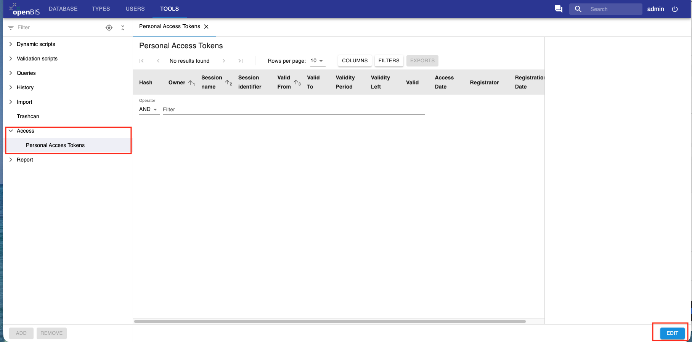
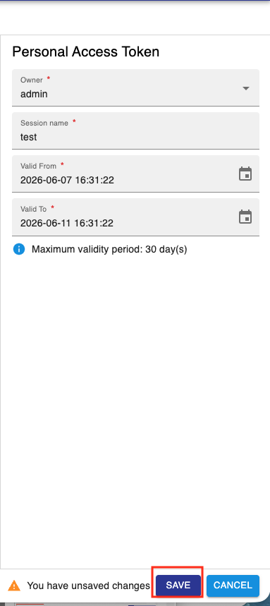

Personal Access Tokens
==========================

[Personal Access Tokens (PATs)](../../../software-developer-documentation/apis/personal-access-tokens.md) can be used to connect to openBIS via pyBIS or the openBIS Drive.

A PAT can be created by a user and by default it can be valid for up to 30 days, but this period can be extended to up to 1 year.

To create a PAT in the admin UI:

1. Go to **Access -> Personal Access Tokens** in the **Tools** section:

2. Click **Edit**

3. Enter a name for the PAT and the start and end validity dates:

4. Click **Save**

PATs can also be created with [pyBIS](../../../software-developer-documentation/apis/python-v3-api.md#personal-access-token-pat).