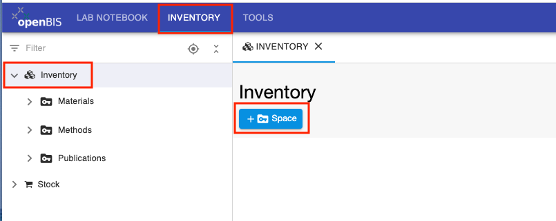
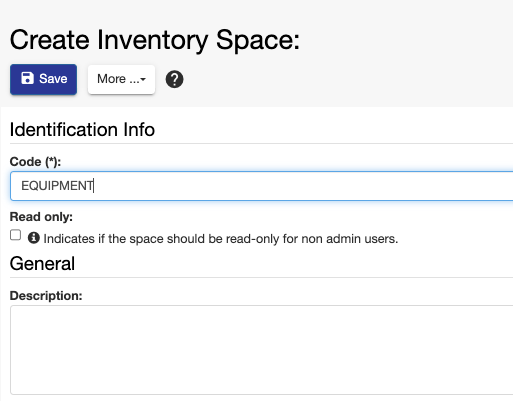
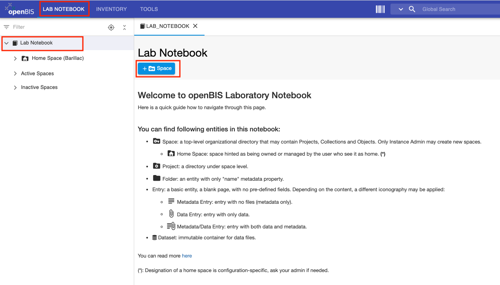
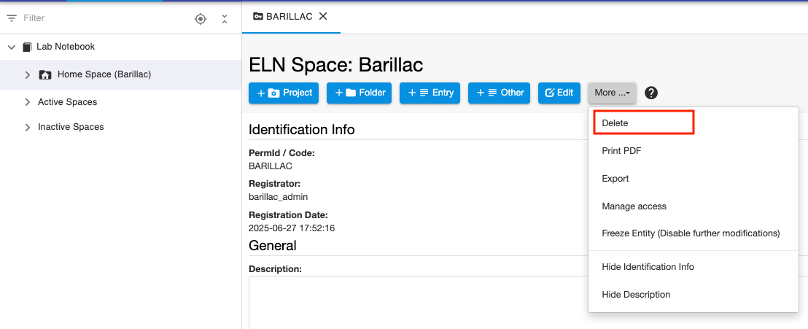

Space Management
====
 
## Create new Inventory Spaces
  
The default Inventory contains three
folders: **Materials**, **Methods**, **Publications**. These are openBIS *Spaces*.

Additional *Spaces* can be created by an *Instance admin*.

To create a new *Space* under the Inventory:

1.  Select **Inventory** in the main menu
2.  Click on **+Space** in the Inventory page

 

 

3\. Enter the **Code** for the *Space*, e.g. EQUIPMENT. Please note that
codes only accept alphanumeric characters, –, . , \_.

You have the option to choose if the space should be read-only for all users, except admins.

4\. **Save**

 

 

#### Multi-group instances

 

In a multi-group instance, the *Instance admin* can choose where to
create a new *Space*:

 

1.  **no group**. The new *Space* will have no prefix and the Settings
    defined in General Settings will apply (see [General ELN
    Settings](./multi-group-set-up.md#general-eln-settings)).
2.  **in one of the existing groups**. The new *Space* will have the
    group prefix and the Settings of that group will apply (see [Group
    ELN
    Settings](./multi-group-set-up.md#group-eln-settings)).

 

 

 
 
## Create new Lab Notebook Spaces
 
To create a new *Space* under the Lab Notebook:

1.  Select **Lab Notebook** in the main menu
2.  Click on **+Space** in the Lab Notebook page

 
   

 

3\. Enter the **Code** for the *Space*. Please note that codes only
accept alphanumeric characters, –, . , \_.

4\. **Save**    

 

#### Multi-group instances

 

In a multi-group instance, the *Instance admin* can choose where to
create a new *Space*:

 

1.  **no group**. The new *Space* will have no prefix and the Settings
    defined in General Settings will apply (see [General ELN
    Settings](./multi-group-set-up.md#general-eln-settings)).
2.  **in one of the existing groups**. The new *Space* will have the
    group prefix and the Settings of that group will apply (see [Group
    ELN
    Settings](./multi-group-set-up.md#group-eln-settings)). 

 

 

 

Use cases where this could be useful:

1.  in a multi-group instance with user folders in the Lab Notebook it
    is desired to have in addition some *Spaces* that are not linked to
    a particular user, but maybe rather to some projects.
2.  in a multi-group instance it is not at all desired to have the lab
    notebooks organised by users, but rather by projects. A *system
    admin* can configure the user management config file not to create
    users folders in the lab notebook section (see [Multi group instances](../../../uncategorized/user-group-management-for-multi-groups-openbis-instances.md)).

 

The rights for *Spaces* not belonging to any group need to be manually
assigned by an *Instance admin*.

 
 
## Delete Spaces

*Spaces* can be deleted by *Instance admins* or by *Space admins*.

 
To delete a *Space*:

1.  Click on the **Space** you want to delete in the navigation menu
2.  Select **Delete** from the **More..** dropdown

 

3\. Provide a **reason** for deletion

4\. **Accept**

  

Notes:

*Spaces* are not moved to the trashcan, but they are permanently deleted straight away.

*Spaces* can only be deleted when they are empty and no entries previously belonging to the *Space* are in the trashcan.

 

 
## Move Spaces between Lab Notebook and Inventory

If a *Space* belongs to the Inventory, this information is stored in the
**ELN Settings,** under the section **Inventory Spaces.**
 

To move a *Space* from the Lab Notebook to the Inventory, click on the
**+** button on top of the **Inventory Spaces** section, select the
*Space* you want to move and **Save** the Settings.

 
To move a *Space* from the Inventory to the Lab Notebook, click on the
**–** button next to the *Space* you want to remove in the **Inventory
Spaces** section and **Save** the Settings.
 

ELN Settings can be edited by *Instance admins*, *group admins* in
multi-group instances and by anyone with admin rights to the
ELN\_SETTINGS *Space*.
 

