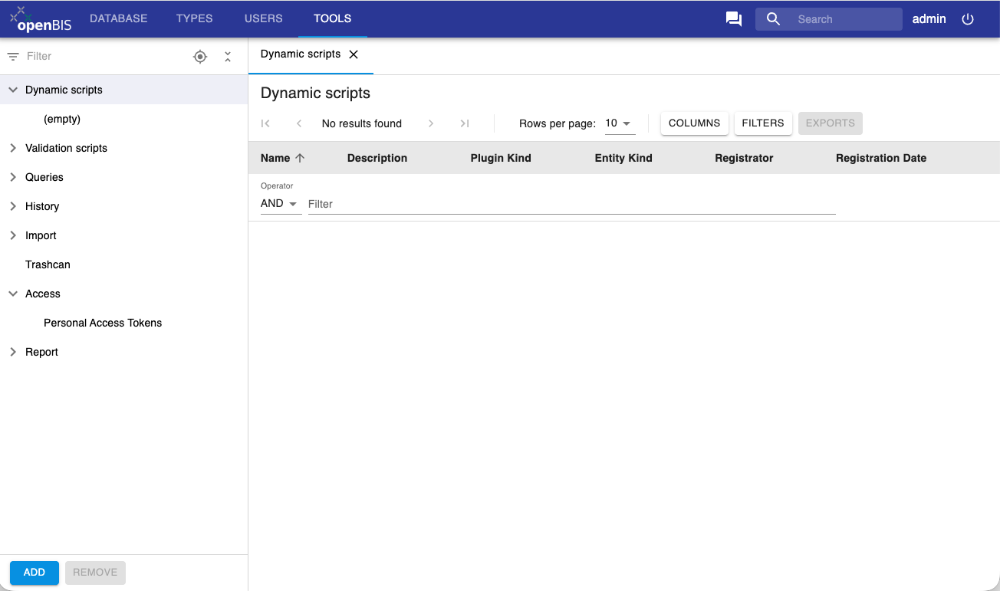
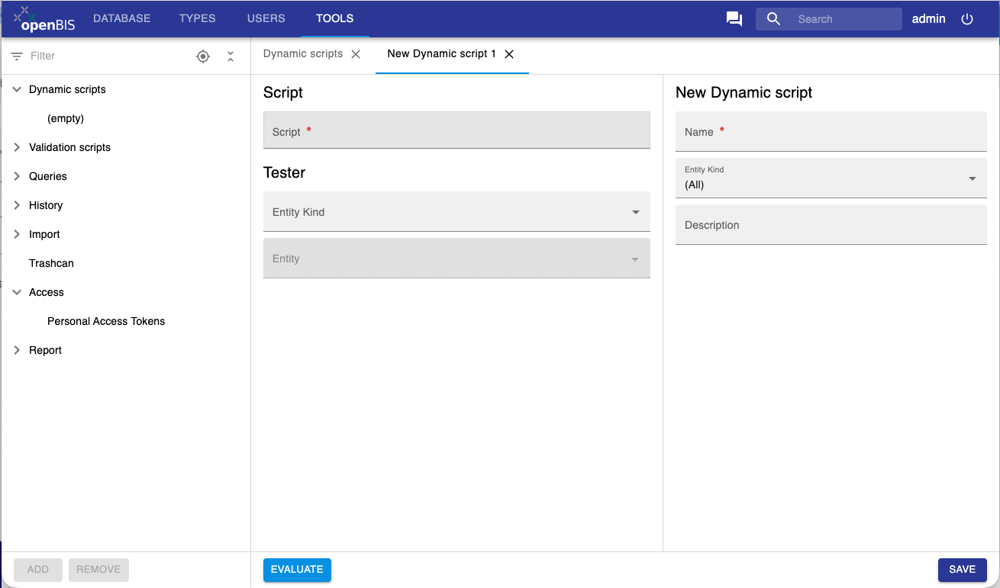
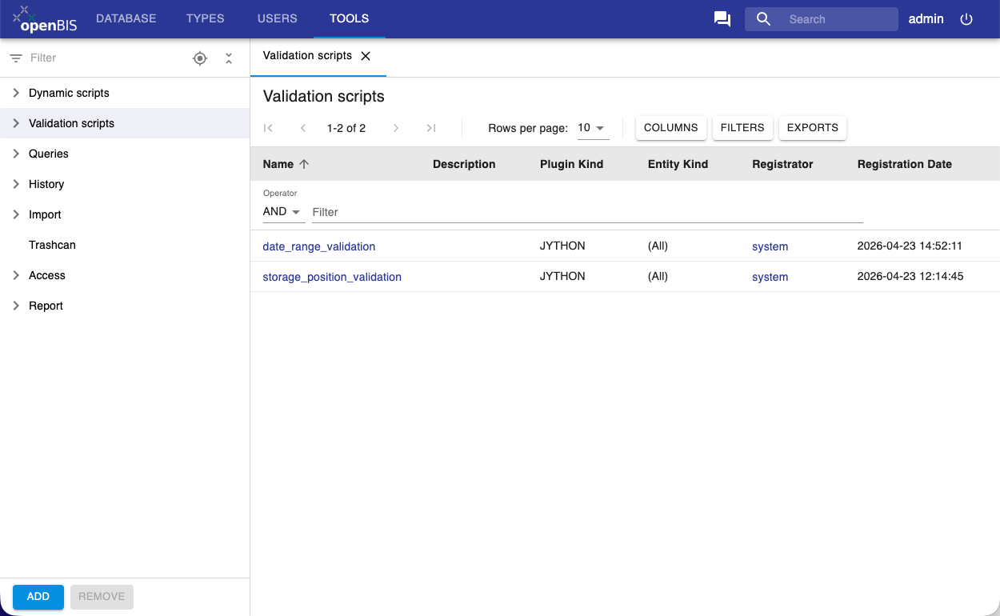
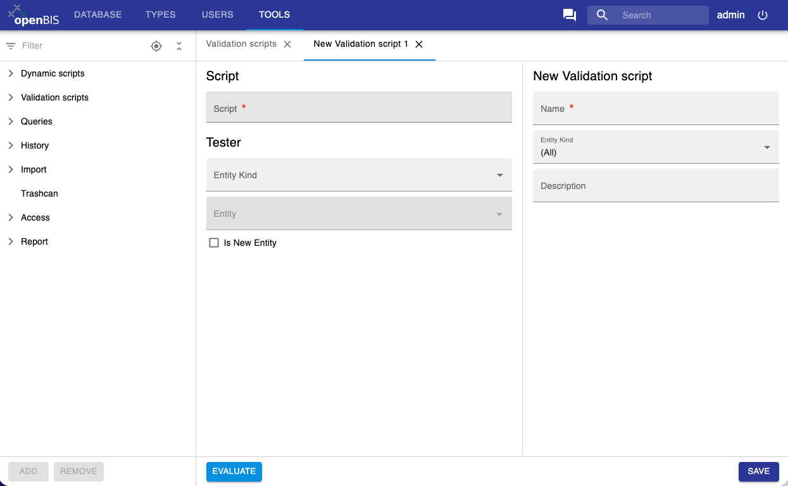

Properties Handled By Scripts
====
 

##### Introduction

One of the reasons why openBIS is easily extensible and adjustible is
the concept of generic entities like objects, experiments and
datasets. By adding domain specific properties to the mentioned
entities, an instance administrator creates a data model specific to a given
field of study. Values of configured properties will be defined by the
user upon creation or update of the entities (samples etc.).

In most cases values of properties must be provided directly by the
user. The default way of handling a property in openBIS can be changed
by an instance admin defining a property that should be handled by a script
written in [Jython](http://www.jython.org) or predeployed plugin written
in Java. Jython plugins use Jython version configured by the
service.properties property `jython-version` which should be 2.7.

##### Types of Scripts

There is one type of plugin that can be used for handling properties
and one script type to perform validations on entities:

1.  **Dynamic Property Evaluator** (for properties referred to as *Dynamic Properties*)  
    -   for properties that **can't be modified by users**,
    -   values of such properties are **evaluated automatically**
        using metadata already stored in openBIS (e.g. values of other
        properties of the same entity or connected entities),
    -   the script defines an expression or a function that returns a
        value for a *Dynamic Property* specified in the script.
   

2.  **Entity Validation**
    1.  performed after creation or each update of an entity of a given type.
    2.  the script performs a validation, which can cancel
        the operation if the validation fails.

 
Dynamic Properties
------------------


To create a dynamic property:

1. In the admin UI, go to the **Tools** section and click on **Dynamic scripts**.
2. Click on the **Add** button below the menu



3. A new tab opens with different sections:

- **New Dynamic script**:

    - *Name*: name of your script.
    - *Entity Kind*: the entity type for which the script will be used. Options are *Collection, Dataset, Object*. Can be left empty.
    - *Description*: you can provide a description of what the script does.


- **Script**:

    - *Script*: write your script in this field.

- **Tester**:

In this section you can test your script.

   - *Entity kind*: select an entity type on which you want to test your script. Options are *Collection, Dataset, Object*.
   - *Entity*: select a specific entity of that type on which you want to test your script.
- Click **Evaluate** at the bottom of the page. 

  

### Writing dynamic scripts


The scripts should be written using standard Jython syntax. Dynamic properties can have more than one line of code. If the script contains only one line, it will be evaluated and used as the value of appropriate dynamic property. If on the other hand a multi line script is needed, the function named `"calculate"` will be expected and the the result will be used as property value.

To access the entity object from the script, use the following syntax:

`entity.<requested method>`

Currently available methods that can be called on all kinds of entities
include:

-   `code()`
-   `property(propertyTypeCode)`
-   `propertyValue(propertyTypeCode)`
-   `propertyRendered(propertyTypeCode)`
-   `properties()`

For more details see
[IEntityAdaptor](https://openbis.ch/javadoc/20.10.x/javadoc-dynamic-api/ch/systemsx/cisd/openbis/generic/shared/hotdeploy_plugins/api/IEntityAdaptor.html)
(interface implemented by `entity`) and
[IEntityPropertyAdaptor](https://openbis.ch/javadoc/20.10.x/javadoc-dynamic-api/ch/systemsx/cisd/openbis/generic/shared/hotdeploy_plugins/api/IEntityPropertyAdaptor.html)
(interface implemented by each property).

It is also possible to acces the complete Java Object by calling
`"entityPE()"` method, but this is appropach is not recomended, as the
returned value is not a part of a well defined API and may change at any
point. You may use it as a workaround, in case some data are not
accessible via well defined API, but you should contact openBIS helpdesk and comunicate your needs, so the appropriate methods can be added to the official API.


#### Simple Examples

1.  Show a value of a Sample property which is named 'Multiplicity'

```py
entity.propertyValue('Multiplicity')
```
  

2. Takes an existing property and multiplies the value by 1.5

```py
float(entity.propertyValue('CONCENTRATION_ORIGINAL_ILLUMINA'))*1.5
```

#### Advanced Examples

1.  Show all entity properties as one dynamic property:


```py
def get_properties(e):  
    """Automatically creates entity description"""
    properties = e.properties()
    if properties is None:
        return "No properties defined"
    else:
        result = ""
        for p in properties:
            result = result + "\n" + p.propertyTypeCode() + ": " + p.renderedValue()
        return result
    
def calculate(): 
    """Main script function. The result will be used as the value of appropriate dynamic property."""
    return get_properties(entity)
```

2. Calculate a new float value based some other values


```py
import java.lang.String as String

def calculateValue():
    nM = 0
    uLDNA = 0
    if entity.propertyValue('CONCENTRATION_PREPARED_ILLUMINA') != '' and \
        entity.propertyValue('FRAGMENT_SIZE_PREPARED_ILLUMINA') != '' :
    nM =  float(entity.propertyValue('CONCENTRATION_PREPARED_ILLUMINA')) /  \
            float(entity.propertyValue('FRAGMENT_SIZE_PREPARED_ILLUMINA')) *  \
            1000000 / 650
    if float(entity.propertyValue('UL_STOCK')) !='' :
        uLDNA =  float(entity.propertyValue('UL_STOCK')) * 2 / nM
        uLEB = float(entity.propertyValue('UL_STOCK')) - uLDNA
        return String.format("%16.1f", uLEB)
    return 0

def calculate():
    """Main script function. The result will be used as the value of appropriate dynamic property."""
    return calculateValue()
```

3. Calculate a time difference between two time stamps:


```py
from datetime import datetime
def dateTimeSplitter(openbisDate):
    dateAndTime, tz = openbisDate.rsplit(" ", 1)
    pythonDateTime = datetime.strptime(dateAndTime, "%Y-%m-%d %H:%M:%S")  
    return pythonDateTime
def calculate():
    
    try:
    start = entity.propertyValue('FLOW_CELL_SEQUENCED_ON')
    end = entity.propertyValue('SEQUENCER_FINISHED')
    s = dateTimeSplitter(start)
    e = dateTimeSplitter(end)
    diffTime = e-s
    return str(diffTime)
    except:
    return "N/A"
```

  

4. Illumina NGS Low Plexity Pooling Checker: checks if the complexity of a pooled sample is good enough for a successful run:

```py
def checkBarcodes():
    '''
    'parents' are a HashSet of SamplePropertyPE
    ''' 
    VOCABULARY_INDEX1 = 'BARCODE'
    VOCABULARY_INDEX2 = 'INDEX2'
    RED = set(['A','C'])
    GREEN = set(['T', 'G'])
    SUCCESS_MESSAGE="OK"
    NO_INDEX = "No Index"
    
    listofIndices = []
    boolList = []
    positionList = []
    returnString = " "
    for e in entity.entityPE().parents:
    for s in e.properties:
        if s.entityTypePropertyType.propertyType.simpleCode == VOCABULARY_INDEX1:
        index = s.getVocabularyTerm().code
        if len(listofIndices) > 0:
            for n in range(0,len(index)-1):
            listofIndices[n].append(index[n])
        else:
            for n in range(0,len(index)-1):
            listofIndices.append([index[n]])
        
        # remove any duplicates   
        setofIndices=[set(list) for list in listofIndices]    
    
        # Test whether every element in the set 's' is in the RED set
        boolList=[setofNuc.issubset(RED) for setofNuc in setofIndices]
    if boolList:
    for b in boolList:
        if b:
        positionList.append(boolList.index(b)+1)
        # set the value to False, because 'index' returns only the first occurrence
        boolList[boolList.index(b)]=False
    else:
    return NO_INDEX
    #  if s.entityTypePropertyType.propertyType.simpleCode == VOCABULARY_INDEX2:
    #   pass 
    if positionList:
    for pos in positionList:
        returnString += "WARNING! Base position " + str(pos) + " of " + \
                            VOCABULARY_INDEX1 + \
                            " does not contain both color channels" + \
                            "\n" 
    else:
    returnString = SUCCESS_MESSAGE
    return returnString
def calculate(): 
    """Main script function. The result will be used as the value of appropriate dynamic property."""
    return checkBarcodes()
```

#### Data Types

Any data type that can be used by openBIS properties is supported by dynamic properties. The script always returns just a string
representation of a property value. The value is then validated and in special cases converted before being saved. The string formats and validation rules are the same as in batch import/update of samples/experiments/datasets.

The non-trivial cases are properties with data type:

-   CONTROLLED VOCABULARY - use code of vocabulary term as string
    representation


### Creating and Deploying Java Plugins

To create valid Java plugin for Dynamic Properties, one should create a class that is implementing `ch.systemsx.cisd.openbis.generic.server.dataaccess.dynamic_property.calculator.api.IDynamicPropertyCalculatorHotDeployPlugin` interface. The class should be annotated with `ch.ethz.cisd.hotdeploy.PluginInfo` annotation specifying the name of the plugin, and `ch.systemsx.cisd.openbis.generic.server.dataaccess.dynamic_property.calculator.api.IDynamicPropertyCalculatorHotDeployPlugin` class as a plugin type.

Such a plugin should be exported to a jar file and put
into `<<openBIS installation directory>>/servers/entity-related-plugins/dynamic-properties`
directory. The plugin will be detected automatically and will be
automatically available to openBIS. No restart is needed.

### Dynamic properties evaluator

Evaluation of dynamic properties may be very time consuming, therefore
it is not done automatically after each metadata update. To make sure
that the potential inconsistencies are repaired, the maintenance task
can be defined (`service.properties`), that runs in specified intervals:

`maintenance-plugins = dynamic-property-evaluator`

```py
dynamic-property-evaluator.class = ch.systemsx.cisd.openbis.generic.server.task.DynamicPropertyEvaluationMaintenanceTask
# run daily at midnight  
dynamic-property-evaluator.interval = 86400
dynamic-property-evaluator.start = 00:00
```


If the value of a dynamic property has not yet been calculated, it will
be shown as `(pending evaluation)`.


## Entity validation scripts
 
### Introduction

Entity validation scripts are a mechanism to ensure metadata
consistency. For each entity type a user can define a validation
procedure, which will be performed at each creation or update of the
entity of that type. There are two ways to define an entity validation
procedure: Jython scripts and Java plugins.

### Defining a Jython validation script

1. In the admin UI, go to the **Tools** section and click on **Validation scripts**.
2. Click on the **Add** button below the menu



3. A new tab opens with different sections:

- **New Validation script**:

    - *Name*: name of your script.
    - *Entity Kind*: the entity type for which the script will be used. Options are *Collection, Dataset, Object*. Can be left empty.
    - *Description*: you can provide a description of what the script does.

- **Script**:

    - *Script*: write your script in this field.

- **Tester**:

In this section you can test your script.

   - *Entity kind*: select an entity type on which you want to test your script. Options are *Collection, Dataset, Object*.
   - *Entity*: select a specific entity of that type on which you want to test your script.
   - Click **Evaluate** at the bottom of the page. 

  

### Script specification

The script should at least include the validate function, that takes two
parameters. The first one is the entity being validated, and the second
is the boolean stating whether it is a new entity (creation) or an
existing one(update).

1.  the function name should be 'validate'. It will be called with two
    parameters.  
    1.  the first argument is the entity. It will be the object
        implementing
        the [IEntityAdaptor](https://openbis.ch/javadoc/20.10.x/javadoc-dynamic-api/ch/systemsx/cisd/openbis/generic/shared/hotdeploy_plugins/api/IEntityAdaptor.html) interface
    2.  the second argument is the boolean "isNewEntity". It will be
        true if the entity is new.
2.  The script should return None (or nothing) if the validation is
    successful and a string with an error message, if the validation
    fails.

#### Triggering Validation of other Entities

A plugin can specify that another entity needs to be validated as well.
For example, a change to a sample could require validation of its
children. The infrastructure can be informed of this dependency by
calling `requestValidation` with the entity that needs to be validated
as an argument.

### Script example

Here is the example script that validates, that the newly created entity
does not have any properties defined:

**Basic Example**

    def validate(entity, isNew):
      if isNew:
        if not entity.properties() is None:
          return "It is not allowed to attach properties to new sample."

**Triggering Example**

    def validate(entity, isNew):
      for s in entity.children():
        requestValidation(s)


### Creating and Deploying Java Validation Plugins

To create a valid Java plugin for Entity Validation, one should create a
class that is implementing
`the ch.systemsx.cisd.openbis.generic.server.dataaccess.entity_validation.IEntityValidatorHotDeployPlugin` interface.
The class should be annotated with
`ch.ethz.cisd.hotdeploy.PluginInfo` annotation specifying the name of
the plugin,
and `ch.systemsx.cisd.openbis.generic.server.dataaccess.entity_validation.IEntityValidatorHotDeployPlugin` class
as a plugin type.

All classes needed to run the plugin have to be exported to a jar file
and put into
`the directory <<openBIS installation directory>>/servers/entity-related-plugins/entity-validation`.
The plugin will be detected and made available automatically to openBIS.
No restart is required for that.

### When are validations performed

Validations are performed at the end of the transaction, not at the
moment of the change. So if during some longer operation there are
several updates to different entities, all of them are evaluated at the
end, when all changes are available to the validation script.

Therefor it is possible to write for instance a dropbox that makes some
updates that break validation temporarily, and still succeeds as long as
the validations succeed after all the updates have been done.

### Good practices

1.  Validation scripts should be read-only.  
    -   In theory it is possible to edit the entity during the
        validation. This is a bad practice. Consider using [Dynamic
        Properties](./properties-handled-by-scripts.md#dynamic-properties) if you
        want calculations being performed after the entity updates.
2.  Think about performance  
    -   The plugins will be executed for every creation or update of
        entities of that type. This can affect the performance
        drastically if the plugin will be too heavy.


 


 
