Additional Functionalities
==========================
 

## Visualise Relationships

  
Parent-child relationships between *Objects* can be visualised as trees
or tables in the ELN.

To see the genealogical tree, select the **Hierarchy Graph** option from the **More…** dropdown in an *Object* form.

 

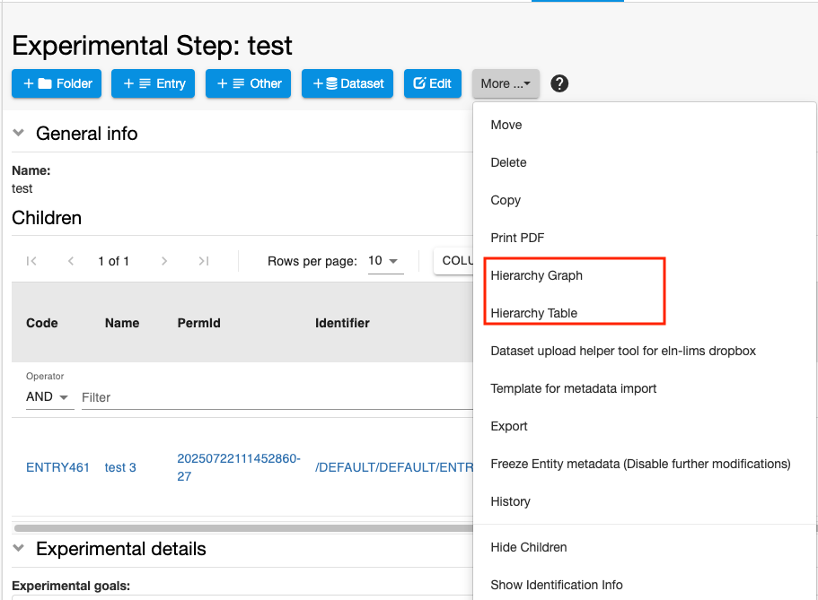

 

Large trees can be pruned, by selecting how many levels of parents
and/or children and which types to show.

 

To view the genealogy of an *Object* in a tabular format, select the **Hierarchy Table** option from the **More…** dropdown.

## Copy Objects

To create a copy of an existing entry, select **Copy** from the
**More..** drop down menu in the *Object* page.

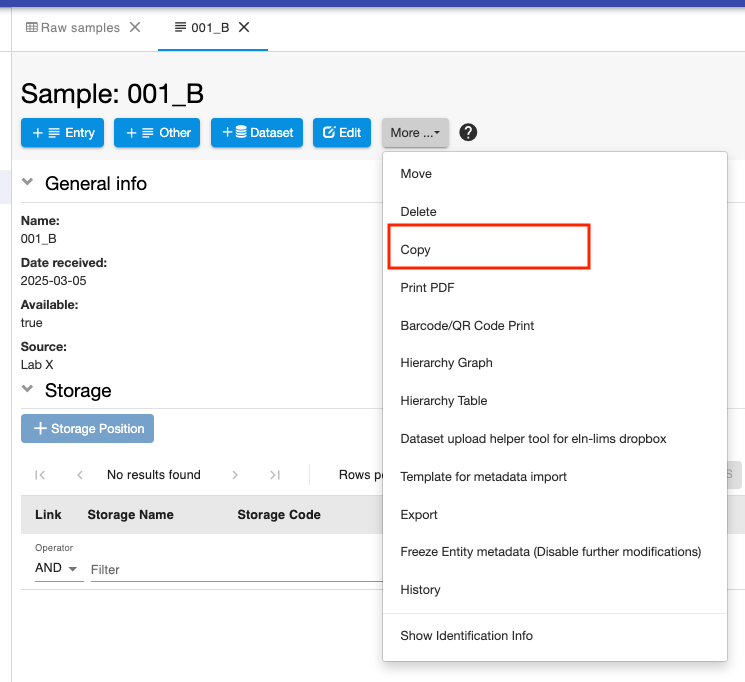

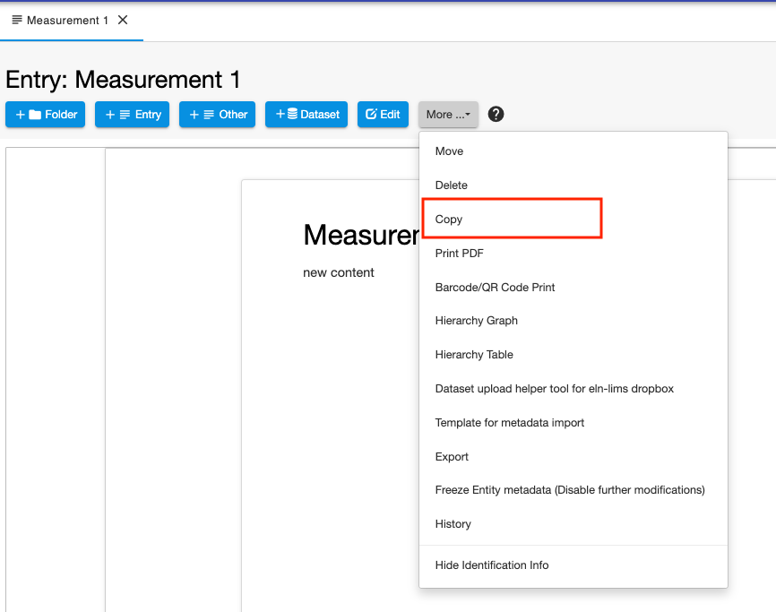

When an *Object* is copied, the user has the following options:

- **Copy Comments Log**: If the comments log is available in the *Object* being copied, the user can choose whether to copy this or not.
- **Link Parents**: the copied *Object* will keep the links to the parents present in the orginal *Object*. 
- **Children**:
    - **Do NOT Copy or Link**: children are not copied nor linked.
    - **Link**: the copied *Object* will keep the links to the children present in the orginal *Object*. 
    - **Copy into parents collection**: children present in the original *Object* are copied into the same entity (*Space, Project, Collection*) the *Object* belongs to and will be linked to the copied *Object*.

All these options are disabled by default.

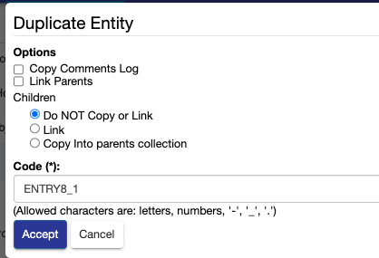

*Objects* are always copied in the entity they belong to (*Space, Project, Collection*). 
After copying, you can move entries to a different entity.

## Move Objects

*Objects* can be moved from one entity to another, either from the *Object* form or from a *Collection* table, if they belong to a *Collection*.

### Move from entry form

To move *Objects* to a different entity, select **Move** from the
**More…** drop down menu in the *Object* form.

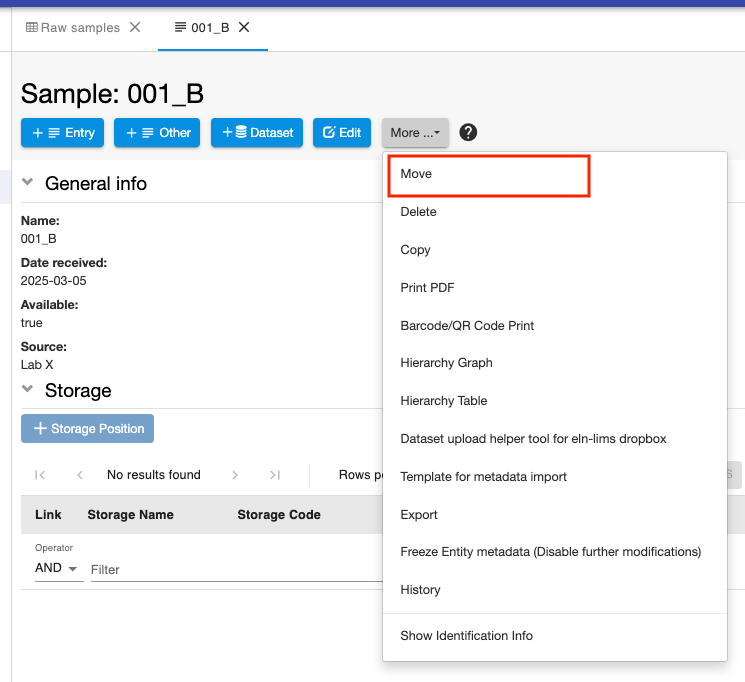

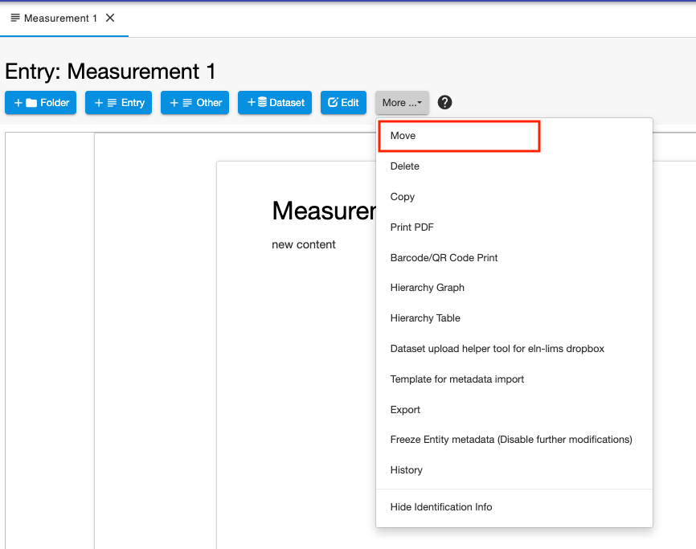

You have the option to move to an existing entity (*Space, Project, Collection*)

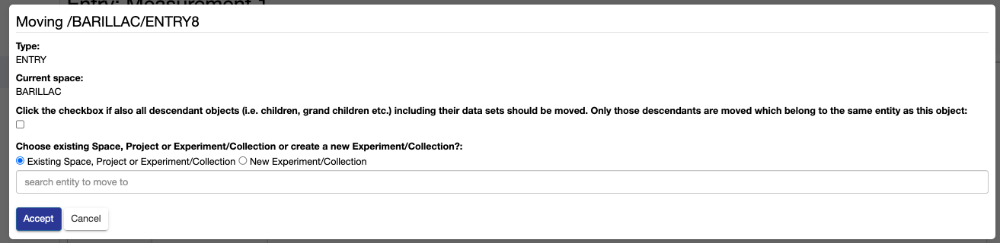

or to move to a new *Collection*.

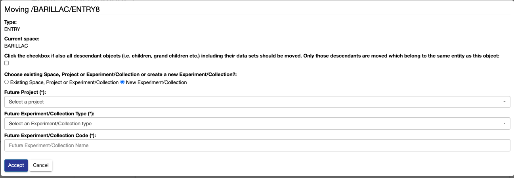

### Move from Collection Table

It is also possible to move *Objects* beloging to *Collections* from *Collection* tables. You can
select one or multiple entries from a table and click on the **Move**
button.

Also in this case you can move to an existing entity or create a
new *Collection*.

## Templates

It is possible to have templates for given *Object* types in openBIS. Templates have prefilled values.
This is useful when performing repetitive tasks, where some fields are always the same, or would require only minor changes.   

Templates need to be crated by the lab manager in the [**ELN Settings**](../general-admin-users/admins-documentation/create-templates-for-objects.md). 
If templates have been created for a given *Object* type, you can choose from the list of available templates by clicking the **Template** button on the *Object* form, as shown below.  

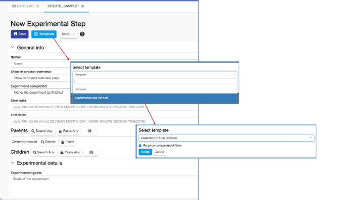

If the template you use contains predefined Parents/Children and you alreday have some parents/children defined in your *Object* that you wish to preserve, 
you should leave the option "Merge current parents/children" selected. 
This can happen for example in the Lab Notebook, when you register one *Object* starting from another *Object* and a parent/child relationship is automatically created. See [**Lab Notebook**](./lab-notebook.md). 

## Browse Entries by Type

  
The **Object Browser** under the **Tools** main menu allows to see
all entities of the same type, which may be
contained in different *Spaces*, *Projects*, *Experiments/Collections*. 

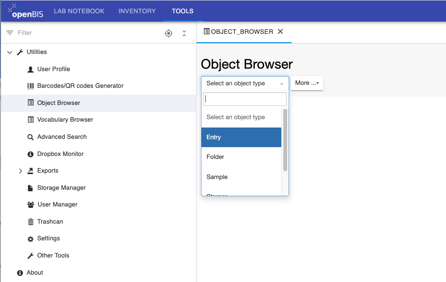

 

From the **Object Browser** page, it is also possible to **Batch
register** or **Batch update** *Objects* using an XLS or TSV template.

 

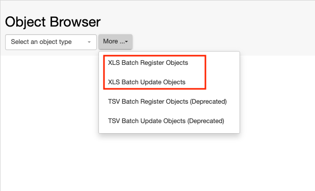

 

## Print PDF 

For every entity in openBIS it is possible to generate a pdf using the **Print PDF** option from the **More..** dropdown menu. 

The generated pdf file can be printed or downloaded from the browser. 

An example for a *Space* is shown in the picture below.

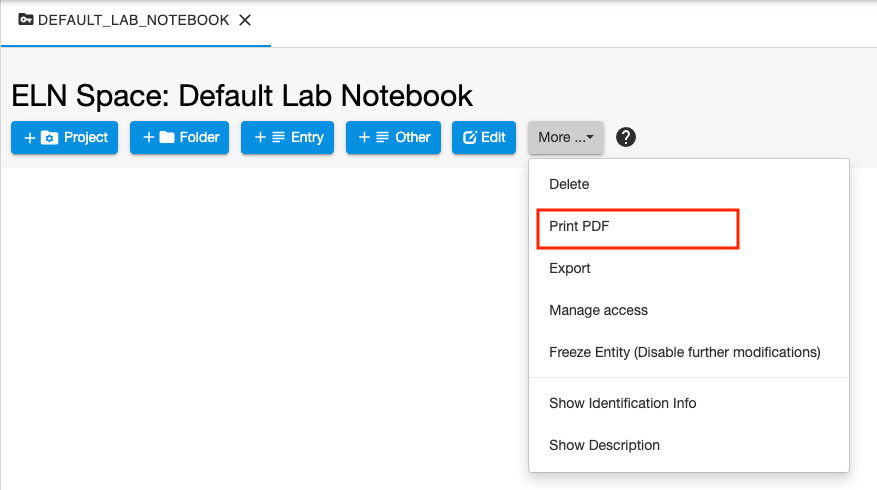 

 
## Trashcan

  
When *Experiments*, *Objects* and *Datasets* are deleted, they are moved
to the openBIS **trashcan**, under the **Utilities** menu in the **Tools** tab. Items
can be removed from the trashcan only by someone with *Space admin* or
*Instance admin* role. Deletion from the trashcan is **IRREVERSIBLE**.

 

Note: *Spaces* and *Projects* are directly permanently deleted, they are
not moved to the trashcan first.

 

To empty the whole trashcan, click the blue **Empty Trash** button above the table.

To delete permanently single entries choose one of two options from the
Operations dropdown:

 

-   **delete permanently**: deletes permanently only the selected entry.
-   **delete permanently (including dependent deletions)**: if the
selected entry had children which are also in the trashcan, this
option allows to permanently delete both the entry and its children.

 

If one entity was unintentionally deleted, the operation can be reverted
at this stage by choosing the **Revert Deletions** option from
the **Operations** drop down in the table.

 

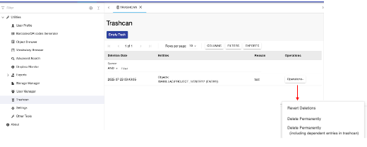

 
## Visualize Available Storage Space

The storage space available in an openBIS instance can be visualized by navigating to **Other Tools** in the menu under the **Tools** tab and clicking on the **Show available storage space** button.

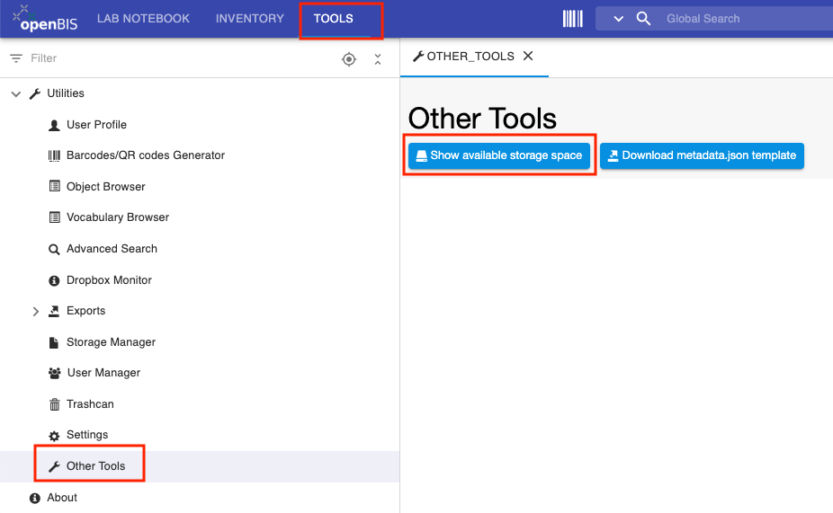

Before uploading large datasets, the available storage space should always be checked.

 
## Vocabulary Browser

  
The **Vocabulary browser** is accessible from the **Utilities** 
menu under the **Tools** tab. This shows all controlled vocabularies registered in openBIS and
the terms they contain. Vocabularies are predefined lists of values to
choose from in given fields. Vocabularies can be created/modified by an
openBIS *Instance admin* (see [New Entity Type
Registration](../general-admin-users/admins-documentation/new-entity-type-registration.md)).

This information is needed for filling the forms for **Batch
Upload **or**Batch Update** of *Objects* via TSV file. If an *Object*
has a property of type *Controlled Vocabulary*, the codes of the
vocabulary have to be entered in the .tsv template file. This is not the
case for XLS Batch registration or update, where labels can be used.

 

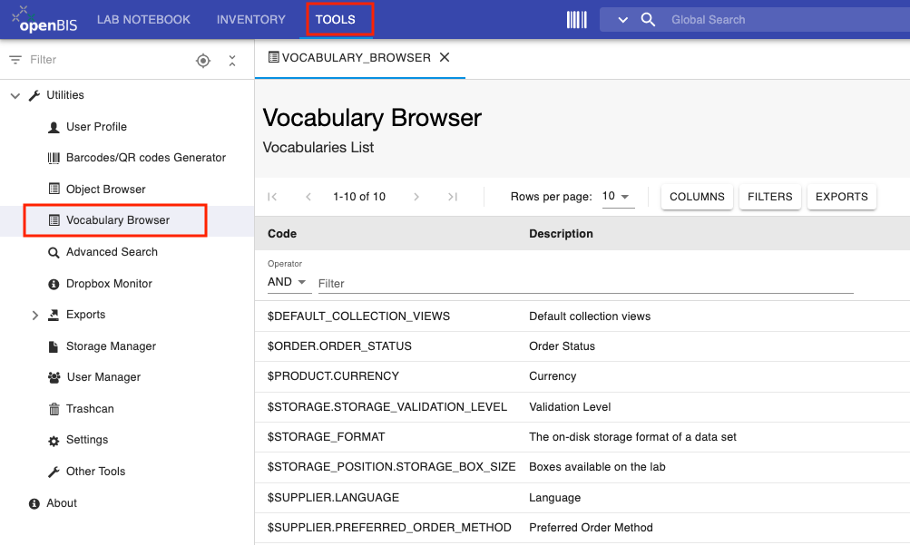

 
## Freeze Entities

  
Each level of the openBIS hierarchy (*Space, Project,
Experiment/Collection, Object, Dataset*) can be frozen, so it can be no
longer edited and/or deleted.

At every level, everything contained underneath is selected by default
to be frozen. E.g. if I choose to freeze a *Space*, everything contained
in the *Space* is automatically selected to be frozen. Single entities can
be manually unselected.

A *Space admin* role is necessary to freeze entities in a given *Space*.  
  

**IMPORTANT: the freezing is IRREVERSIBLE!**  
  

This operation cannot be undone from any UI, not even by an *Instance admin.* Please freeze entities only when you are absolutely sure that
they should not be further modified!

###  **How to freeze an entity**

  
At each level of the openBIS hierarchy (*Space, Project,
Experiment/Collection, Object, Dataset*) the **Freeze Entity** option is
available under the **More..** dropdown menu. See the example for a
*Space* below.

 

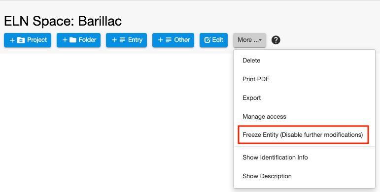

 

If you select this, a list of entities contained or connected to the one
selected will be presented to you, as shown below. By default everything
is selected, so you need to unselect entries that you do not want to
freeze.

  

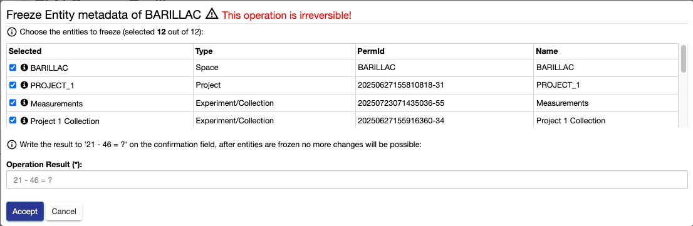

 

To freeze one or several entities, you need to enter the result of The operation presented in the widget. 

**Rules for freezing**

 

1.  **Freeze Space only**

||Allowed|Not allowed|
|--- |--- |--- |
|Create new Project||x|
|Create new Experiment/Collection|x||
|Create new Object||x|
|Create new Dataset in existing Experiment/Collection|x||
|Create new Dataset in existing Object|x||
|Edit existing Project|x||
|Edit existing Experiment/Collection|x||
|Edit existing Object|x||
|Edit existing Dataset|x||
|Delete Space||x|
|Delete Project||x|
|Delete Experiment/Collection|x||
|Delete Object|x||
|Delete Dataset|x||
|Move Experiment/Collection|x||
|Move Object|x||
|Copy Object||x|
|Export|x||

2.  **Freeze Project only**

||Allowed|Not allowed|
|--- |--- |--- |
|Create new Experiment/Collection||x|
|Create new Object||x|
|Create new Dataset in existing Experiment/Collection|x||
|Create new Dataset in existing Object|x||
|Edit Project||x|
|Edit existing Experiment/Collection|x||
|Edit existing Object|x||
|Edit existing Dataset|x||
|Delete Project||x|
|Delete Experiment/Collection||x|
|Delete Object||x|
|Delete Dataset||x|
|Move Experiment/Collection||x|
|Move Object||x|
|Copy Object||x|
|Export|x||

3. **Freeze Experiment/Collection only**

||Allowed|Not allowed|
|--- |--- |--- |
|Create new Object||x|
|Create new Dataset in existing Experiment/Collection||x|
|Create new Dataset in existing Object||x|
|Edit existing Experiment/Collection||x|
|Edit existing Object|x||
|Edit existing Dataset|x||
|Delete Experiment/Collection||x|
|Delete Object||x|
|Delete Dataset||x|
|Move Experiment/Collection||x|
|Move Object||x|
|Copy Object||x|
|Export|x||

4. **Freeze Object only**

||Allowed|Not allowed|
|--- |--- |--- |
|Create new Dataset in existing Object||x|
|Edit existing Object||x|
|Edit existing Dataset in Object|x||
|Delete Object||x|
|Delete Dataset||x|
|Move Object||x|
|Copy Object|x (only if the Experiment is not frozen)||
|Export|x||

5. **Freeze Dataset only**  

||Allowed|Not allowed|
|--- |--- |--- |
|Edit existing Dataset||x|
|Delete Dataset||x|
|Move Dataset||x|
|Export|x||

 

 
## Custom Imports
 
From openBIS version 20.10.4, Custom Imports, previously available only
in the core UI, are available in the ELN UI.

Custom imports allow users to import metadata in a custom way, by using
a dropbox script in the background. You can use this if you want to
parse a file in a given format and import the information from this file
as metadata in openBIS.

 
Custom imports are not available by default, but need to be enabled on
the server side by a *system admin*, and a dropbox script needs to be
associated with an import (see [Custom
Imports](../../software-developer-documentation/legacy-server-side-extensions/custom-import.md)).
 

If one or more custom imports are configured in openBIS, the **Custom
Import** option is available under the **Tools** in the **navigation
menu**.

The available custom imports can be selected from the **Custom Import
Service** drop down menu in the Custom Import page.
 
If the available custom import provides a template that can be used as
input for the import, the template will be available to download from
the Custom Import page.

 

 

If the custom import is not configured to provide a template, no
download link is shown in the Custom Import page.

 

 

 
## Entity history

 

Whenever an entity of type *Collection/Experiment*, *Object* or
*Dataset* is modified in openBIS, the changes are stored in the
database. The stored changes are modifications to property fields,
addition and deletion of parents/children for *Objects* and *Datasets*,
changes of *Space/Project/Experiment/Object* ownership if an entity is
moved.

The **History** of changes of each entity is now available in the ELN
UI. In versions prior to openBIS 20.10.3 this was only available in the
core UI.
 
 

### History table for Collections

 

In a *Collection* page, the **History** can be accessed from the
**More..** dropdown list.

 

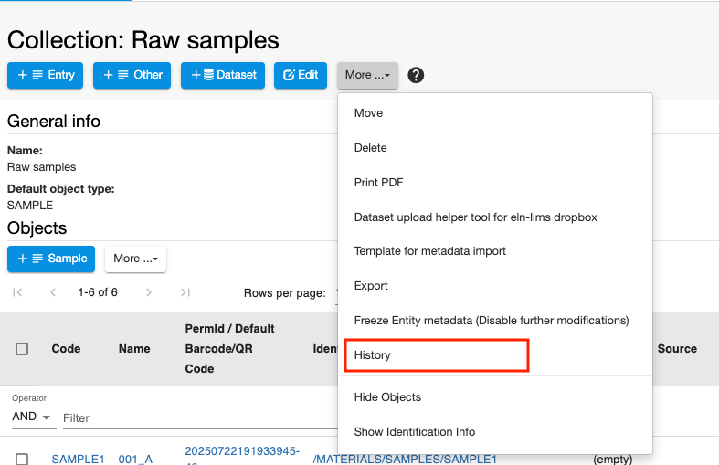

 

The **History** table shows the version number of the changes, the
author of the changes, the changes made (with the values before- in red,
and after the change – in green), and the timestamp, i.e. the time when
the changes were made.

 

For a *Collection*, the **PermID** (Permanent Identifier) of the
*Project* it belongs to is shown. If a *Collection* is moved from one
*Project* to another, the PermID of the old and new *Projects* are shown
in the history table.

 

 

 

The **show** option in **Full Document** shows the full metadata of the
entry (not only the changed fields) when changes were applied. This is
displayed in JSON format.

 

 

 

### History table for Objects

 

For every *Object*, the history of changes can be accessed from the
**More..** dropdown on the *Object* page.

 

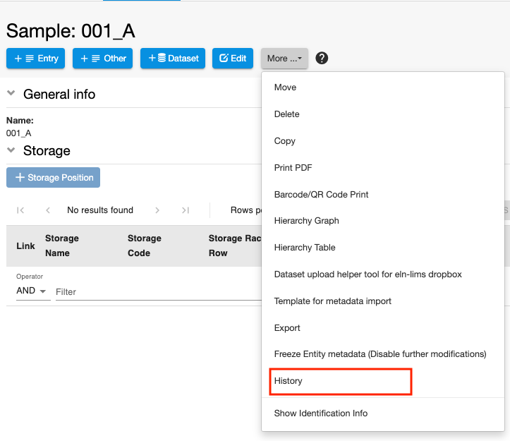

 

 

For an *Object*, the **PermID** (Permanent Identifier) of the
*Collection* it belongs to is shown. If an *Object* is moved from one
*Collection* to another, the PermID of the old and new *Collections* are
shown in the history table.

 

### History table for Datasets

 

For every dataset, the history of changes can be accessed from the
**More..** dropdown on the *Dataset* page.

 

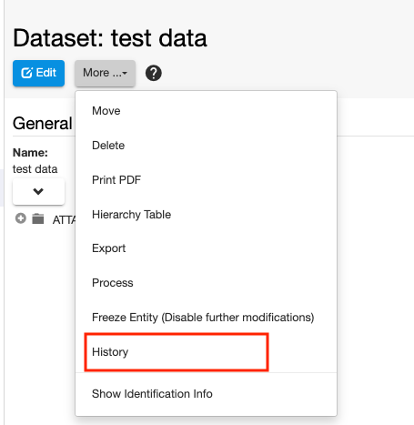

 

For a *Dataset*, the **PermID** (Permanent Identifier) of the
*Object*/*Collection* it belongs to is shown. If a *Dataset* is moved
from one *Object*/*Collection* to another, the PermID of the old and new
*Objects*/*Collections* are shown in the history table.

## Spreadsheet

The spreadsheet component needs to be enabled by a group admin or lab manager who can edit the ELN Settings, as described here: [Enable Rich Text Editor or Spreadsheet Widgets](../general-admin-users/admins-documentation/new-entity-type-registration.md#enable-rich-text-editor-or-spreadsheet-widgets)

The spreadsheet supports some basic Excel functionalities, such as mathematical formulas (e.g. =SUM(A1+A2)).
It is possible to import an openBIS Object into the spreadsheet, with the **import** button, on the spreadsheet itself:

Please note that if the Object is updated in openBIS, it will NOT be automatically updated in the spreadsheet.

## Session Token

When users log in to openBIS, a session token is generated. The session token is visible in the ELN UI, under the **User Profile**, in the **Tools** navigation menu.

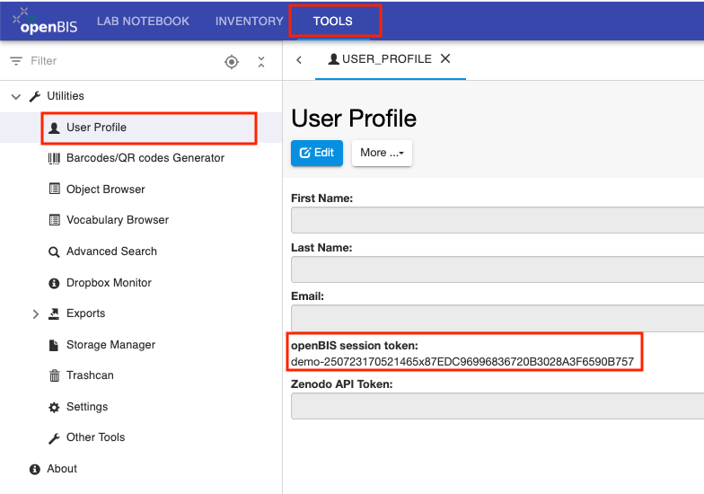 

The session token is needed to connect to openBIS via pyBIS or obis, in cases where SSO (e.g. SWITCHaai) is used for authentication. See [pyBIS](../../software-developer-documentation/apis/python-v3-api.md#connect-to-openbis).

