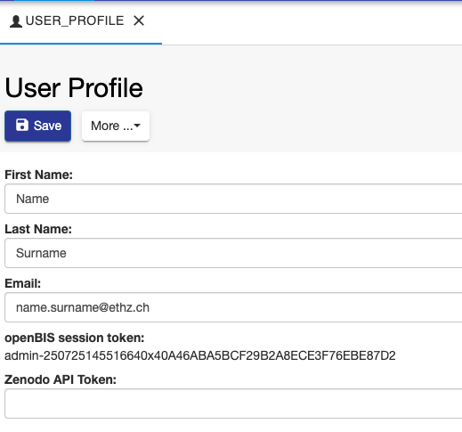
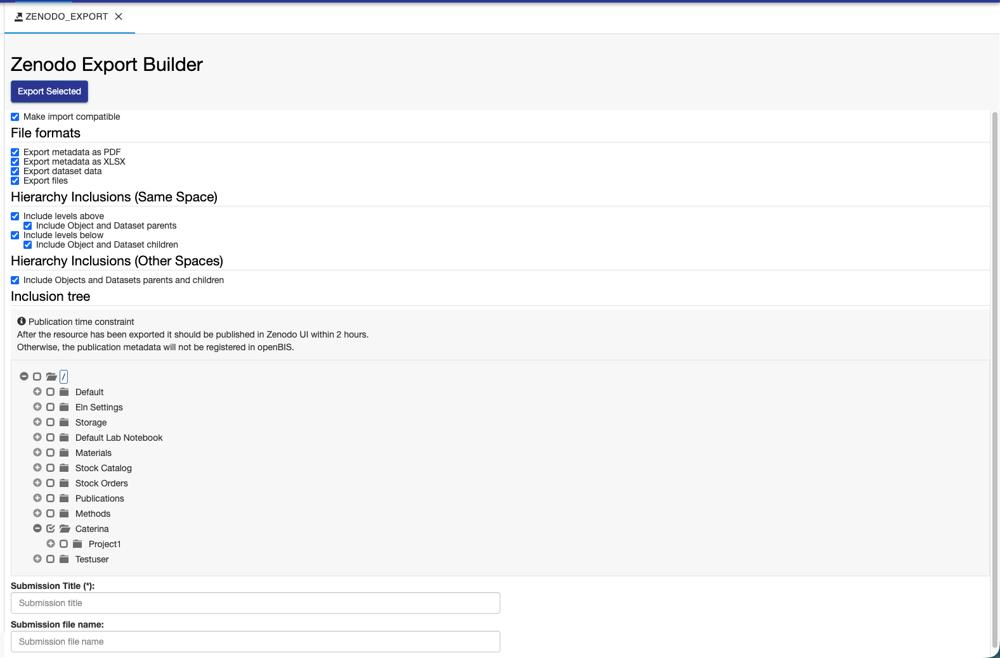
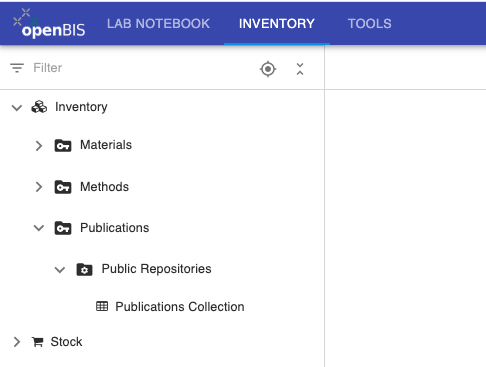
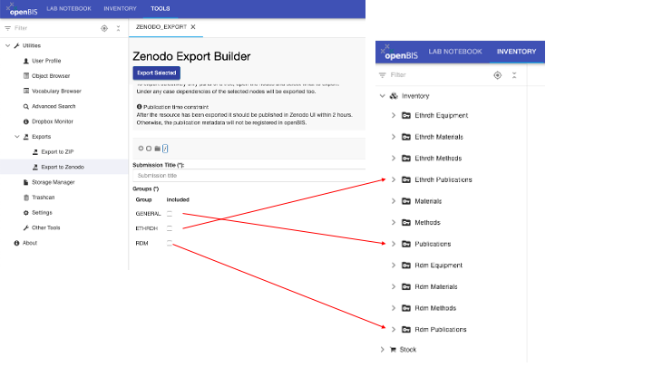
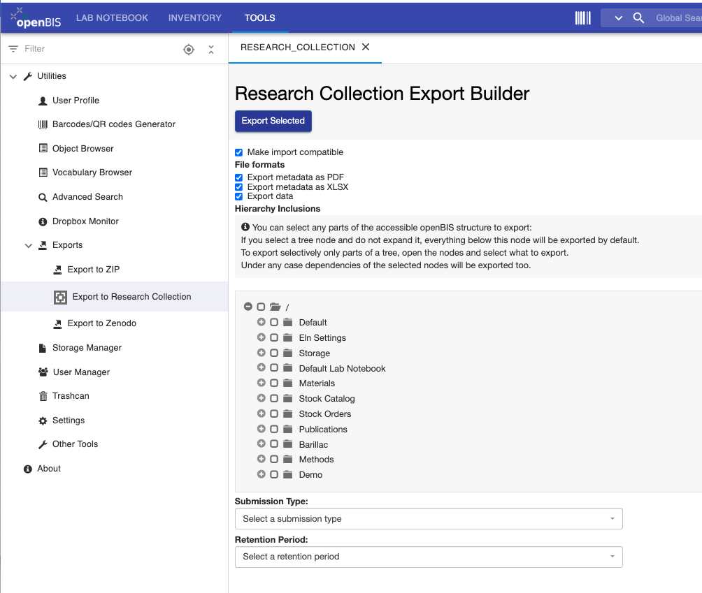

Data Export to Repositories
====
 
## Export to Zenodo
  
openBIS provides an integration with the **Zenodo** data
repository ([https://zenodo.org/).](https://zenodo.org/)

  
This enables data direct data transfer from openBIS to Zenodo. First of
all the connection to Zenodo needs to be configured on *system level*
in the DSS service.properties (see [How to configure the openBIS
DSS)](../../system-documentation/standalone/optional-datastore-server-configuration.md)
If this is configured, a lab manager, who has admin rights for the
**Settings,** needs to enable it in the ELN, as explained in [Enable
Transfer to Data
Repositories](../general-admin-users/admins-documentation/enable-transfer-to-data-repositories.md)**.**

###  Create Zenodo Personal Access Token

  
In order to be able to export data to Zenodo, you need a valid Zenodo
account. You also need to create a **personal access token.** This can
be done from the **Applications** under **Settings** in Zenodo, as shown
below:

### Save Zenodo Personal Access Token in openBIS

  
After creating the personal access token in Zenodo, this needs to be
stored in openBIS, with the following procedure:

1.  Go to **User Profile** under **Utilities** in the main menu, in the **Tools** tab.
2.  Enable editing.
3.  Add the Zenodo API Token.
4.  **Save.**
 

### Export data to Zenodo

  
To export data to Zenodo:

1.  Go to **Exports** -> **Export to Zenodo** under **Utilities** in
    the main menu, in the **Tools** tab.
2.  Select the Export options you want to use. The options are the same as explained above, in the [Export of entities](../general-users/data-export.md#export-lab-notebooks-inventory-spaces))
3.  Select the entities you want to export from the menu.
4.  Enter a **Submission** **Title.**
5.  Click **Export Selected** on top of the export form.
6.  The selected data are transferred as a *.zip* file to Zenodo. You are now redirected to Zenodo, where you should fill in additional    metadata information.
7.  Publish the entry in Zenodo.

 

 

After you hit the **Publish** button in Zenodo, a new entry with the
details of this submission will be created in the **Publications**
folder in the **Inventory**. Please note that this may take a few
minutes.

 

## Export data to Zenodo in a multi-group instance

If you export data from a multi-group instance where you have access to more than one group, you need to select the group under which the new publication entry should be created. 

In the example below we see 3 group names: GENERAL, ETHRDH, RDM.

If you select GENERAL, the publication entry will be created under the PUBLICATION *Space* (if present).

If you select ETHRDH, the publication entry will be created under the ETHRDH_PUBLICATION *Space*. 

If you select RDM, the publication entry will be created under the RDM_PUBLICATION *Space*. 

 
## Export to ETH Research Collection

The [ETH Research Collection](https://www.research-collection.ethz.ch/)
is a FAIR repository for publications and research data provided by ETH
Zurich to its scientists.

 

Data can be uploaded to the ETH Research Collection **only by members of
ETH Zurich**. This export feature is only available to ETHZ members.

 

To export data to the ETH Research Collection:

1.  Go to **Exports** -> **Export to Research Collection** under **Utilities** in
    the main menu, in the **Tools** tab.
2.  Select the Export options you want to use. The options are the same as explained above, in the [Export of entities](../general-users/data-export.md#export-lab-notebooks-inventory-spaces))
3.  Select what to export from the tree.
4.  Select the **Submission Type** from the available list: *Data
    collection, Dataset, Image, Model, Sound, Video, Other Research
    Data*.
5.  Select the **Retention Period** that will be used in the ETH
    Research Collection: *10 years, 15 years, indefinite.* This is time
    for which the data will be preserved in the Research Collection.
6.  Click the **Export Selected** button on top of the page.
7.  The selected data are transferred as *.zip* file to the ETH Research
    Collection. You will be redirected to the ETH Research Collection
    and will need to complete the submission process there.

 

A new entry with the details of this submission will be created in the
**Publications** folder in the **Inventory** after the submission
process in complete. This may take a few minutes.

 

The size limit for one single export to the ETH Research Collection is
10GB.

## Export data to the ETH Research Collection in a multi-group instance
 
If you export data from a multi-group instance where you have access to more than one group, you need to select the group under which the new publication entry should be created. See explanation in section [Export data to Zenodo in a multi-group instance](../general-users/data-export.md#export-data-to-zenodo-in-a-multi-group-instance)).
 

