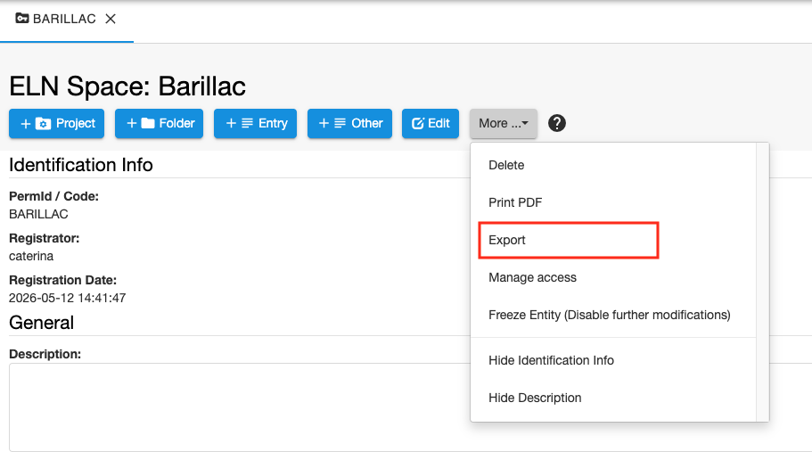
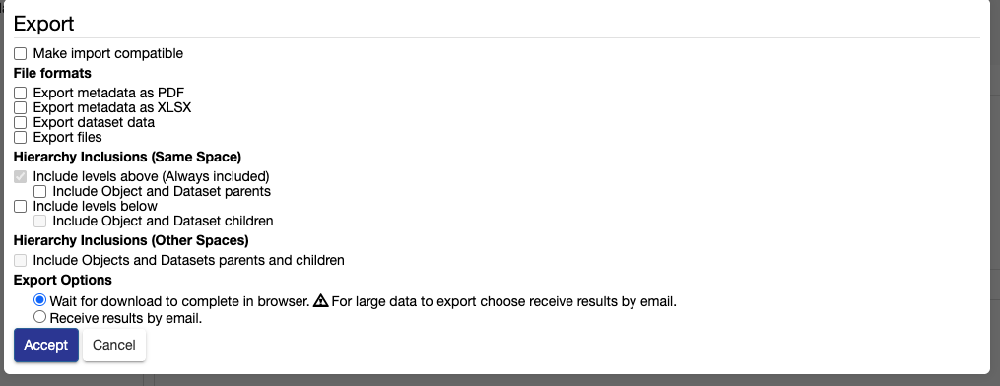
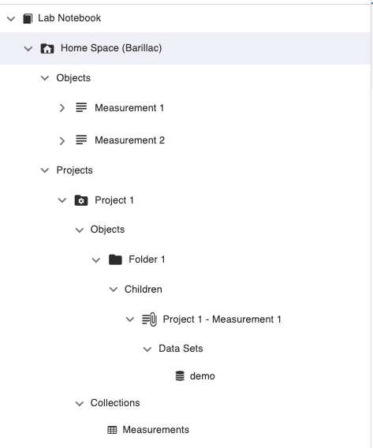
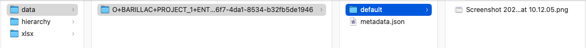
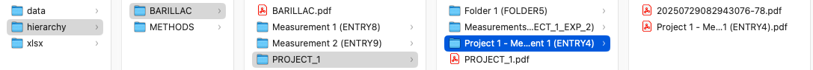
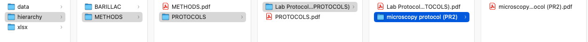
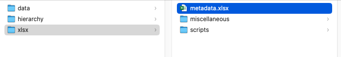
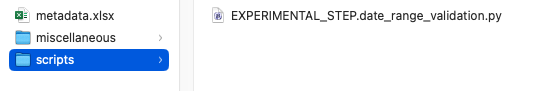
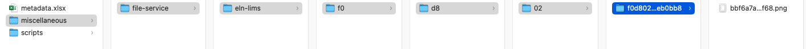

Data & Metadata Export
====
 

## Export of Entities in Lab Notebooks & Inventory Spaces 

  
All levels of the *Lab Notebook* and *Inventory* can be exported, using
the **Export** option in the **More..** drop down, as shown below for a *Space*.  

In each case, the following export options are available: 

 
- **Make import compatible**. If selected, datasets are exported in a **data** folder and are in a format ready to be uploaded in openBIS using the default eln-lims dropbox; the metadata are exported in a **xlsx** folder which contains information in a format ready to be uploaded via the openBIS admin UI.

#### File formats

- **Export metadata as PDF**. Metadata are exported in a **hierarchy** folder that keeps the folder structure of the ELN. At each level, one pdf file for each exported entity is generated.

- **Export metadata as XLSX**. Metadata are exported in one **xlsx** folder. The folder contains the metadata of all exported entities and the corresponding masterdata in a **metadata.xlsx** file. If **Make import compatible** is selected, this file is suitable for re-import in openBIS. If not, the file contains some fields which are not compatible with re-imports. These fields are: PermId of entities, registrator, registration date, modifier, modification date. In addition to the metadata.xlsx file, the **xlsx** folder might contain additional folders:
    - a **scripts** folder, which contains scripts associated with types in the metadata.xlsx file, if these are present;
    - a **data** folder which holds the content of large text fields that exceed the size of an Excel cell;
    - a **miscellaneous** folder which contain images embedded in text of exported entries, if present.

- **Export dataset data**. The default maximum size of all datasets to be exported is 10GB. This can be configured by a system admin in the [AS service.properties file](../../system-documentation/configuration/optional-application-server-configuration.md). We recommend to use [sftp](../general-users/lab-notebook.md#data-access) to download large datasets. Alternatively it is also possible to use PyBIS or the obis command line.
If **Make import compatible** is selected, datasets are exported in a **data** folder in a format ready to be uploaded in openBIS using the default eln-lims dropbox. If not, the datasets are exported in a **hiearchy** folder that matches the ELN hierarchy.

- **Export files**. This refers to files directly attached to entities (in AFS), not as openBIS datasets. The files are contained in the corresponding entity folders in **hierarchy**.

#### Hierarchy inclusions (Same Space)

-   **Include levels above (Always included)**. Thi referrs to the fact that if you select a level below *Space* (see [openBIS data model](../advance-features/openbis-data-modelling.md)), all levels above will be exported. For example, if you export Object A, which belongs to Collection A, Project A, Space A, the export will contain Space A/ Project A/ Collection A/ Object A.

    - **Include Objects and Dataset parents**. If you export one Object or Dataset that has parents in the same *Space*, also in different *Projects/Collections*, these parents will be exported.

- **Include levels below**. If selected, all hierachy levels below the selected entity and belonging to the same *Space* are exported.

    - **Include Objects and Dataset children**. If you select this option, all *Objects* and *Dataset* children of the *Object/Dataset* you want to export will also be exported.

#### Hierarchy inclusions (Other Space)

- **Include Objects and Datasets parents and children**. This allows to export *Objects* and *Datasets* parents and children that belong to a different *Space* than the *Space* from where *Objects* and *Datasets* are being exported. Example: I export Object A in Space 1, which has parents in Space 2. If this option is selected, the parents in Space 2 are also exported, otherwise they are not.

#### Export options

- **Wait for download to complete in browser**. This is suitable when exporting only metadata or small datasets. When the dowload is ready, a zip file will be available to download from the browser.

_Note: ensure that pop-ups are not disabled in your browser_.

- **Receive results by email**. If this option is selected, when the export is ready, you will receive an email notification with a download link.  Email notification needs to be configured on *system level* during or after installation, as explained in [Configure Data Store
Server](../../system-documentation/configuration/optional-datastore-server-configuration.md)

### Examples

We provide below a couple of examples of the export, to clarify how it works.

#### **1. Import-compatible export of a Space selecting all options**

We select all options from the export widget, as shown below.

 

We export a *Space* called BARILLAC in the Lab Notebook with all its sublevels (see below). 

One *Object* in this *Space* has a protocol as parent, and this is in the METHODS *Space*. 

The exported zip file contains 3 folders:

**A.** **data** folder

This contains the datasets in the correct format to be uploaded via eln-lims dropbox, as shown below.

**B.** **hiearchy** folder

This contains folders that match the openBIS hierarchy (*Space, Project, Experiment/Collection, Object*).

In this case 2 *Space* folders are present:

1. **BARILLAC**: is the exported space.

2. **METHODS**: contains a protocol which is parent of a measurement in the *Space* BARILLAC. This was exported because the option **Include Objects and Datasets parents and children from different spaces** was selected for export.

Inside each folder, there is a pdf of the corresponding entity. Example: 

- in the Space folder **BARILLAC** there is a **BARILLAC.pdf** file that contains the metadata of the *Space*;
- in the **Measurement 1 (ENTRY8)** folder there is a **Measurement 1 (ENTRY8).pdf** file that contains the metadata of this *Object*;
- in the Project folder **PROJECT_1** there is a **PROJECT_1.pdf** file that contains the metadata of the Project;

**C.** **xlsx** folder. 

This contains:

- a **metadata.xlsx** file which has the metadata of the exported entities and the corresponding masterdata (types and properties) in the correct format to be re-imported in another openBIS instance;

- a **scripts** folder that contains evaluation plugins associated to two types defined in the metadata.xlsx file. This folder is present only if the exported types have plugins associated with them.

- a **miscellaneous** folder that contains images that are embedded in text fields of the exported entities. This folder is present only if exported entities contain images embedded in text.

If the entities you are exporting contain very large txt with more than 32,767 characters (Excel limit for cell size), these are exported separately to a **data** folder inside the **xlsx** folder.

#### **2. Non import-compatible export of a Space selecting all options**

We export the same *Space* as described in Example 1, with all options selected, but the export this time is not import-compatible, as shown below.

 

 
In this case the exported *.zip* file contains only 2 folders: **hierarchy** and **xlsx**. Data are exported inside the **hierachy** folder, instead of being in a separate **data** folder.

**A.** **hierarchy** folder

This contains the same folder structure as described above. In addition, in this case, if an *Object* or an *Experiment/Collection* contains a dataset, this is exported in a **data** folder inside the entity it belongs to.

**B.** **xlsx** folder 

This contains the same files and folders as described in Example 1. The only difference in this case is that the metadata.xlsx is not import-compatible. It contains some fields which are not compatible with openBIS re-import, as explained above.

## Export to ZIP

If you want to export entities from multiple *Spaces*, you can use the **Export to ZIP** option available under the **Tools** section.

The options for the export are  similar to what is described above. Howver, in this case, only the option to receive the export via email is available. 
When export is ready, you will receive an email with a link to download the zip file containing the exported entities.

 
