Data Upload
====


In openBIS 7.0 a new data store (AFS) has been introduced. This allows to upload data to *Experiments/Collections* and *Objects* (e.g., *Experimental Steps*) and these data are not immutable. AFS data can be deleted, renamed, and new data can always be uploaded to an entity. The AFS supports the upload of large data files (in the range of low hundreds GB).
*Datasets* are still avaible in openBIS 7.0 and can be attached to *Experiments/Collections* and *Objects* (e.g., *Experimental Steps*). openBIS *Datasets* are immutable.
For users using openBIS 7.0, we recommend to use AFS data, rather than *Datasets*. *Datasets* will be removed in openBIS 8.0 (a migration will be provided).


 
# Data upload via web UI

## AFS data upload

To upload data to an *Object* or *Experiment/Collection*, click on the **Files** tab of the entity, as shown below.

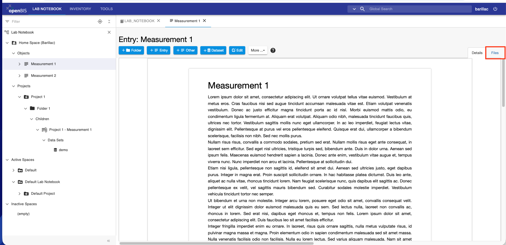

You have the option to upload single files or folders.

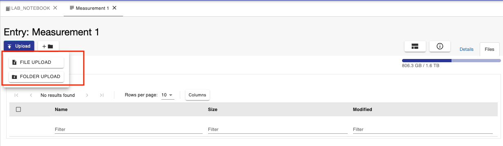

After upload, when you select a file or folder, a few options become available, as shown below.

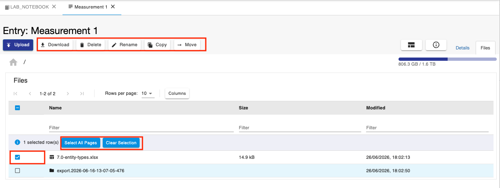

By default files are shown in list view, however it is possible to switch to gallery view using the button shown below.

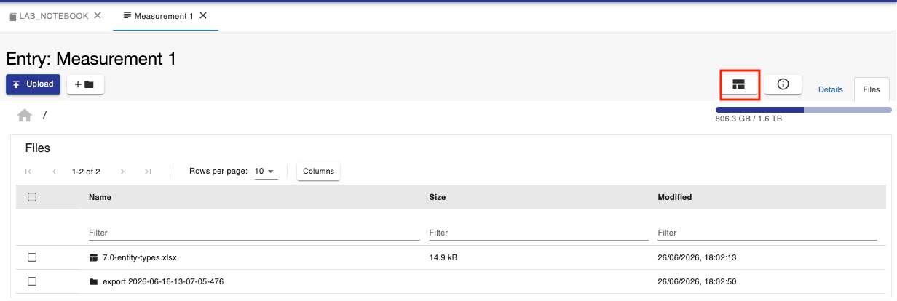

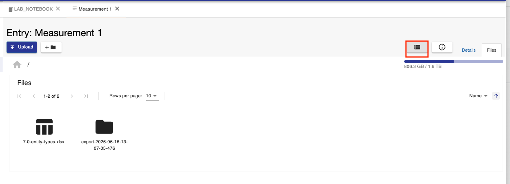

If you delete a file or folder, a new folder called **.afs.trash** is created and all deleted items are moved here.

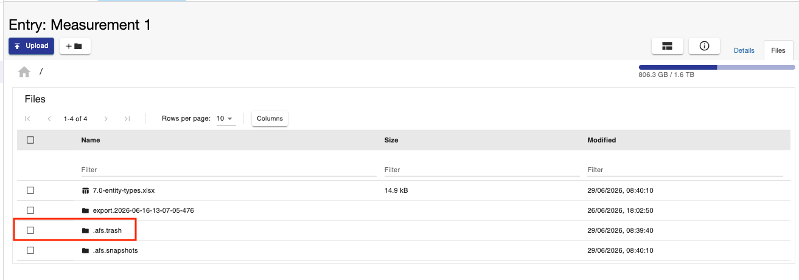

From here, items can be either moved back or permanently deleted.


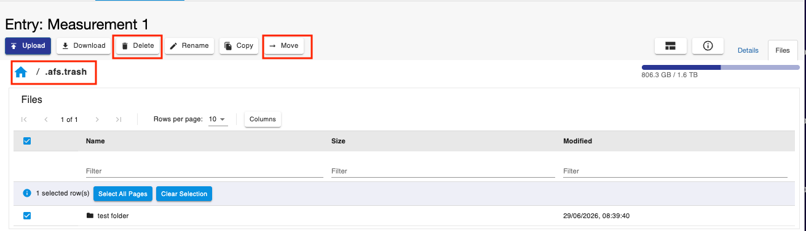


If you upload a modified version of a file that already exists, a folder called **.afs.snapshots** is created. Previous versions of the file are moved here.

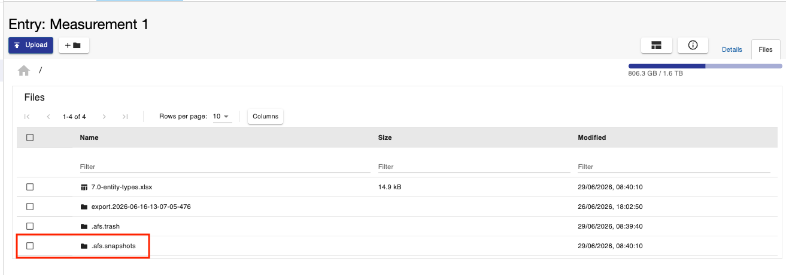

If you delete a file, a folder with the name of the file you deleted is created. Inside this folder the previous version of the file is contained.

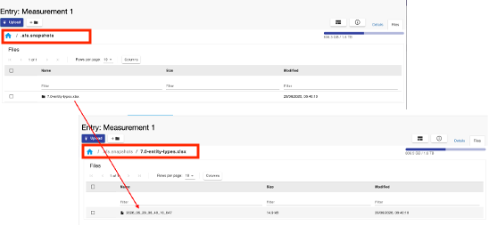


## Dataset upload

To upload data via the web interface: 

1.Click the **+Dataset** button in the form, as shown below.

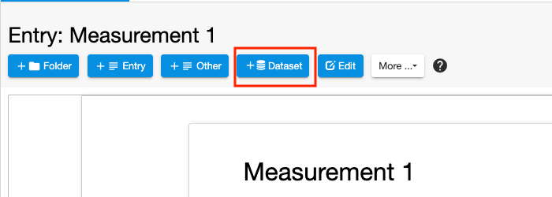

2\. Select the dataset type (e.g. Attachment).

3\. Fill in the relevant fields in the form. It is advisable to always
enter a **Name**, because this is shown in the menu. If the name is not
provided, the dataset code is shown.

4\. Drag and drop files in the **Files** **Uploader** area or browse for
files.

5\. When uploading a zip file, the option to **uncompress before
import** will be presented in the form.

6\. **Save.**  

 


 

**Note for MacOS users:** the default MacOS archiver generates hidden
folders that become visible in openBIS upon unarchive. To avoid this
there are two options:

1.  Zip using  the following command on the command-line: `zip -r folder-name.zip folder-name/\*  -x “\.DS\_Store”`
2.  Use an external archiver (e.g. Stuffit Deluxe).


# Data upload via DSS dropbox

Web upload of data files is only suitable for files of limited size (few GB). To upload larger data, openBIS uses dropbox scripts that run in the background (see [Dropboxes](../../software-developer-documentation/server-side-extensions/dss-dropboxes.md)). A default dropbox script is provided with the openBIS ELN-LIMS plugin, and the dropbox folder needs to be set up by a *system admin*.

If this is set up, users need to organise their data in a specific way, prior to upload:


 

**Folder 1** needs to have a specific name that encodes the information
of where the data should be uploaded to openBIS.

The name of **Folder 1** can be generated from the ELN interface:
 

1.  From the page where you want to upload data, select **Dataset upload helper tool for eln-lims dropbox** from the **More…** dropdown 
and follow the instructions on screen.

 

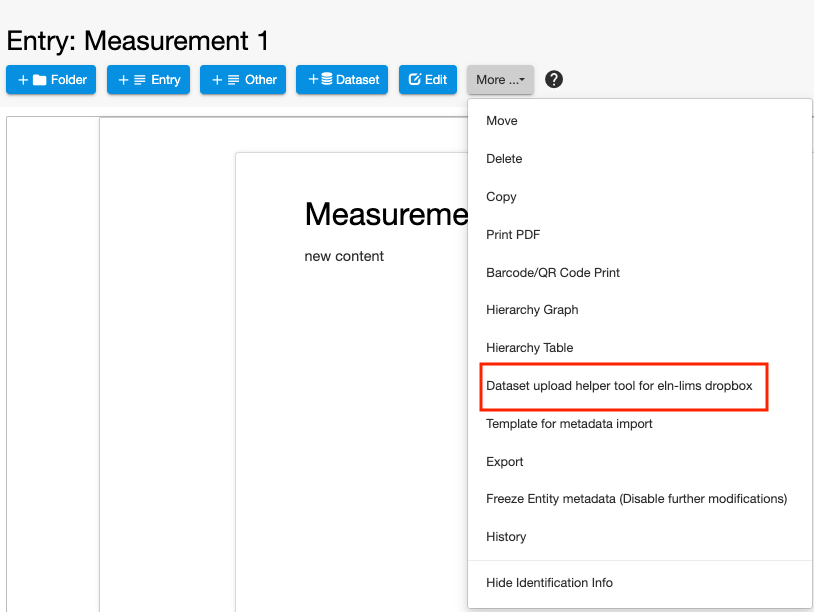

 

2. Select:
    1.  The dataset type from the list of available types (mandatory);
    2.  Enter the name of your dataset (optional, but recommended);
    3.  Copy the generated name of the folder using the copy to clipboard icon.
 


 

3\. In your finder/explorer, create a new folder and paste the name you
copied from openBIS. Place your data in this folder.

 


 

4\. Place this folder containing your data inside the
**eln-lims-dropbox** folder. openBIS continuously monitors this folder
and when data are placed here, they are **moved** to the final storage.
The move happens after a predefined (and customisable) inactivity period
on the eln-lims-dropbox folder.

 

### DSS Dropbox with markerfile
 

In case of uploads of data >100GB we recommend to configure the
**eln-lims-dropbox-marker**. The set up and configuration need to be
done by a *system admin*. The process of data preparation is the same as
described above, however in this case the data move to the openBIS final
storage only starts when a markerfile is placed in the
eln-lims-dropbox-marker folder. The marker file is an empty file with
this name: **.MARKER\_is\_finished\_<folder-to-upload-name>.** Please note the “.” at the start of the name, which indicates that this is a hidden file. This file should also not have any extension. For example, if the folder to be uploaded has the following name:

 
```
O+BARILLAC+PROJECT\_1+EXP1+RAW\_DATA+test
```
 

The marker file should be named:

 

.MARKER\_is\_finished\_O+BARILLAC+PROJECT\_1+EXP1+RAW\_DATA+test


#### **How to create the Marker file in Windows**

 

You can create the Marker file in Windows using a text editor such as
**Editor**. Any other text editor will  also work.

1.  open **Editor.**
2.  Save the file with a name such as
    .*MARKER\_is\_finished\_O+BARILLAC+PROJECT\_1+EXP1+RAW\_DATA+test.*
3.  The file is automatically saved with a “.txt” extension. This needs
    to be removed.
4.  Use the *Rename* option to remove the extension from the file.

 

#### **How to create the Marker file on Mac**

 

If you are not familiar with the command line, you can create an empty
text file using for example the **TextEdit** application in a Mac. Any
other text editor will also work.

1.  Open the **TextEdit** application and save an empty file with a name such as
    *.MARKER\_is\_finished\_O+BARILLAC+PROJECT\_1+EXP1+RAW\_DATA+test*.
2.  Save to any format.
3.  You will get a message to say that files starting with “.” are reserved for the system and will be hidden. Confirm that you want to
    use “.”
4.  To show these hidden files, open the Finder and press **Command + Shift + . (period)**.
5.  The file you saved before has an extension, that needs to be removed. If the extension is not shown in your Finder, go to Finder
    Preferences menu, select the Advanced tab, and check the “Show all filename extensions” box.
6.  Remove the extension from the file.

 

### DSS Dropbox monitor

 
It is possible to check the status of the upload via dropbox using the
**Dropbox Monitor** under **Utilities** in the main men, in the **Tools** tab.

The Dropbox Monitor shows a table with all available dropboxes for a
given openBIS instance. By default, *default-dropbox, eln-lims-dropbox
and eln-lims-dropbox-marker* are shown.

If data are uploaded in a dropbox folder, users can see the status of
the data upload in the table. A red face in the column **Last Status**
indicates a failure of data import, a green face indicates successful
data import.

 

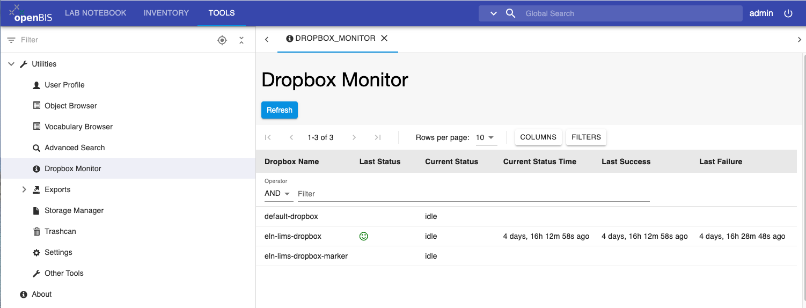

 

If you click on the row of the table above, you can see the details of
every upload attempt for a given dropbox, as shown below. For failures,
the log with the error is shown.

 

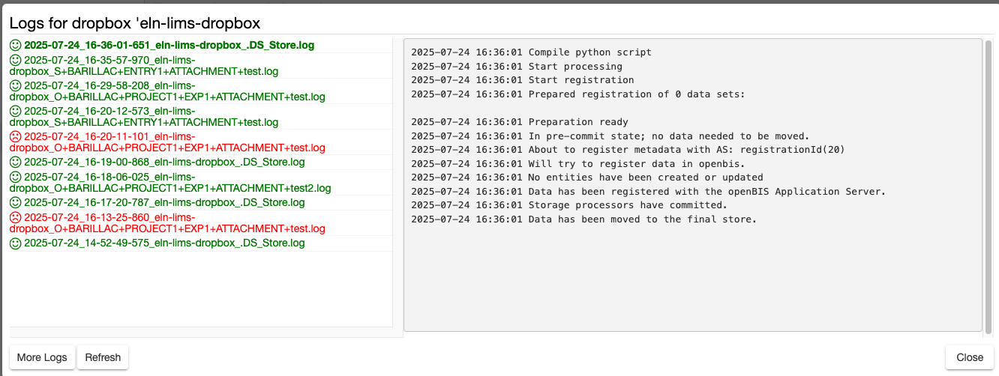

 

### Registration of metadata for datasets via dropbox

 

Starting from openBIS version 20.10.2, the default eln-lims dropbox
supports the registration of metadata for datasets. The metadata needs
to be provided in a file called **metadata.json.** This file should be
placed inside the folder with the openBIS-generated name described
above, together with the data. This is shown in the example below.

O+BARILLAC+PROJECT\_1+EXP1+RAW\_DATA+test

is the folder with the openBIS-generated name. Inside this folder there
is the metadata.json file, and the data, which consists of a few files
and 2 folders.


 

 

For example, the metadata.json file for the default RAW\_DATA dataset
type would be:

```
{ “properties” :

{ “$NAME” : “my raw data”,

“NOTES” : “This is a test for metadata upload via dropbox” }

}
```
 

It is possible to download the template metadata.json file for each
dataset type from the **Other Tools** section under the **Utilities** in
the main menu.

 

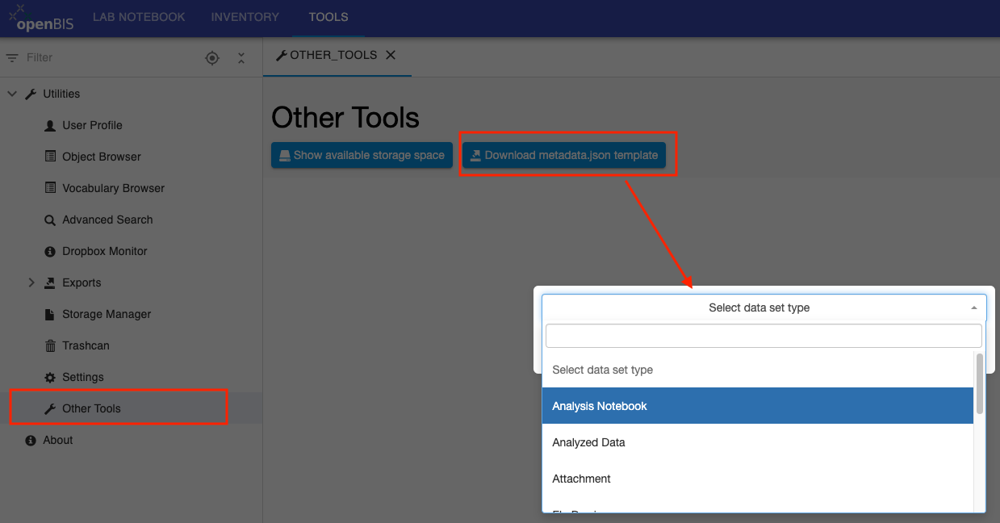

  

In **Other Tools**, there is also the **Show available storage space**
button, which shows the available storage space on the openBIS instance.
This is helpful in calculating how much space one might require for
future data upload, especially large data.

 


