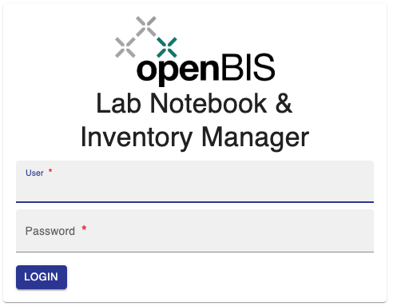
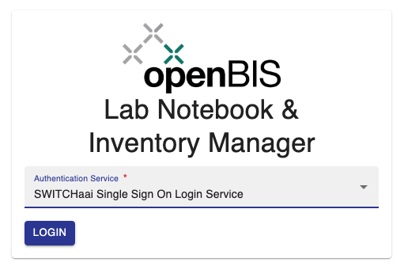
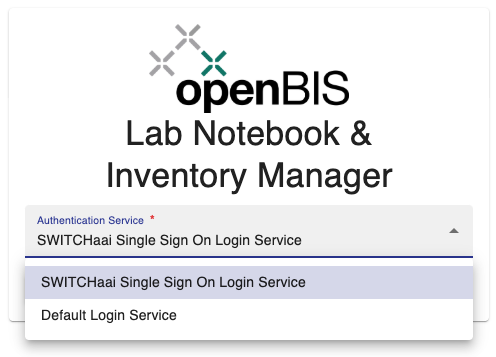

# General Overview

  
The openBIS platform has three primary functionalities:  
  

1.  **Inventory management** of laboratory samples, materials,
    protocols, equipment.
2.  **Laboratory notebook**, to document lab experiments.
3.  **Data management**, to store all data related to lab experiments
    (raw, processed, analysed data, scripts, Jupyter notebooks, etc.).

  
It is possible to use all functionalities or only selected ones.

 

In the most general use-case, the **Inventory** is shared by all lab
members, so everyone can access information about available lab
materials and regularly used protocols. 

In addition, every lab member has a personal folder in the **Lab
notebook**, where to organise projects and experiments. This folder can
be shared with other lab members or collaborators with openBIS access.  
Experimental steps described in the lab notebook can be linked to
protocols and samples stored in the inventory. Experimental steps can
also be linked to each other.

**Data** of any sort can be attached to the corresponding Experimental
step in different ways, depending on the size.

Data can be exported to data repositories, such as
[Zenodo](https://zenodo.org/) or the [ETH Research
Collection](https://www.research-collection.ethz.ch/) (for ETHZ users
only).  
  

This allows to have the complete overview of workflows and information,
from initial data generation to data analysis and publication.  
  

The openBIS ELN interface can be accessed via a URL of this type:
**https://openbis-xxx/openbis/webapp/eln-lims/**  
  

where *openbis-xxx* is the name of the server specified in the openBIS
configuration file, during the installation by a system admin.

## Login

### File based and/or LDAP authentication

When file based and/or LDAP authentication are used in openBIS, the login interface is as shown below. Users need to provide their username and password to login.
Only registered users with assigned rights can login to openBIS.

### SWITCHaai authentication

When SWITCHaai (SSO) authentication is used in addition to file based and/or LDAP authentication, the login interface is as shown below. 

SWITCHaai is selected by default. In this case, users need to click on **Login** and they will be redirected to the SWITCHaai login page.

If a user would like to authenticate with a file-based account or LDAP (depending on system configuration), they need to select **Default Login Service** from the dropdown and provide username and password.

openBIS also supports SWITCH edu-id authentication and the login process is the same as described in this section.
