Lab Notebook
============

In the most common use-cases, the **Lab Notebook** part of the openBIS ELN-LIMS contains a personal **Home Space** (i.e. folder) for each user.

In the navigation menu, we see the **Home Space** on top and **Active Spaces** and **Inactive Spaces** below. 
**Active Spaces** are all *Spaces* of exisiting lab members a user has access to. **Inactive Spaces** are the *Spaces* of deactivated lab members a user has access to.

 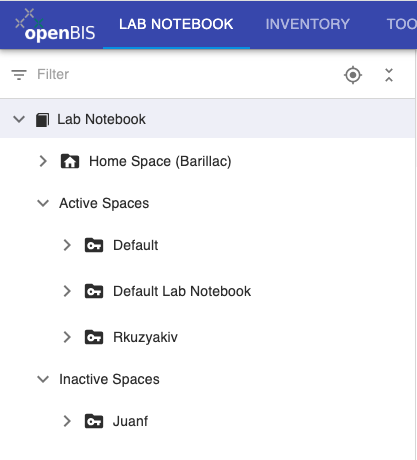

## Home Space

In the default settings, every user has a **Home Space**, which is their personal lab notebook folder.

It is also possible to organise the Lab Notebook on _Projects_, rather than on personal _Spaces_. This should be configured by an _Instance admin_.

We will focus on the most common use case, with personal _Spaces_.

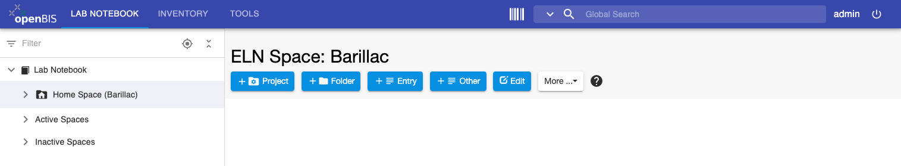

In your **Home Space**, you can create the following:

1.    A **Project**. You can consider this a folder, that allows you to group together your experiments/measurements. 
At the *Project* level one can control access (see [openBIS data model](./docs/user-documentation/advance-features/openbis-data-modelling.md)). *Projects* (and their content) can be shared with other group members and collaborators.

2.    A **Folder**. In openBIS terms, this is an *Object* that allows you to group together other *Objects*, like a folder on the file system. It can contain *Objects* of any type. The *Objects* inside a Folder are children of the Folder *Object*.

3.    An **Entry**. This is a notebook page.

4.    Any **Other Object**. These are *Objects* of other types available in your openBIS, which can contain specific metadata for your measurements/experiments. These are created by an _Instance admin_.

## Project

Inside a *Project*, you can create the following:

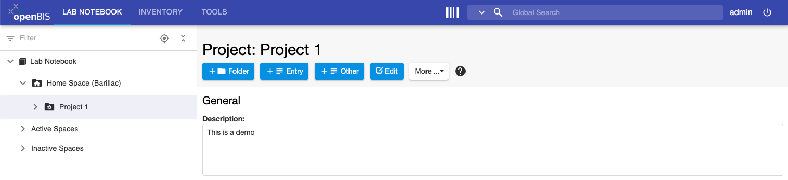

1.    A **Folder**. This is an *Object* that allows you to group together other *Objects*, like a folder on the file system. It can contain *Objects* of any type.

2.    An **Entry**. This is a notebook page.

3.    Any **Other Object**. These are *Objects* of other types available in your openBIS, which can contain specific metadata for your measurements. These are created by an *Instance admin*.

4.    An **Experiment/Collection**. See below for when to use them. 

### When to use Projects:

- If you are working on multiple research projects, you can create an openBIS _Project_ for each of them.
- If you need to control access to some of information in your lab notebook. In openBIS access can be controlled at the level of _Spaces_ and _Projects_ (see [openBIS data model](./docs/user-documentation/advance-features/openbis-data-modelling.md)).

## Experiment/Collection

An openBIS _Experiment/Collection_ is defined as a specific scientific question. The individual attempts to answer this question, are _Objects_ of type _Entry_, _Experimental Step_ or other custom _Objects_. 

Inside an _Experiement/Collection_ you can create:

1.    A **Folder**. This is an *Object* that allows you to group together other *Objects*, like a folder on the file system. It can contain *Objects* of any type.

2.    An **Entry**. This is a notebook page.

3.    Any **Other Object**. These are *Objects* of other types available in your openBIS, which can contain specific metadata for your measurements. These are created by an *Instance admin*.

### Difference between Default Experiment and Collection.

*Default Experiment* and *Collection* are two different types of _Experiment/Collection_
(see [openBIS data model](../advance-features/openbis-data-modelling.md)
). *Collection* is a _Standard Type_ provided with the openBIS installation; *Default Experiment* is a _Default Type_ and 
is created if _eln-lims-template-types_ plugin is enabled (see [ELN Types](./docs/user-documentation/general-users/ELN-types.md)).

The difference between the two consists in the fact that a *Collection* can be considered similar to a folder, with no metadata and the content of a *Collection* is visible in a table in the *Collection* page and not in the ELN menu.

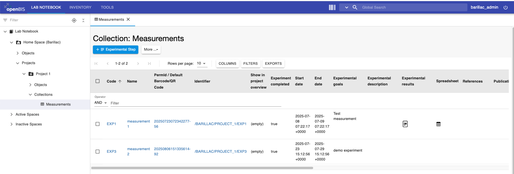

A *Default Experiment* has metadata fields that can be filled in. 
In addition, the content of the *Default Experiment* is shown in the ELN navigation menu.

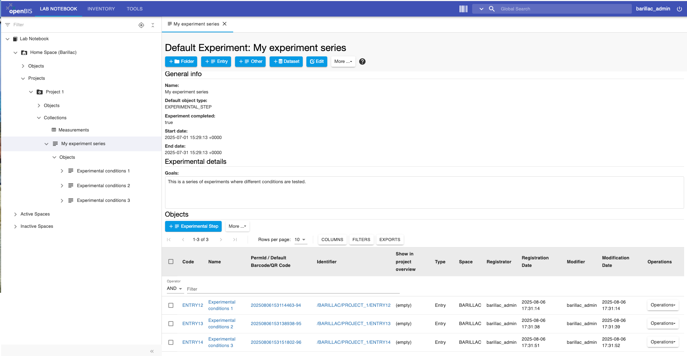

To see the *Objects* belonging to the *Default Experiment* also in a table in the main page, as shown above, you should select **Show Objects** from the **More..** dropdown.

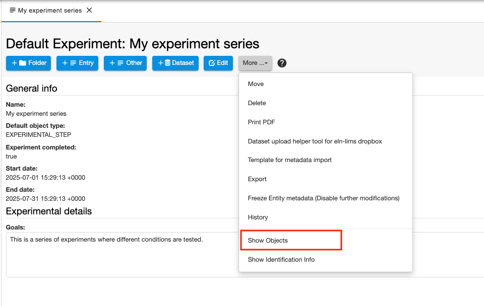

## Entry

This is an empty page, which resembles a Word document.

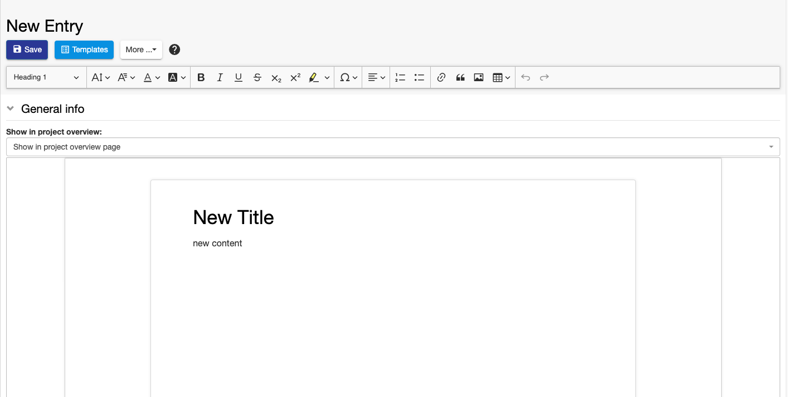

It can be used to describe measurements/experiments when no specific metadata needs to be recorded.

## Experimental Step

This is a *Default Type* provided by openBIS (see [ELN Types](./docs/user-documentation/general-users/ELN-types.md)), with some generic metadata fields, such as _start date, end date, goals, description, results_, etc. 

It can be used by users who prefer to use a more structured approach in taking their notes.

An *Instance admin* can create additional *Object* types with specific metadata required for given types of measurements/experiments.

 
## Datasets

Datasets can be considered as folders where data files are stored (see [openBIS data model](./docs/user-documentation/advance-features/openbis-data-modelling.md)).

### Datasets tables

Since openBIS version 20.10.7, a dataset table has been added to the *Experiment/Collection* and *Object* pages.

This table shows the metadata of the datasets. The content of the datasets can be navigated through the main menu.

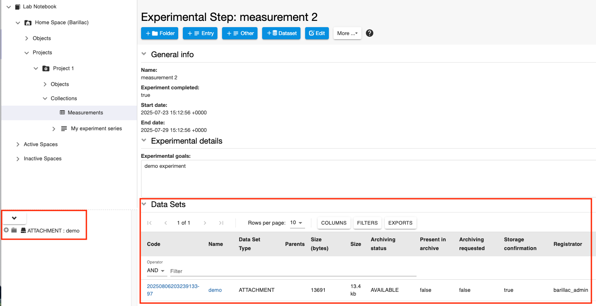
 

 
### Move Datasets
 

It is possible to move a *Dataset* from one *Experiment/Object* to
another *Experiment/Object*.

1.  Click on the *Dataset* in the main menu
2.  In the *Dataset* page select **Move** from the **More..** dropdown
3.  Enter the name or code of the *Experiment* or *Object* where you
    want to move the *Dataset* to. If you start typing, openBIS will
    show you a list of possible entries that match what you entered.
4.  Press the **Accept** button.

 

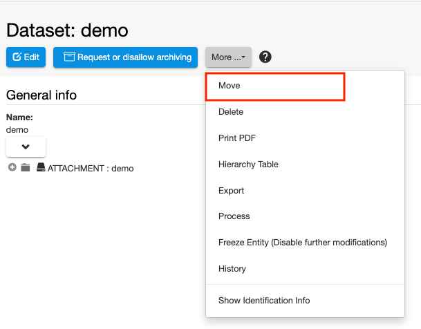

 

  

 
## Move one Experiment/Collection to a different Project

 
It is possible to move one *Experiment/Collection* and all contained *Objects* and
*Datasets* from one *Project* to another.

If *Objects* contain parent/child relationships these are preserved.

 

To move one *Experiment/Collection* from one *Project* to another:

 

1.  Select the *Experiment/Collection* you want to move from the navigation menu.
2.  Select **Move** from the **More…** dropdown

 

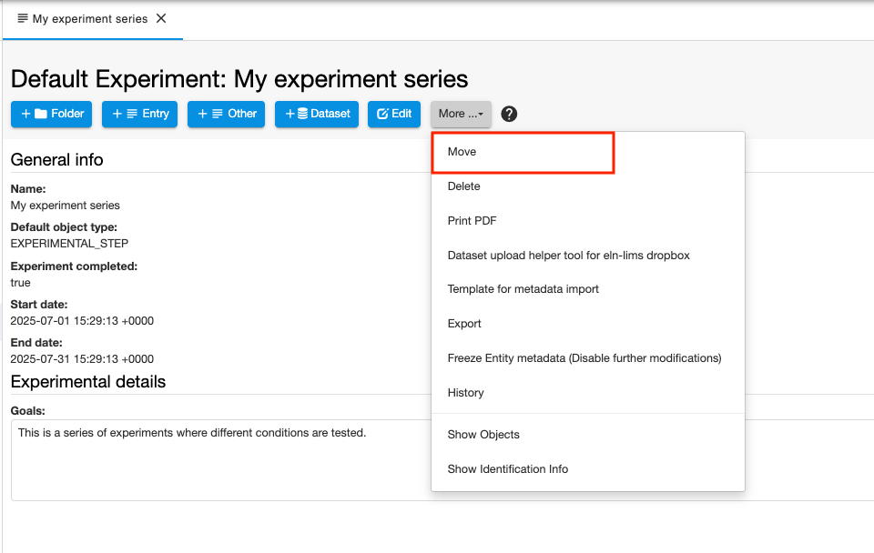

 

3\. Enter the code of the *Project* where you want to move your
*Experiment/Collection*. If you start typing the code, openBIS will prompt you with a
list of available options and you can select the appropriate one from
there.

 

4\. Click **Accept**

 
## Project Overview

In the *Project* page you have the options to see:

1.  *Default Experiments*, *Experimental Steps* and *Entries* with the field **Show in project overview = true**. 
This is a way to mark the most relevant *Experiments**, *Experimental steps* and *Entries* and see them at a glance on the *Project* page (**Show Overview**).
2.  All *Experiments/Collections* belonging to the Project (**Show Experiments/Collections**).

The two options are available from the *More..* dropdown on the Project
page.

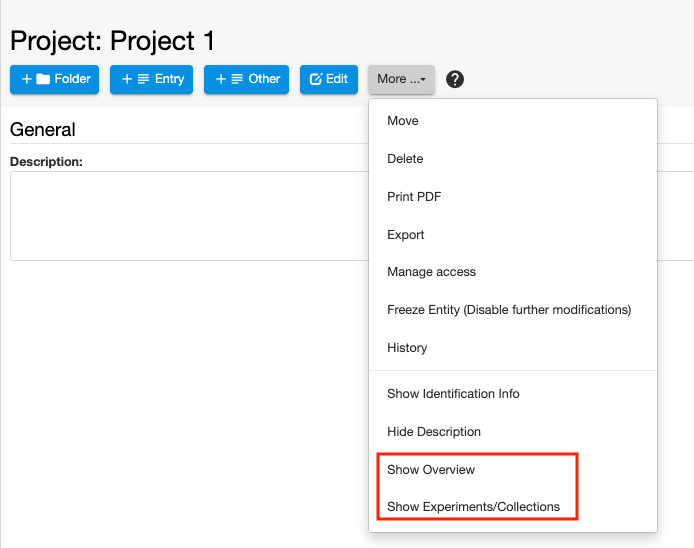

Below you see an example of an overview in a *Project* page.

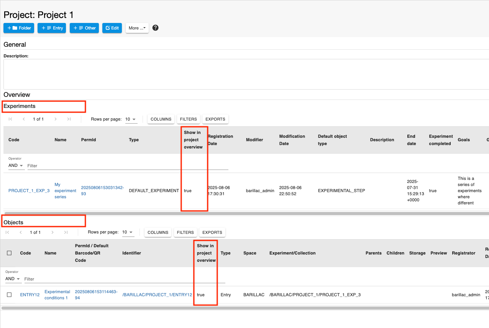

Below you see an example of the visualisation of *Experiments* and
*Collections* in a *Project* page.

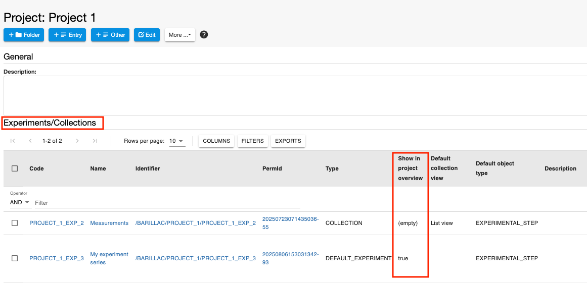

 
## Edit and Delete Projects, Experiments, Experimental Steps

*Projects*, *Experiments/Collections*, *Experimental Steps* and *Entries* can be edited at any
time, by selecting the **Edit** icon from the toolbar of the relevant page.

They can be deleted using the **Delete** option under **More** tab in the toolbar.

 

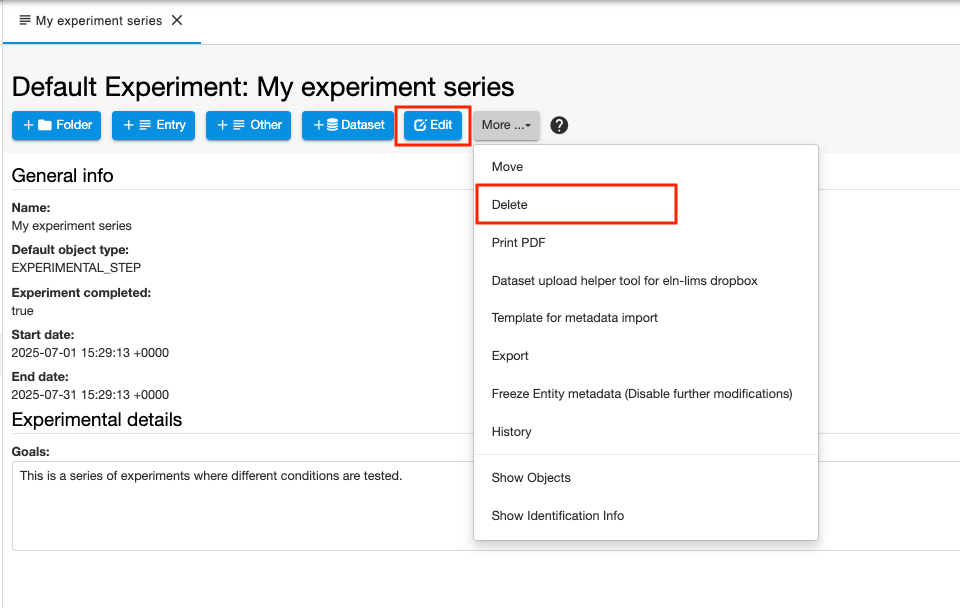

 

*Experiments/Collections*, *Experimental Steps* and *Entries* are moved to the **trashcan**,
from where they need to be removed in order to be permanently deleted
from the database. *Projects* are directly deleted, they are not moved
to the trashcan first. *Projects* can be deleted only after deleting all
the *Experiments/Collections* they contain.

Please be aware that, by default, only users with *Space/Project Admin* and
*Instance Admin* role have permission to delete. Default permissions can
be modified on *system level* (see [Changing the openBIS
capability role map](../../system-documentation/standalone/installation-and-configuration-guide.md#changing-the-capability-role-map)).

 
## Sharing Lab Notebooks and Projects

  
It is possible to share either a complete lab notebook or single
*Projects*, using the **Manage Access** option in the **More..**
dropdown of a *Space* or *Project* page, as shown below.

 

 

Available roles are:

1.  **Observer**: read-only access to *Space* or *Project*.
2.  **User**: can create and modify entities in *Space* or *Project*.
3.  **Admin**: can create, modify and delete entities in *Space* or *Project*.

The roles can be granted to:

1.  **User**: the user needs to be already registered in openBIS. The username of the user needs to be entered.
2.  **Group**: the name of a user group existing in openBIS needs to be entered.

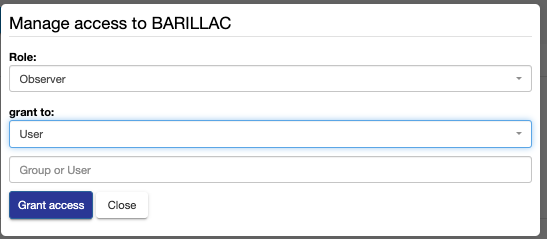

