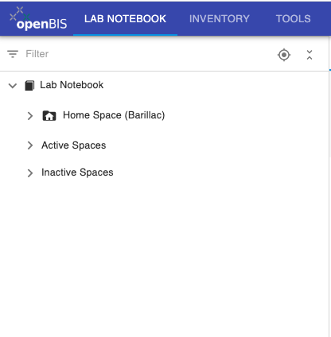
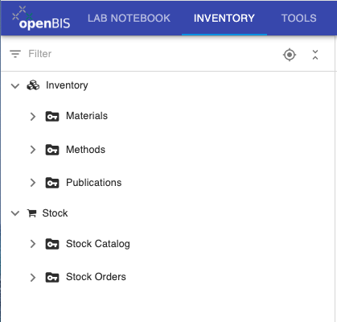
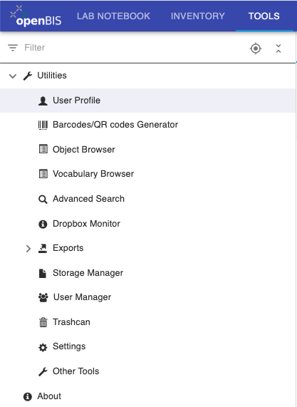
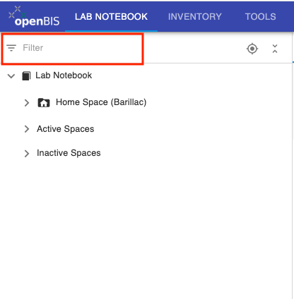
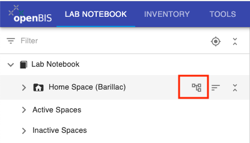
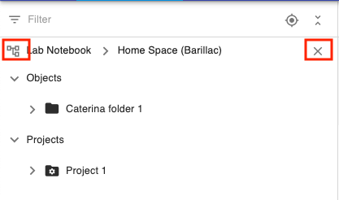
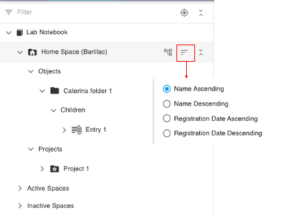
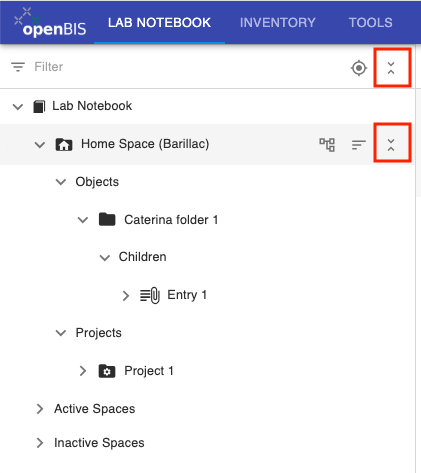
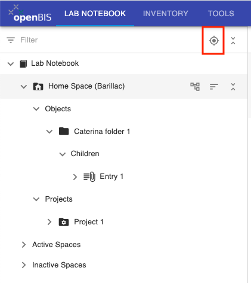

Navigation menu
==========================

 

openBIS 20.10.12 features a new navigation menu. The Lab Notebook, Inventory and Tools are on separate tabs, as shown below:

**Lab Notebook**

**Inventory**

**Tools**

## Menu functionalities

 

**1. Filter**. You can filter the menu by names or codes.

 

 

 

**2. Root nodes**. If you do not want to navigate the full menu, but
only a section of it, you can set the section you want to navigate as
root node, by clicking the icon shown in the picture below.

 

 

This now becomes the root node, as shown below. To restore the full menu
view, you can click on the root node icon shown below or on the "X".

 

**3. Sorting**. The default sorting of the menu is alphabetical. It
is possible to sort individual sections of the menu
(*Lab Notebook, Inventory, Stock*) and individual nodes inside those sections. 

It is possible to do a custom sorting by moving around (drag&drop) entities
in the menu. Please note that this is only possible inside a given
level, i.e. you can re-organise *Objects* inside a
*Collection/Experiment*; *Collections/Experiments* inside a *Project*;
*Projects* inside a *Space*. However, you cannot move entities from one
level to another, i.e. you cannot move an *Object* to a different
*Collection/Experiment*; a *Collection/Experimen*t to a different
*Project*; a *Project* to a different *Space*. This can only be done
via the **Move** option under the **More..** dropdown menu in the
forms.

  

**4. Collapse/Expand.** The full menu or individual nodes can be
expanded or collapsed, with the button shown below.

 

 

 
 

**5. Scroll to selected node**. In some cases, the view in the main ELN
page does not correspond to an entry selected in the menu. You can
scroll to the selected node in the menu, using the button shown below.

 

 
The state of the menu is saved. Every time you change something in the
menu, this change will be saved and when you login next time you will
see the menu in the state you last saved it.
