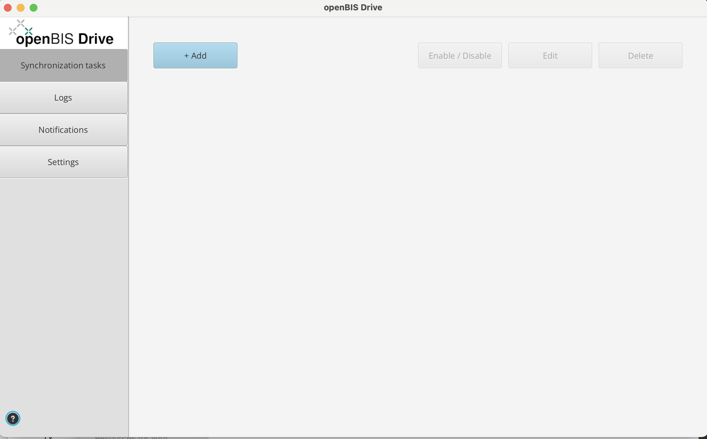
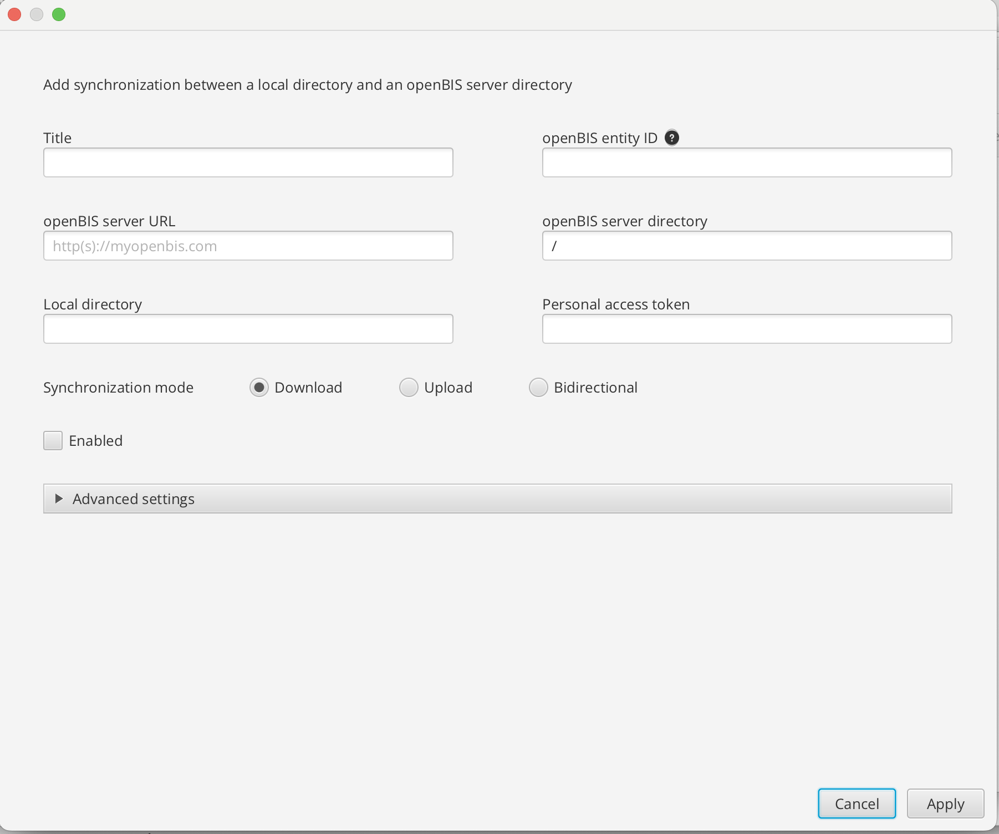
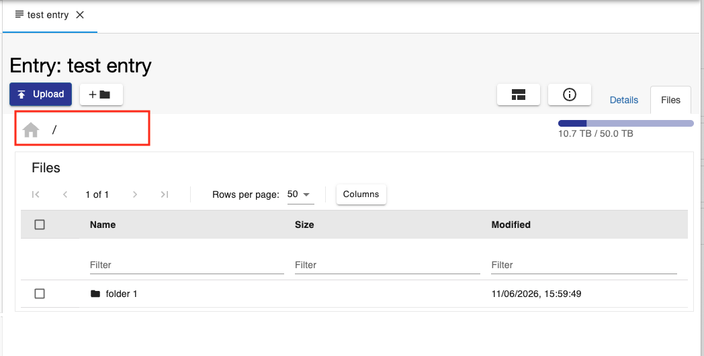
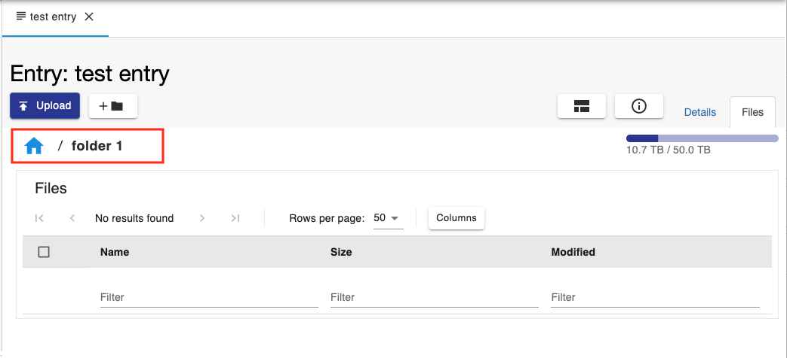
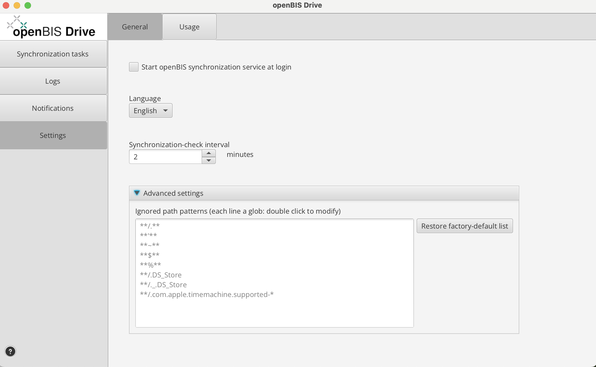
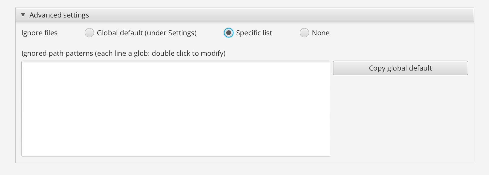
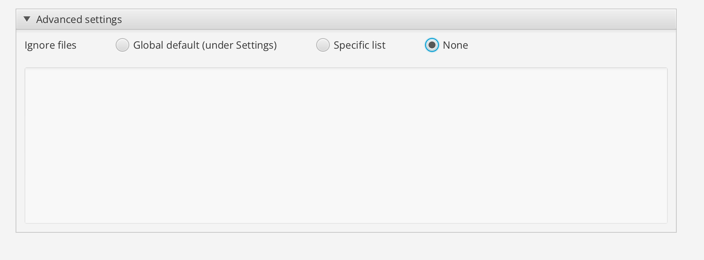
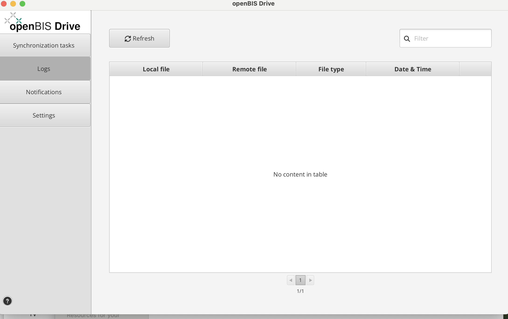
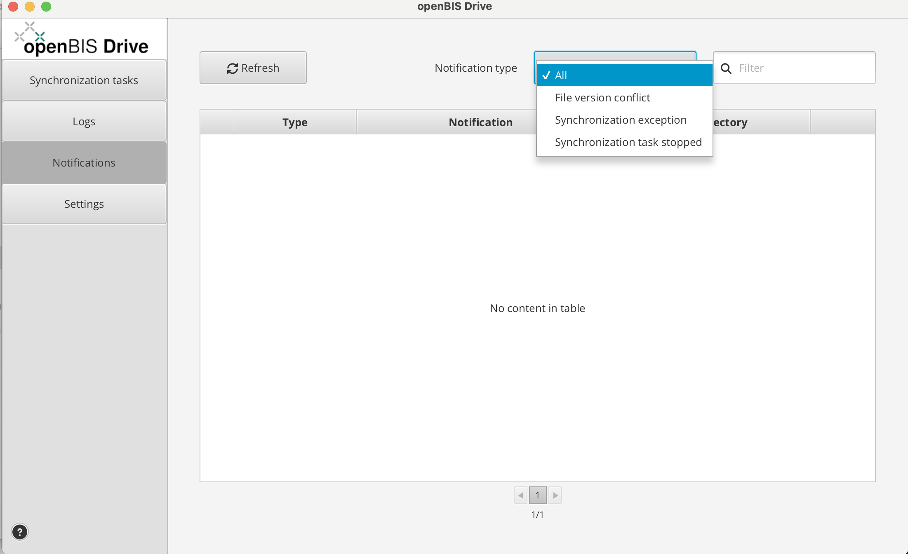
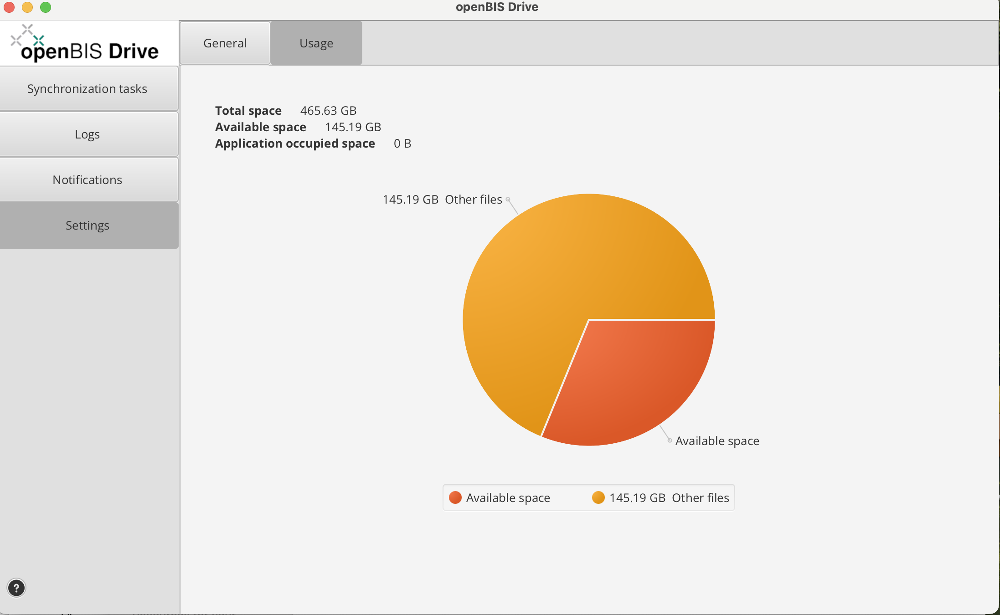

openBIS Drive
==========================

openBIS Drive is an application that allows you to syncronize your files and folders from a local storage to the openBIS storage.

You can download openBIS Drive for Mac, Windows and Linux here:

For installation, you can follow instructions provided here: [openBIS Drive installation](../advance-features/openbis-drive.md#installation)

When you open openBIS Drive, you can create a new sync jon by clicking on the **+ Add** button.

This opens a window where you need to enter the information explained below.

- **Title**. you can enter a name for the syncronization job. If you do not enter anything, this field will be automatically filled in with the name of the openBIS entity selected for syncing.
- **openBIS entity ID**. This is the openBIS entity (Collection or Object) to which you want to sync data. If you start typing the name or code of the desired entity a list of options from which you can choose will appear. It is possible to sync also to Datasets, but only in download mode.
- **openBIS server URL**. This is the URL of the openBIS server you want to sync to. 
- **openBIS server directory**. By default this will be the home directory on the entity you want to sync to 

If you want to sync to a specific folder inside the home folder, you can provide the path here.

- **Local directory**. This is the folder (directory) on you local storage you want to sync to an openBIS entity.
- **Personal accees token**. PATs can now only be created via the [admin UI](../../user-documentation/general-admin-users/admins-documentation/pat.md) or [pyBIS](../../software-developer-documentation/apis/python-v3-api.md#personal-access-token-pat). This is used to connect to openBIS.

- **Syncronization mode**. You can choose between **Download** (from openBIS to local storage), **Upload** (from local storage to oepnBIS), **Bidirectional**. 

- **Enabled**. You need to select this to enable the synchronization task.
- **Advanced Settings**. In this section you can customize the rules you want to use for files that should be ignored for upload to openBIS.
    - **Global default**. This is the default list of ignored file patterns used by the Drive.

    

    - **Specific list**. Here you can specify your list of file patterns to ignore. You can also copy the defaults and modify them.

    

    - **None**. You can select thsi option if you do not want ignore any pattern, so all files will be uploaded/downloaded by the Drive.

    

On the left hand-side menu of openBIS Drive you can select:

- **Logs**. This shows the logs of the syncronization tasks.

    

- **Notifications**. Here you can see different types of notifications.

  

- **Settings**. Here you see two different types of Settings:
    - **General** 

You can specify the following:

- if you want to start synchronization when you login.
- which language to use.
- the time interval for synchronization. Default is 2 minutes.
- Adavanced settings. Here you can restore default ignore settings, if they have been mondified.

    - **Usage**. Here you can see the total local storage and how much of this storage is synced to openBIS.

