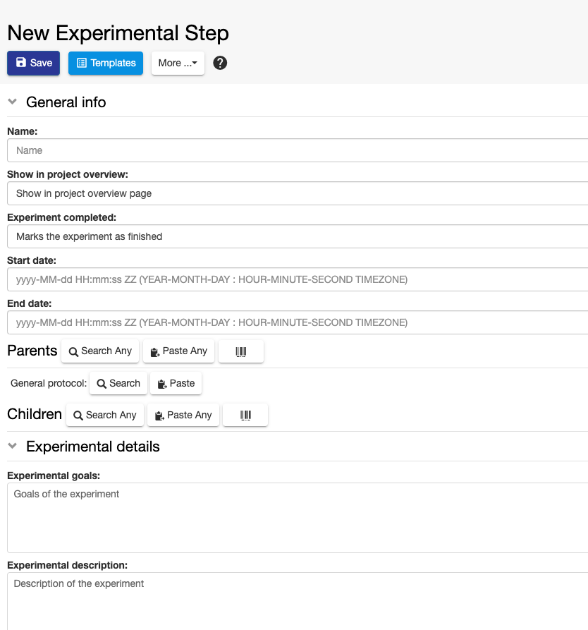
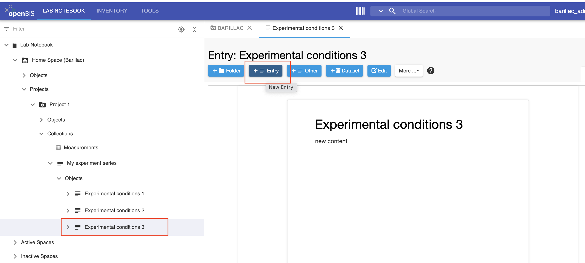
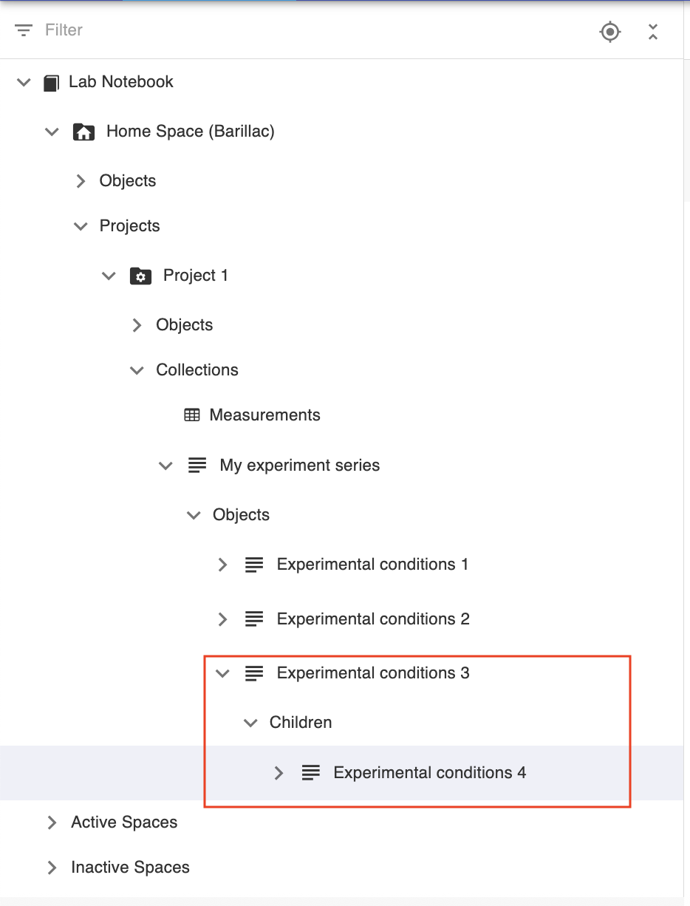

Parents and children
============

# Add parents and children 

In every *Object* form, there are a
**Parents** and **Children** sections where it is possible to specify links to other *Objects* (see [openBIS data model](./docs/user-documentation/advance-features/openbis-data-modelling.md)).

In the default *Experimental Step* and in the *Entry*, it is possible to specify links to materials, methods, equipment
from the *Inventory* or to any other *Object*, e.g. another
*Experimental Step* or *Entry*.

**Parents** are all samples/materials used in an experimental procedure,
standard protocols from the inventory followed in the experimental
procedure, the equipment used. It is also possible to set one
*Experimental Step/Entry* as parent of a second *Experimental
Step/Entry,* to keep the connection between the two.

The name of this section and which parents should be shown in the form,
is customisable by the *lab manager* or *group admin* as described in
[Customise Parents and Children Sections in Object
Forms](../general-admin-users/admins-documentation/customise-parents-and-children-sections-in-object-forms.md)

## Adding a parent

### Adding a parent of a predefined type in the form

In the screenshot above, **General protocol** is predefined as parent
type in the form. We have two options to add a parent of this predefined
type:

#### **1. Search**

1.  1.  Click on the **Search** button.
    2.  Enter the **name** or **code** of the entity you want to add as
        parent.
    3.  Select the entity you want to add from the list presented to you.

The parent will be added only when you **save** the entity.

#### **2. Paste**

1.  1.  You may copy the identifier of an entity you want to add as
        parent from a file, or from an advanced search or from another
        ELN page. You can paste the identifier(s) in the **Paste** text
        field.
    2.  Click the **+Add** button

### Adding parents of any available type

If you want to add a parent that is not specified in the *Experimental
Step* form, you can use the **Search Any** or **Paste Any** options next
to **Parents.**

#### 1. Search Any

1.  Click **Search Any**
2.  Select the *Object* type for which you want to add a parent
3.  Search by **code** or **name** as explained above
4.  Click the **+Add** button

#### 2. Paste Any

There are cases where you may want to add several parents of the same
type or also of different types. In this case, we recommend to use the
**Advanced Search** to find the entities you want to add. You can select
the desired entities from the table and the **Copy Identifiers** button
will become visible. You can copy the identifiers and paste them in the
**Paste Any** field in the *Experimental Step* page, as shown below.

### Adding parents via barcodes

If you want to add a parent that is registered in openBIS and has a
barcode associated with it by scanning the barcode:

 

1. Click on the **barcode** icon in the Parents section

2. A **Barcode/QR code reader** window opens

3. Scan the barcode/QR code of the entry you want to add as parent with
a scanner or with the camera of a mobile device

4. Click on the **Add Objects** button

5. **Close**

## Removing a parent

To remove a parent, choose **Remove** from the **Operations** drop down in the parent table, as shown below.

## **Adding and Removing Children**

Children of *Experimental Steps* are usually sequential *Experimental
Steps,* or products of the *Experimental Step.* As for the **Parents**
section, this section can also be customised by a *group admin* or *lab
manager* in the **ELN Settings** ([Customise Parents and Children Sections in Object Forms)](../general-admin-users/admins-documentation/customise-parents-and-children-sections-in-object-forms.md).

The procedure for adding and removing children is the same as explained
for parents.

# Parent-child relationships between entries in lab notebook

In the Lab Notebook section, if you create a new *Object* from an
existing *Object*, independently of the type, this will be automatically
set as parent of the new *Object*. For example, if you create a new
Entry (*Experimental conditions 4*) from an existing Entry
(*Experiemntal conditions 3*), this will be automatically set as child of *Experiemntal conditions 3*, as shown below.

If you do not wish to have this relationship established, you need to
create the new *Object* starting from the *Experiment/Collection* level.

