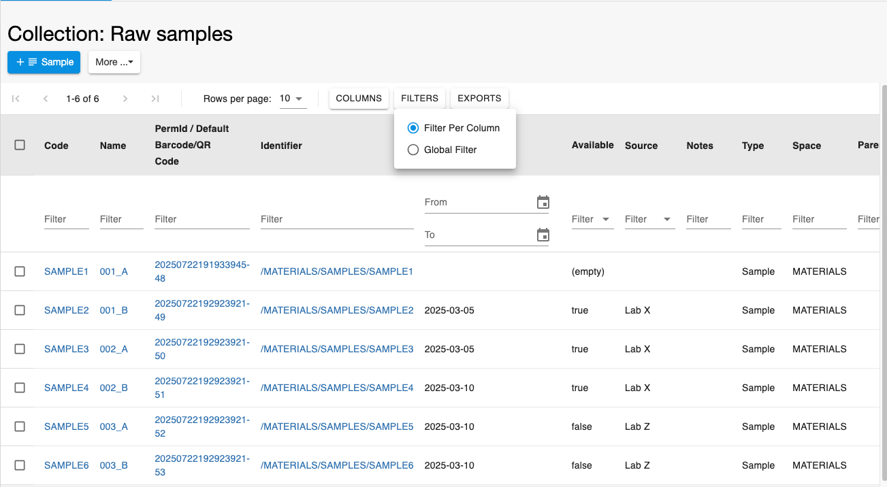
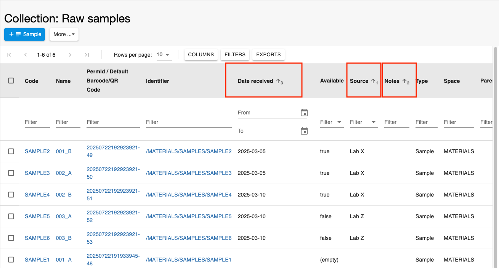
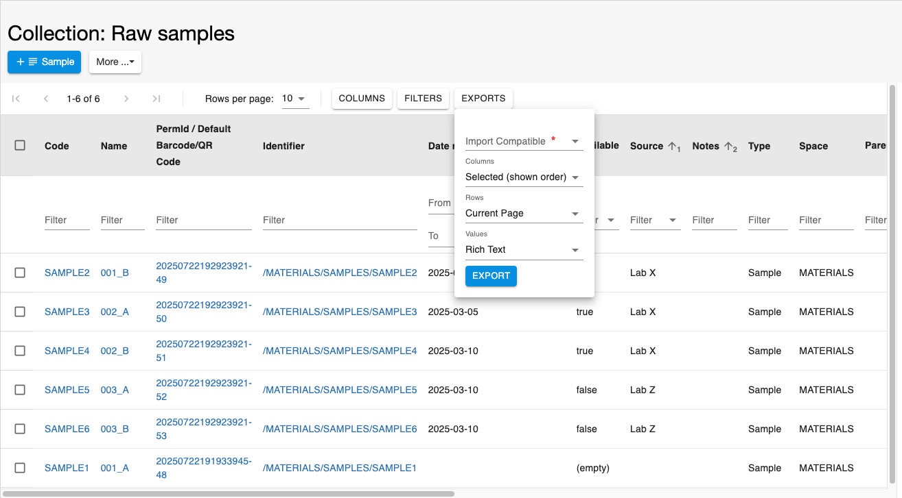
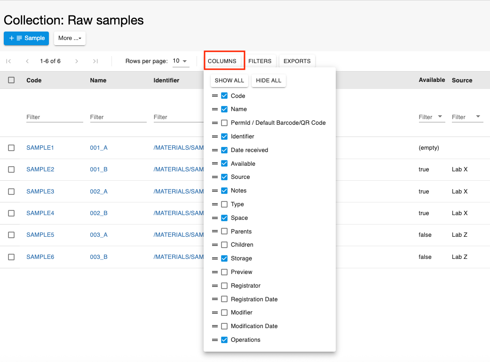
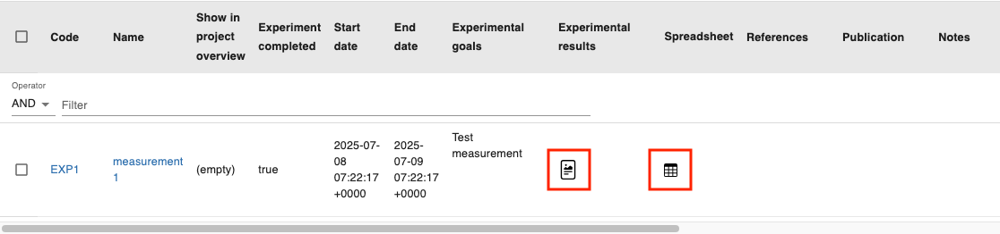
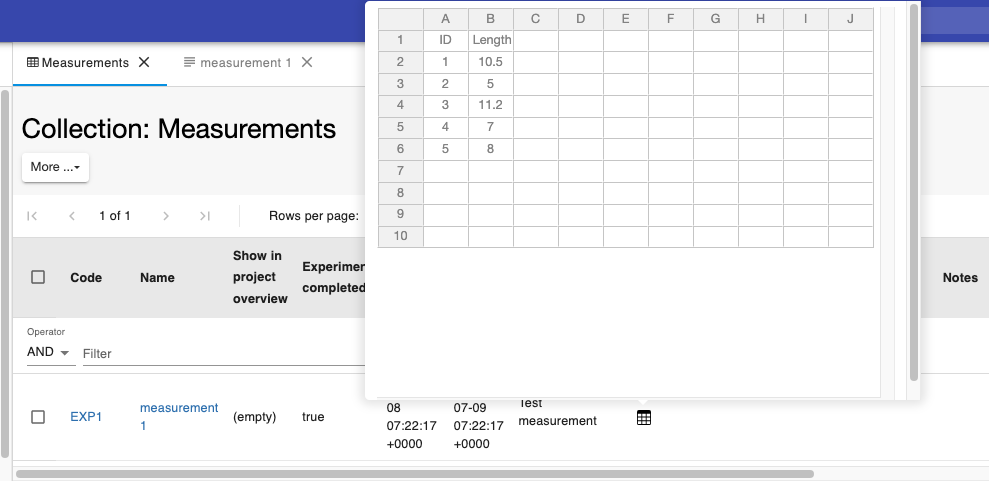
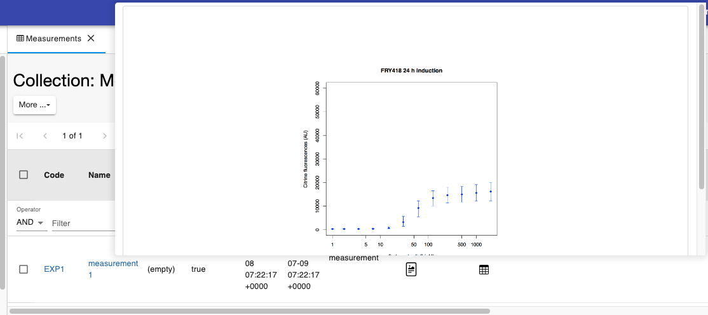
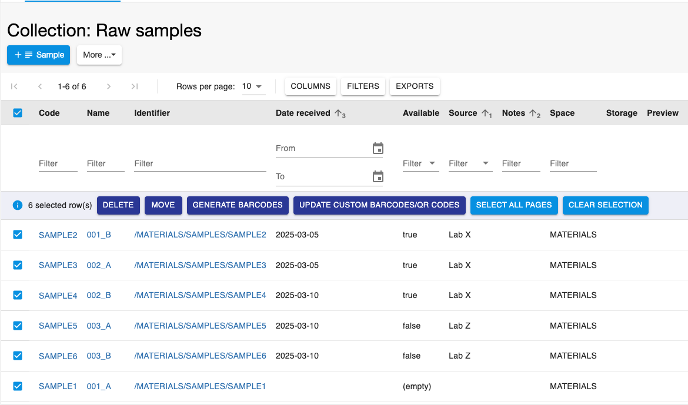
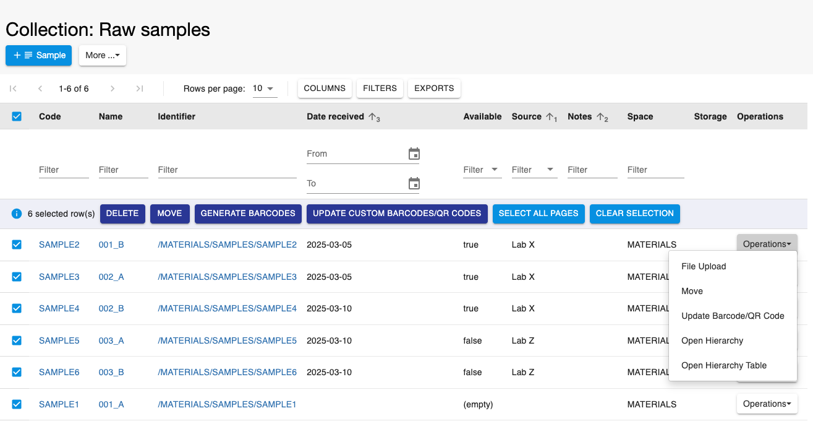

Tables
==========================

All tables in the ELN have a similar format and functionalities. The
tables have been redesigned for the 20.10.3 release of openBIS.

Here we give an overview of the main functionalities of the tables.

 

## Filters

Two filter options are available from the **Filters** button: 
- **Filter Per Column**: filter on individual columns. 
- **Global Filter**: filter terms across the entire table using the **AND** or **OR** operator. 

## Sorting

It is possible to sort individual columns or also multiple columns. For
multi-column sorting, you should click on the column header and press
the **Cmd** keyboard key. The order of sorting is shown by a number in
each column, as shown below.

 

## Exports

Tables can be exported in different ways, using the **EXPORTS** button shown
below.

 

1. **Import Compatible**:

           
- **Yes**: in this case some columns which are incompatible
             with imports (i.e. registration date, registrator,
             modification date, modifier) are not exported even if
             selected; some columns that are required by openBIS for
             imports are added to the exported file even if not
             selected (i.e. code, identifier, $ column). Moreover text
             fields are exported in HTML, to keep the formatting upon
             import.
- **No**: in this case all columns or selected columns are
             exported.

  

  
 2. **Columns**:

- **All (default order)**. All columns are exported, in
             accordance with the selection explained above for import
             compatibility.
- **Selected (shown order)**. Selected columns are exported,
             in accordance with the selection explained above for
             import compatibility.

  3. **Rows**:
- **All Pages**. All pages of the table are exported.
- **Current Page**. Only the currently visible page of
                 the table is exported.
- **Selected Rows**. Only selected rows in the table are
                 exported.

 4\. **Value**:

- **Plain Text**. Text fields are exported in plain text,
             without any formatting. This option is not available if
             the export is import-compatible.
- **Rich Text**. Text fields are exported in HTML format.

Tables are exported to **XLS** format. Exported tables can be used for
updates via the **XLS Batch Update Objects**. 

Note: Excel has a character limit of 32767 characters in each cell. If you export entries where a field exceeds this limit, you get a warning and the exported Excel file will not contain the content of the cell which is above this limit and the cell is highlighted in red, as shown below.

## Columns

Users can select which properties to display in the table clicking on
the **COLUMNS** button. It is also possible to show all properties or
hide all properties. The position of the columns can also be changed by
placing the cursor next to the = sign in the list and moving the fields.
This information is stored in the database for each user.

 

 

### **Spreadsheets and text fields**

If a table contains *Objects* which have a spreadsheet field with data, a spreadsheet icon is displayed in the table. Upon clicking
on the icon, the content of the spreadsheet can be expanded.  
If a table contains *Objects* with long text fields, only the
beginning of the text is shown and can be expanded. If the text contains
a picture or a table, an icon is shown in the table and the content of
the text becomes visible by clicking on the icon.

  

  

## **Selection of entries in table**

Single entries in a table can be selected using the checkbox in the row.
By clicking the checkbox in the table header, all entries of the table
are selected. After selection of entries, some actions become available:

 -  **Delete**: allows to move the selected entries to the trashcan.
 -  **Move**: allows to move the selected entries to a different existing *Collection/Experiment* or to a new one.
 -  **Generate barcodes**: allows to generate custom barcodes for the selected entries.
 -  **Update custom barcodes/QR codes**: allows to update existing custom barcodes of the selected entries.
 -  ** Select all pages**: allows to select entities on all pages of the table, if the table has more than one page.    
 -  **Clear selection**: allows to clear the selection made.

 

 

In *Object* tables inside *Experiments/Collections* there is an
**Operations** column, which allow users to perform certain tasks on an
*Object*:

 1.  Upload a file to the *Object*
 2.  Move the *Object* to another exiting *Experiment/Collection*.
 3.  Update Barcode/QR code.
 4.  Open the hierarchy graph. This is the graph showing parent/child
     connections of the *Object*.
 5.  Open the hierarchy table. This is the table showing parent/child
     connections of the *Object*.

 

 